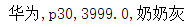

# day01课后练习

# 基础题目
## 第一题：概念题
1. 什么叫做类与类的继承，作用是什么？
  ```java

  ```
2. 请写出继承的格式
  ```java

  ```

3. 请写出继承的特点
  ```java

  ```

## 第二题：语法练习
* 语法点：继承
* 请使用继承定义以下类:
  ```java
  程序员(Coder)
    成员变量: 姓名,年龄
    成员方法: 吃饭,睡觉,敲代码

  老师(Teacher)
    成员变量: 姓名,年龄
    成员方法: 吃饭,睡觉,上课
  ```
  将程序员和老师中相同的内容(姓名,年龄,吃饭,睡觉)抽取到父类Person中

* 按步骤编写代码，效果如图所示：
  

* 编写步骤：
  1. 定义父类Person类,添加姓名,年龄成员变量,添加吃饭,睡觉方法
  2. 定义Coder类继承Person类,添加敲代码方法
  3. 定义Teacher类继承Person类,添加上课方法
  4. 在测试类中，创建Code对象,并设置成员变量的值,调用Coder对象的eat,sleep,coding方法.创建Teacher对象,并设置成员变量的值,调用Teacher对象的eat,sleep,teach方法

* 参考答案：
* Person类
  ```java
  
  ```
* Coder类
  ```java
  
```
* Teacher类
  ```java
  
  ```
* Test2测试类
```java

```


## 第三题：语法练习
* 语法点：继承
* 请使用继承定义以下类:
  ```java
  狗(Dog)
    成员变量: 姓名,颜色,价格
    成员方法: 吃饭,看家

  猫(Cat)
    成员变量: 姓名,颜色,价格
    成员方法: 吃饭,抓老鼠
  ```
  将狗和猫相同的内容(姓名,颜色,价格,吃饭)抽取到父类Animal中

* 按步骤编写代码，效果如图所示：
  

* 编写步骤：
  1. 定义父类Animal类,添加姓名,年龄,价格成员变量,添加吃饭方法
  2. 定义Dog类继承Animal类,添加看家方法
  3. 定义Cat类继承Animal类,添加抓老鼠方法
  4. 在测试类中，创建Dog对象,并设置成员变量的值,调用Dog对象的eat,lookHome方法.创建Cat对象,并设置成员变量的值,调用Cat对象的eat,catchMouse方法

* 参考答案：
* Animal类
  ```java
  
  ```
* Dog类
  ```java
  
  ```
* Cat类
  ```java
  
  ```
* Test3测试类
  ```java
  
  ```

## 第四题：语法练习
* 语法点：static

* 按步骤编写代码，效果如下：
  



* 编写步骤：
  1. 写一个标准的华为手机类(HWPhone)
  2. 手机属性有: 型号(type),价格(price),颜色(color) ,及静态的品牌(brand)
  3. 手机行为有: 打电话(call)
  4. 写手机测试类(PhoneTest)
  5. 创建手机对象,并设置手机的属性
6. 打印手机对象的品牌,型号,价格和颜色
  7. 调用手机打电话方法

* 参考答案：

测试类：

```java

```

HWPhone.java

```java

```

## 第五题：语法练习

* 语法点：继承

* 按步骤编写代码，效果如图所示：
  

* 编写步骤：
  1. 模拟教学管理系统师生信息
  2. 定义Person类
     1. 属性：姓名(私有)、年龄(私有)
     2. 构造方法：无参构造方法，有参构造方法
     3. 成员方法：getXxx方法，setXxx方法
  3. 定义Teacher类，继承Person
     1. 属性：学科(私有)
     2. 构造方法：无参构造方法，有参构造方法
     3. 成员方法：getXxx方法，setXxx方法，讲课方法
  4. 定义Student类，继承Person
     1. 属性：分数(私有)
     2. 构造方法：无参构造方法，有参构造方法
     3. 成员方法：getXxx方法，setXxx方法，考试方法


* 参考答案：
```java

```

