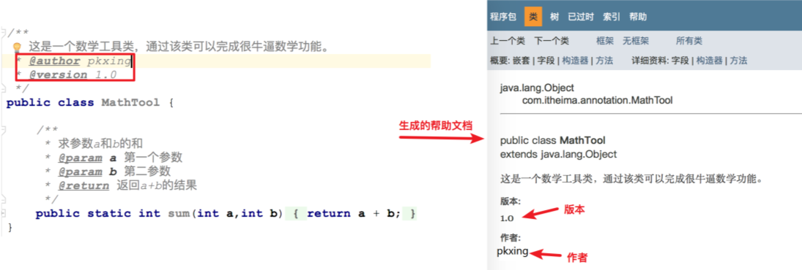
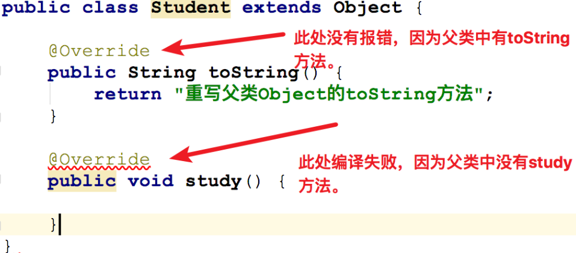

# day12【JUnit单元测试、反射、注解、动态代理】

# 学习目标 

- [ ] 能够使用Junit进行单元测试
- [ ] 能够通过反射技术获取Class字节码对象
- [ ] 能够通过反射技术获取构造方法对象，并创建对象。
- [ ] 能够通过反射获取成员方法对象，并且调用方法。
- [ ] 能够通过反射获取属性对象，并且能够给对象的属性赋值和取值。
- [ ] 能够说出注解的作用 
- [ ] 能够自定义注解和使用注解
- [ ] 能够说出常用的元注解及其作用
- [ ] 能够解析注解并获取注解中的数据
- [ ] 能够完成注解的MyTest案例
- [ ] 能够说出动态代理模式的作用
- [ ] 能够使用Proxy的方法生成代理对象
- [ ] 能够使用四种方法的引用
- [ ] 能够使用Base64对基本数据、URL和MIME类型进行编解码

# 第一章 Junit单元测试

```java
Junit是什么
    *  Junit是Java语言编写的第三方单元测试框架(工具类)
    *  类库 ==> 类  junit.jar

单元测试概念
    * 单元：在Java中，一个类就是一个单元
    * 单元测试：程序猿编写的一小段代码，用来对某个类中的某个方法进行功能测试或业务逻辑测试。

Junit单元测试框架的作用
    * 用来对类中的方法功能进行有目的的测试，以保证程序的正确性和稳定性。
    * 能够让方法独立运行起来。

Junit单元测试框架的使用步骤
    * 编写业务类，在业务类中编写业务方法。比如增删改查的方法
    * 编写测试类，在测试类中编写测试方法，在测试方法中编写测试代码来测试。
        * 测试类的命名规范：以Test开头，以业务类类名结尾，使用驼峰命名法
            * 每一个单词首字母大写，称为大驼峰命名法，比如类名，接口名...
            * 从第二单词开始首字母大写，称为小驼峰命名法，比如方法命名
            * 比如业务类类名：ProductDao，那么测试类类名就应该叫：TestProductDao
        * 测试方法的命名规则：以test开头，以业务方法名结尾
            * 比如业务方法名为：save，那么测试方法名就应该叫：testSave

测试方法注意事项
    * 必须是public修饰的，没有返回值，没有参数
    * 必须使注解@Test修饰

如何运行测试方法
    * 选中方法名 --> 右键 --> Run '测试方法名'  运行选中的测试方法
    * 选中测试类类名 --> 右键 --> Run '测试类类名'  运行测试类中所有测试方法
    * 选中模块名 --> 右键 --> Run 'All Tests'  运行模块中的所有测试类的所有测试方法

如何查看测试结果
    * 绿色：表示测试通过
    * 红色：表示测试失败，有问题

Junit常用注解(Junit4.xxxx版本)
    * @Before：用来修饰方法，该方法会在每一个测试方法执行之前执行一次。
    * @After：用来修饰方法，该方法会在每一个测试方法执行之后执行一次。
    * @BeforeClass：用来静态修饰方法，该方法会在所有测试方法之前执行一次。
    * @AfterClass：用来静态修饰方法，该方法会在所有测试方法之后执行一次。

Junit常用注解(Junit5.xxxx版本)
     * @BeforeEach：用来修饰方法，该方法会在每一个测试方法执行之前执行一次。
     * @AfterEach：用来修饰方法，该方法会在每一个测试方法执行之后执行一次。
     * @BeforeAll：用来静态修饰方法，该方法会在所有测试方法之前执行一次。
     * @AfterAll：用来静态修饰方法，该方法会在所有测试方法之后执行一次。
```

- 示例代码

```java
/**
 业务类：实现加减乘除运算
 */
public class Cacluate {
    /*
     业务方法1：求a和b之和
     */
    public int sum(int a,int b){
        return  a + b + 10;
    }
    /*
     业务方法2:求a和b之差
     */
    public int sub(int a,int b){
        return  a - b;
    }
}

public class TestCacluate {

    static Cacluate c = null;

    @BeforeClass // 用来静态修饰方法，该方法会在所有测试方法之前执行一次。
    public static void init(){
        System.out.println("初始化操作");
        // 创建Cacluate对象
        c = new Cacluate();
    }

    @AfterClass // 用来静态修饰方法，该方法会在所有测试方法之后执行一次。
    public static void close(){
        System.out.println("释放资源");
        c = null;
    }

   /* @Before // 用来修饰方法，该方法会在每一个测试方法执行之前执行一次。
    public void init(){
        System.out.println("初始化操作");
        // 创建Cacluate对象
        c = new Cacluate();
    }

    @After // 用来修饰方法，该方法会在每一个测试方法执行之后执行一次。
    public void close(){
        System.out.println("释放资源");
        c = null;
    }*/

    @Test
    public void testSum(){
        int result = c.sum(1,1);
        /*
            断言：预习判断某个条件一定成立，如果条件不成立，则直接奔溃。
            assertEquals方法的参数
            (String message, double expected, double actual)
            message： 消息字符串
            expected: 期望值
            actual: 实际值
         */
        // 如果期望值和实际值一致，则什么也不发生，否则会直接奔溃。
        Assert.assertEquals("期望值和实际值不一致",12,result);
        System.out.println(result);
    }

    @Test
    public void testSub(){
        // 创建Cacluate对象
        // Cacluate c = new Cacluate();

        int result = c.sub(1,1);
        // 如果期望值和实际值一致，则什么也不发生，否则会直接奔溃。
        Assert.assertEquals("期望值和实际值不一致",0,result);
        System.out.println(result);
    }
}
```

# 第二章 反射
## 2.1 反射的概述

### 2.1.1  反射的引入

* 问题：IDEA中的对象是怎么知道类有哪些属性，哪些方法的呢？

```java
 通过反射技术对象类进行了解剖得到了类的所有成员。
```

### 2.1.2  反射的概念

```java
 反射是一种机制，利用该机制可以在程序运行过程中对类进行解剖并操作类中的所有成员(成员变量，成员方法，构造方法)
```

### 2.1.3 使用反射操作类成员的前提

```java
要获得该类字节码文件对象，就是Class对象
```

### 2.1.4 反射在实际开发中的应用

```java
* 开发IDE(集成开发环境)，比如IDEA,Eclipse
* 各种框架的设计和学习 比如Spring，Hibernate，Struct，Mybaits....
```

## 2.2 Class对象的获取方式

### 2.2.1 三种获取方法

```java
* 方式1: 通过类名.class获得
* 方式2：通过对象名.getClass()方法获得
* 方式3：通过Class类的静态方法获得： static Class forName("类全名")
    * 每一个类的Class对象都只有一个。
```

- 示例代码

```java
public class ReflectDemo01 {
    public static void main(String[] args) throws ClassNotFoundException {
        // 获得Student类对应的Class对象
        Class c1 = Student.class;

        // 创建学生对象
        Student stu = new Student();
        // 通过getClass方法
        Class c2 = stu.getClass();
        System.out.println(c1 == c2);

        // 通过Class类的静态方法获得： static Class forName("类全名")
        Class c3 = Class.forName("com.itheima._03反射.Student");
        System.out.println(c1 == c3);
        System.out.println(c2 == c3);
    }
}
```

### 2.2.2 Class类常用方法

```java
String getSimpleName(); 获得类名字符串：类名
String getName();  获得类全名：包名+类名
T newInstance() ;  创建Class对象关联类的对象
```

- 示例代码

```java
public class ReflectDemo02 {
    public static void main(String[] args) throws Exception {
        // 获得Class对象
        Class c = Student.class;
        // 获得类名字符串：类名
        System.out.println(c.getSimpleName());
        // 获得类全名：包名+类名
        System.out.println(c.getName());
        // 创建对象
        Student stu = (Student) c.newInstance();
        System.out.println(stu);
    }
}
```

## 2.3 反射之操作构造方法

### 2.3.1 Constructor类概述

```java
反射之操作构造方法的目的
    * 获得Constructor对象来创建类的对象。

Constructor类概述
    * 类中的每一个构造方法都是一个Constructor类的对象
```

### 2.3.2 Class类中与Constructor相关的方法 

```java
1. Constructor getConstructor(Class... parameterTypes)
        * 根据参数类型获得对应的Constructor对象。
        * 只能获得public修饰的构造方法
 2. Constructor getDeclaredConstructor(Class... parameterTypes)
         * 根据参数类型获得对应的Constructor对象，包括private
 3. Constructor[] getConstructors()
        获得类中的所有构造方法对象，只能获得public的
 4. Constructor[] getDeclaredConstructors()
        获得类中的所有构造方法对象，包括private修饰的
```

### 2.3.3 Constructor对象常用方法

```java
1. T newInstance(Object... initargs)
 	根据指定的参数创建对象
2. void setAccessible(true)
   设置是否取消权限检查，true取消权限检查，false表示不取消(暴力反射)
```

### 2.3.4 示例代码

```java
public class ReflectDemo03 {

    /*
      Constructor[] getConstructors()
           获得类中的所有构造方法对象，只能获得public的
      Constructor[] getDeclaredConstructors()
            获得类中的所有构造方法对象，包括private修饰的
    */
    @Test
    public void test03() throws Exception {
        // 获得Class对象
        Class c = Student.class;
        //  获得类中的所有构造方法对象，只能获得public的
        // Constructor[] cons = c.getConstructors();
        Constructor[] cons = c.getDeclaredConstructors();
        for (Constructor con:cons) {
            System.out.println(con);
        }
    }

    /*
       Constructor getDeclaredConstructor(Class... parameterTypes)
           根据参数类型获得对应的Constructor对象
    */
    @Test
    public void test02() throws Exception {
        // 获得Class对象
        Class c = Student.class;
        // 获得两个参数构造方法对象
        Constructor con = c.getDeclaredConstructor(String.class,String.class);
        // 取消权限检查(暴力反射)
        con.setAccessible(true);
        // 根据构造方法创建对象
        Object obj = con.newInstance("rose","女");
        System.out.println(obj);
    }

    /*
        Constructor getConstructor(Class... parameterTypes)
            根据参数类型获得对应的Constructor对象
     */
    @Test
    public void test01() throws Exception {
        // 获得Class对象
        Class c = Student.class;
        // 获得无参数构造方法对象
        Constructor con = c.getConstructor();
        // 根据构造方法创建对象
        Object obj = con.newInstance();
        System.out.println(obj);

        // 获得有参数的构造方法对象
        Constructor con2 = c.getConstructor(String.class, String.class,int.class);
        // 创建对象
        Object obj2 = con2.newInstance("jack", "男",18);
        System.out.println(obj2);
    }
}
```

## 2.4 反射之操作成员方法

### 2.4.1 Method类概述

```java
反射之操作成员方法的目的
    * 操作Method对象来调用成员方法
Method类概述
    * 每一个成员方法都是一个Method类的对象。
```

### 2.4.2 Class类中与Method相关的方法

```java
* Method getMethod(String name,Class...args);
    * 根据方法名和参数类型获得对应的构造方法对象，只能获得public的

* Method getDeclaredMethod(String name,Class...args);
    * 根据方法名和参数类型获得对应的构造方法对象，包括private的

* Method[] getMethods();
    * 获得类中的所有成员方法对象，返回数组，只能获得public修饰的且包含父类的

* Method[] getDeclaredMethods();
    * 获得类中的所有成员方法对象，返回数组,只获得本类的，包含private修饰的
```

### 2.4.3 Method对象常用方法

```java
*  Object invoke(Object obj, Object... args)
    * 调用指定对象obj的该方法
    * args：调用方法时传递的参数
*  void setAccessible(true)
    设置是否取消权限检查，true取消权限检查，false表示不取消(暴力反射)
```

### 2.4.4 示例代码

```java
public class ReflectDemo04 {

    // 反射操作静态方法
    @Test
    public void test04() throws Exception {
        // 获得Class对象
        Class c = Student.class;
        // 根据方法名获得对应的成员方法对象
        Method method = c.getDeclaredMethod("eat",String.class);
        // 通过method执行对应的方法
        method.invoke(null,"蛋炒饭");
    }

    /*
     * Method[] getMethods();
        * 获得类中的所有成员方法对象，返回数组，只能获得public修饰的且包含父类的
     * Method[] getDeclaredMethods();
        * 获得类中的所有成员方法对象，返回数组,只获得本类的，包含private修饰的
   */
    @Test
    public void test03() throws Exception {
        // 获得Class对象
        Class c = Student.class;
        // 获得类中的所有成员方法对象，返回数组，只能获得public修饰的且包含父类的
        // Method[] methods = c.getMethods();
        // 获得类中的所有成员方法对象，返回数组,只获得本类的，包含private修饰的
        Method[] methods = c.getDeclaredMethods();
        for (Method m: methods) {
            System.out.println(m);
        }

    }

    /*
       Method getDeclaredMethod(String name,Class...args);
           * 根据方法名和参数类型获得对应的构造方法对象，
    */
    @Test
    public void test02() throws Exception {
        // 获得Class对象
        Class c = Student.class;

        // 根据Class对象创建学生对象
        Student stu = (Student) c.newInstance();
        // 获得sleep方法对应的Method对象
        Method m =  c.getDeclaredMethod("sleep");
        // 暴力反射
        m.setAccessible(true);

        // 通过m对象执行stuy方法
        m.invoke(stu);
    }

    /*
        Method getMethod(String name,Class...args);
            * 根据方法名和参数类型获得对应的构造方法对象，
     */
    @Test
    public void test01() throws Exception {
        // 获得Class对象
        Class c = Student.class;
        
        // 根据Class对象创建学生对象
        Student stu = (Student) c.newInstance();
        // 获得study方法对应的Method对象
        Method m =  c.getMethod("study");
        // 通过m对象执行stuy方法
        m.invoke(stu);


        /// 获得study方法对应的Method对象
        Method m2  = c.getMethod("study", int.class);
        // 通过m2对象执行stuy方法
        m2.invoke(stu,8);
    }
}
```

## 2.5 反射之操作成员变量

### 2.5.1 Field类概述

```java
反射之操作成员变量的目的
    * 通过Field对象给对应的成员变量赋值和取值

Field类概述
    * 每一个成员变量都是一个Field类的对象。
```

### 2.5.2 Class类中与Field相关的方法

```java
* Field getField(String name);
    *  根据成员变量名获得对应Field对象，只能获得public修饰
* Field getDeclaredField(String name);
    *  根据成员变量名获得对应Field对象，包含private修饰的
* Field[] getFields();
    * 获得所有的成员变量对应的Field对象，只能获得public的
* Field[] getDeclaredFields();
    * 获得所有的成员变量对应的Field对象，包含private的
```

### 2.5.3 Field对象常用方法

```java
void  set(Object obj, Object value) 
void setInt(Object obj, int i) 	
void setLong(Object obj, long l)
void setBoolean(Object obj, boolean z) 
void setDouble(Object obj, double d) 

Object get(Object obj)  
int	getInt(Object obj) 
long getLong(Object obj) 
boolean getBoolean(Object ob)
double getDouble(Object obj) 

void setAccessible(true);暴力反射，设置为可以直接访问私有类型的属性。
Class getType(); 获取属性的类型，返回Class对象。
```

> setXxx方法都是给对象obj的属性设置使用，针对不同的类型选取不同的方法。
>
> getXxx方法是获取对象obj对应的属性值的，针对不同的类型选取不同的方法。

### 2.5.4 示例代码

```java
public class ReflectDemo05 {
    /*
        Field[] getFields();
            * 获得所有的成员变量对应的Field对象，只能获得public的
        Field[] getDeclaredFields();
            * 获得所有的成员变量对应的Field对象，包含private的
     */
    @Test
    public void test02() throws Exception {
        // 获得Class对象
        Class c  = Student.class;
        // 获得所有的成员变量对应的Field对象
        // Field[] fields = c.getFields();
        // 获得所有的成员变量对应的Field对象，包括private
        Field[] fields = c.getDeclaredFields();
        for (Field f: fields) {
            System.out.println(f);
        }
    }

    /*
        Field getField(String name);
            根据成员变量名获得对应Field对象，只能获得public修饰
        Field getDeclaredField(String name);
            *  根据成员变量名获得对应Field对象，包含private修饰的
     */
    @Test
    public void test01() throws Exception {
        // 获得Class对象
        Class c  = Student.class;
        // 创建对象
        Object obj = c.newInstance();
        // 获得成员变量name对应的Field对象
        Field f = c.getField("name");
        // 给成员变量name赋值
        // 给指定对象obj的name属性赋值为jack
        f.set(obj,"jack");

        // 获得指定对象obj成员变量name的值
        System.out.println(f.get(obj)); // jack
        // 获得成员变量的名字
        System.out.println(f.getName()); // name


        // 给成员变量gender赋值
        // 获得成员变量gender对应的Field对象
        Field f1 = c.getDeclaredField("gender");
        // 暴力反射
        f1.setAccessible(true);
        // 给指定对象obj的gender属性赋值为男
        f1.set(obj,"男");

        System.out.println(obj);

    }
}
```

# 第三章 注解

## 3.1 注解的概述

### 3.1.1 注解的概念

- 注解是JDK1.5的新特性。

- 注解相当一种标记，是类的组成部分，可以给类携带一些额外的信息。

- 标记(注解)可以加在包，类，字段，方法，方法参数以及局部变量上。

- 注解是给编译器或JVM看的，编译器或JVM可以根据注解来完成对应的功能。

  ###### *注解(Annotation)相当于一种标记，在程序中加入注解就等于为程序打上某种标记，以后，javac编译器、开发工具和其他程序可以通过反射来了解你的类及各种元素上有无何种	标记，看你的程序有什么标记，就去干相应的事，标记可以加在包、类，属性、方法，方法的参数以及局部变量上。*

### 3.1.2 注解的作用

 **注解的作用就是给程序带入参数。**

以下几个常用操作中都使用到了注解：

1. **生成帮助文档**：**@author和@version**

   - **@author**：用来标识作者姓名。

   - **@version**：用于标识对象的版本号，适用范围：文件、类、方法。

     - 使用**@author和@version**注解就是告诉**Javadoc工具**在生成帮助文档时把作者姓名和版本号也标记在文档中。如下图：

       

2. **编译检查**：**@Override**

   - **@Override**：用来修饰方法声明。

     - 用来告诉**编译器**该方法是重写父类中的方法，如果父类不存在该方法，则编译失败。如下图

     

3. **框架的配置(框架=代码+配置)**

   - 具体使用请关注框架课程的内容的学习。

### 3.1.3 常见注解

1. **@author**：用来标识作者名，eclipse开发工具默认的是系统用户名。
2. **@version**：用于标识对象的版本号，适用范围：文件、类、方法。
3. **@Override** ：用来修饰方法声明，告诉编译器该方法是重写父类中的方法，如果父类不存在该方法，则编译失败。

## 3.2 自定义注解

### 3.2.1 定义格式

```java
public @interface 注解名{

}
如：定义一个名为Student的注解
public @interface Student {

} 
```

### 3.2.2 注解的属性

1. **属性的格式**

   - **格式1：数据类型 属性名();**
   - **格式2：数据类型 属性名() default 默认值;**

2. **属性定义示例**

   ```java
   // 姓名
   String name();
   // 年龄
   int age() default 18;
   // 爱好
   String[] hobby();
   ```

3. **属性适用的数据类型**

   ```java
   * 八种数据数据类型(int，short，long，double，byte，char，boolean，float)
   * String，Class，注解类型，枚举类
   * 以上类型的数组形式
   ```

## 3.3 使用自定义注解

### 3.3.1 定义和注解

1. **定义一个注解：Book**
   - 包含属性：String value()   书名
   - 包含属性：double price()  价格，默认值为 100
   - 包含属性：String[] authors() 多位作者    
2. 代码实现

```java
@Target({ElementType.METHOD,ElementType.TYPE})
@Retention(RetentionPolicy.RUNTIME)
public @interface Book {
    String value();
    double price() default 100;
    String[] authros();
}
```

### 3.3.2 使用注解

1. **定义类在成员方法上使用Book注解**

```java

```

2. 使用注意事项
   - 如果属性有默认值，则使用注解的时候，这个属性可以不用赋值。
   - 如果属性没有默认值，那么在使用注解时一定要给属性赋值。 

### 3.3.3 特殊属性value

```java
/**
    特殊属性value
        * 如果注解中只有一个属性且名字叫value，则在使用该注解时可以直接给该属性赋值，而不需要给出属性名。
        * 如果注解中除了value属性之外还有其他属性且只要有一个属性没有默认值，则在给属性赋值时
            value属性名也不能省略了。
    小结：如果注解中只有一个属性时，一般都会将该属性名命名为value
 */
@interface TestA{
   String[] value();
   int age() default 100;
   String name();
}

@interface TestB{
    String name();
}

@TestB(name = "zzz")
@TestA(name = "yyy",value = {"xxx","xxx"})
public class AnnotationDemo02 {

}
```

## 3.4 注解之元注解

```java
元注解概述
    * Java官方提供的注解
    * 用来定义注解的注解
    * 任何官方提供的非元注解的定义都使用到了元注解。

常用的元注解
    * @Target
        * 作用：用来标识注解使用的位置，如果没有使用该注解标识，则自定义的注解可以使用在任意位置。
        * 可使用的值定义在ElementType枚举类中，常用值如下
            TYPE，类，接口
            FIELD, 成员变量
            METHOD, 成员方法
            PARAMETER, 方法参数
            CONSTRUCTOR, 构造方法
            LOCAL_VARIABLE, 局部变量

    * @Retention
        * 作用：用来标识注解的生命周期(有效范围)
        * 可使用的值定义在RetentionPolicy枚举类中，常用值如下
            * SOURCE：注解只作用在源码阶段，生成的字节码文件中不存在
            * CLASS：注解作用在源码阶段，字节码文件阶段，运行阶段不存在，默认值
            * RUNTIME：注解作用在源码阶段，字节码文件阶段，运行阶段
```

## 3.5 注解解析

```java
  什么是注解解析
        * 使用Java技术获得注解上数据的过程则称为注解解析。
    与注解解析相关的接口
        * Annotation: 注解类，该类是所有注解的父类。
        * AnnotatedElement:该接口定义了与注解解析相关的方法
             T getAnnotation(Class<T> annotationClass) 根据注解类型获得对应注解对象
             Annotation[]	getAnnotations()
                * 获得当前对象上使用的所有注解，返回注解数组，包含父类继承的
             Annotation[]	getDeclaredAnnotations()
                * 获得当前对象上使用的所有注解，返回注解数组,只包含本类的
             boolean	isAnnotationPresent(Class<Annotation> annotationClass)
                * 判断当前对象是否使用了指定的注解，如果使用了则返回true，否则false

        获取注解数据的原理
            * 注解作用在哪个成员上就会得该成员对应的对象来获得注解
                * 比如注解作用成员方法，则要获得该成员方法对应的Method对象
                * 比如注解作用在类上，则要该类的Class对象
                * 比如注解作用在成员变量上，则要获得该成员变量对应的Field对象。
            * Field,Method,Constructor，Class等类都是实现了AnnotatedElement接口
```

#### 3.5.4.1 需求说明

1. 定义注解Book，要求如下：
   - 包含属性：String value()   书名
   - 包含属性：double price()  价格，默认值为 100
   - 包含属性：String[] authors() 多位作者  
   - 限制注解使用的位置：类和成员方法上
   - 指定注解的有效范围：RUNTIME
2. 定义BookStore类，在类和成员方法上使用Book注解
3. 定义TestAnnotation测试类获取Book注解上的数据

#### 3.5.4.2 代码实现

1. **注解Book**

```java
@Target({ElementType.METHOD,ElementType.TYPE})
@Retention(RetentionPolicy.RUNTIME)
public @interface Book {
    String value();
    double price() default 100;
    String[] authros();
}
```

1. BookShelf类

```java
@Book(value = "红楼梦",authros = {"曹雪芹"})
public class BookShelf  {

    @Book(value = "西游记",authros = {"吴承恩","白求恩"},price = 200)
    public void showBook(){

    }
}
```

1. **TestAnnotation类**

```java
/**
    什么是注解解析
        * 使用Java技术获得注解上数据的过程则称为注解解析。
    与注解解析相关的接口
        * Annotation: 注解类，该类是所有注解的父类。
        * AnnotatedElement:该接口定义了与注解解析相关的方法
             T getAnnotation(Class<T> annotationClass) 根据注解类型获得对应注解对象
             Annotation[]	getAnnotations()
                * 获得当前对象上使用的所有注解，返回注解数组，包含父类继承的
             Annotation[]	getDeclaredAnnotations()
                * 获得当前对象上使用的所有注解，返回注解数组,只包含本类的
             boolean	isAnnotationPresent(Class<Annotation> annotationClass)
                * 判断当前对象是否使用了指定的注解，如果使用了则返回true，否则false

        获取注解数据的原理
            * 注解作用在哪个成员上就会得该成员对应的对象来获得注解
                * 比如注解作用成员方法，则要获得该成员方法对应的Method对象
                * 比如注解作用在类上，则要该类的Class对象
                * 比如注解作用在成员变量上，则要获得该成员变量对应的Field对象。
            * Field,Method,Constructor，Class等类都是实现了AnnotatedElement接口
 */
public class AnnotationDemo04 {
    /*
        获得类上使用的注解数据
     */
    @Test
    public void test02() throws Exception {
        // 获得Class对象
        Class c = BookShelf.class;
        // 判断类上是否使用Book注解
        if(c.isAnnotationPresent(Book.class)){
            // 根据注解的Class对象获得对应的注解对象
            Book annotation = (Book) c.getAnnotation(Book.class);
            // 获得书名
            System.out.println(annotation.value());
            // 获得作者
            System.out.println(Arrays.toString(annotation.authros()));
            // 获得价格
            System.out.println(annotation.price());
        }
        // 获得当前对象上使用的所有注解，返回注解数组
        // Annotation[] annotations = c.getAnnotations();
        Annotation[] annotations = c.getDeclaredAnnotations();
        System.out.println(Arrays.toString(annotations));
    }

    /*
       获得成员方法上注解的数据
    */
    @Test
    public void test01() throws Exception {
        // 获得Class对象
        Class c = BookShelf.class;
        // 获得成员方法对应的Method对象
        Method m = c.getMethod("showBook");
        // 根据注解的Class对象获得对应的注解对象
        Book annotation = m.getAnnotation(Book.class);
        // 获得书名
        System.out.println(annotation.value());
        // 获得作者
        System.out.println(Arrays.toString(annotation.authros()));
        // 获得价格
        System.out.println(annotation.price());
    }
}
```

## 3.6 注解案例

### 3.6.1 案例说明

- 模拟Junit测试的@Test

### 3.6.2 案例分析

1. 模拟Junit测试的注释@Test，首先需要编写自定义注解@MyTest，并添加元注解，保证自定义注解只能修饰方法，且在运行时可以获得。
2. 然后编写目标类（测试类），然后给目标方法（测试方法）使用 @MyTest注解，编写三个方法，其中两个加上@MyTest注解。
3. 最后编写调用类，使用main方法调用目标类，模拟Junit的运行，只要有@MyTest注释的方法都会运行。

### 3.6.3 案例代码

```java
import java.lang.annotation.ElementType;
import java.lang.annotation.Retention;
import java.lang.annotation.RetentionPolicy;
import java.lang.annotation.Target;

@Retention(RetentionPolicy.RUNTIME)
@Target(ElementType.METHOD)
public @interface MyTest {

}

public class TestMyTest {

    @MyTest
    public void tests01(){
        System.out.println("test01");
    }


    public void tests02(){
        System.out.println("test02");
    }

    @MyTest
    public void tests03(){
        System.out.println("test03");
    }
}

/**
 * @author pkxing
 * @version 1.0
 * @Package com.itheima
 * @date 2018/6/23  下午9:10
 */
public class AnnotationDemo05 {
    public static void main(String[] args) throws Exception {
        // 获得Class对象
        Class c = TestMyTest.class;
        Object obj = c.newInstance();
        // 获得所有成员方法
        Method[] methods = c.getMethods();
        for(Method m:methods){
            // 判断m方法是否使用了MyTest注解
            if(m.isAnnotationPresent(MyTest.class)){
                // 调用方法
                m.invoke(obj);
            }
        }
    }
}
```

# 第四章 动态代理 

## 4.1 代理模式【Proxy Pattern】

​			为什么要有“代理”？生活中就有很多例子，例如委托业务等等，**代理就是被代理者没有能力或者不愿意去完成某件事情，需要找个人代替自己去完成这件事**，这才是“代理”存在的原因。例如，我现在需要出国，但是我不愿意自己去办签证、预定机票和酒店（觉得麻烦 ，那么就可以找旅行社去帮我办，这时候旅行社就是代理，而我自己就是被代理了。

## 4.2  动态代理概述

​			动态代理简单来说是：**拦截对真实对象方法的直接访问，增强真实对象方法的功能**

​			动态代理详细来说是：代理类在程序运行时创建的代理对象被称为动态代理，也就是说，这种情况下，代理类并不是在Java代码中定义的，而是在运行时根据我们在Java代码中的“指示”动态生成的。也就是说你想获取哪个对象的代理，动态代理就会动态的为你生成这个对象的代理对象。**动态代理可以对被代理对象的方法进行增强**，**可以在不修改方法源码的情况下，增强被代理对象方法的功能**，**在方法执行前后做任何你想做的事情**。动态代理技术都是在框架中使用居多，例如：Struts1、Struts2、Spring和Hibernate等后期学的一些主流框架技术中都使用了动态代理技术。

## 4.3 案例引出

​	现在，假设我们要实现这样的需求：在企业的大型系统中，每个业务层方法的执行，都需要有对应的日志记录，比如这个方法什么时候调用完成的，耗时多久等信息，根据这些日志信息，我们可以看到系统执行的情况，尤其是在系统出现错误的时候，这些日志信息就显得尤为重要了。现在有一种实现思路是这样的，业务层实现类代码如下：

```java
public interface SchoolService{
     String login(String loginName, String passWord);
   	 String getAllClazzs()；
}


public class SchoolServiceImpl implements SchoolService {

	@Override
	public String login(String loginName, String passWord) {
		
		// 方法执行的开始时间点
		long startTimer = System.currentTimeMillis();
		
		try {
			Thread.sleep(500);
			if("admin".equals(loginName) && "123456".equals(passWord)){
				return "success";
			}
		} catch (Exception e) {
			throw new RuntimeException("登录异常");
		}
		long endTimer = System.currentTimeMillis();
		// 在什么时刻执行完，花费了多长时间完成
		SimpleDateFormat sdf = new SimpleDateFormat("yyyy-MM-dd HH:mm:ss");
		System.out.println("login方法执行->"+sdf.format(endTimer)+"，耗时："+(endTimer - startTimer));
		
		return "登录名称或者密码不正确";
	}

	@Override
	public String getAllClazzs() {
		// 时间点
		long startTimer = System.currentTimeMillis();
		try {
			Thread.sleep(1000);
			return "返回了所有的班级(1班，2班，3班)";
		} catch (Exception e) {
			throw new RuntimeException("查询班级异常");
		}finally{
			long endTimer = System.currentTimeMillis();
			// 在什么时刻执行完，花费了多长时间完成
			SimpleDateFormat sdf = new SimpleDateFormat("yyyy-MM-dd HH:mm:ss");
			System.out.println("getAllClazzs方法执行->"+sdf.format(endTimer)+"，耗时："+(endTimer - startTimer));
		}
	}
}
```

.

​		我们在业务层的方法每次执行的时候都去记录了开始时间和结束时间，这样虽然可以记录每个方法运行的截止时间和耗时情况，但是代码显得很臃肿，这些日记记录代码本身也是与业务功能无关的代码。

## 4.4 使用动态代理优化代码

​	**那么有没有一种方式可以解决这个问题呢？**

​		**动态代理就是解决此类问题非常好的实现手段，通过动态代理我们可以为该业务层实现类对象提供一个动态的代理对象。该代理对象，可以为实现类的所有方法进行代理，并对代理的方法功能进行增强。也就是说只要调用了被代理实现类对象的方法，该方法的执行会先进入到代理对象中去，代理对象可以在该方法执行前记录开始时间，然后去触发该方法的执行，在方法执行完成以后再由代理对象去记录结束时间然后计算时间差作为日志记录，因为方法的日记记录由代理完成了，所以被代理对象的方法就无需自己单独记录日志操作了。这样就产生了一种非常好的设计模型。**

现在我们来使用动态代理写一个日志记录的代理类：

代码如下：

```java
public class LogProxy {
	// 提供一个方法，用于生产需要被代理对象的代理对象。
	public static Object getProxy(Object obj) {
		return Proxy.newProxyInstance(obj.getClass().getClassLoader(), obj
				.getClass().getInterfaces(), new InvocationHandler() {

			@Override
			public Object invoke(Object proxy, Method method, Object[] args)
					throws Throwable {
				// 先记录开始时间点
				long startTimer = System.currentTimeMillis();
				try {
                       // 真正去触发被代理对象中该方法的执行
					return method.invoke(obj, args);
				} catch (Exception e) {
					throw new RuntimeException(e);
				} finally {
					long endTimer = System.currentTimeMillis();
					// 在什么时刻执行完，花费了多长时间完成
					SimpleDateFormat sdf = new SimpleDateFormat(
							"yyyy-MM-dd HH:mm:ss");
					System.out.println(method.getName() + "方法执行->"
							+ sdf.format(endTimer) + "，耗时："
							+ (endTimer - startTimer));
				}
			}
		});
	}

}
```

## 4.5 重点类和方法

在上述代码中 getProxy 方法即是用于获取某个实现类对象的一个代理对象。在该代码中，如果要了解 Java 动态代理的机制，首先需要了解以下相关的类或接口：

java.lang.reflect.Proxy：这是 Java 动态代理机制的主类，它提供了一个静态方法来为一组接口的实现类动态地生成代理类及其对象。

**newProxyInstance方法的三个参数的详解:**

该方法用于为指定类装载器、一组接口及调用处理器生成动态代理类实例

```java
public static Object newProxyInstance(ClassLoader loader, Class[] interfaces, InvocationHandler h)

1、obj.getClass().getClassLoader()目标对象通过getClass方法获取类的所有信息后，调用getClassLoader() 方法来获取类加载器。获取类加载器后，可以通过这个类型的加载器，在程序运行时，将生成的代理类加载到JVM即Java虚拟机中，以便运行时需要！ 

2、obj.getClass().getInterfaces()获取被代理类的所有接口信息，以便于生成的代理类可以具有代理类接口中的所有方法。 

3、InvocationHandler 这是调用处理器接口，它自定义了一个 invoke 方法，用于集中处理在动态代理类对象上的方法调用，通常在该方法中实现对委托类方法的处理以及访问.
```

**invoke方法的参数**

```java
public Object invoke(Object proxy, Method method, Object[] args)
1、Object proxy生成的代理对象，在这里不是特别的理解这个对象，但是个人认为是已经在内存中生成的proxy对象。 
2、Method method：被代理的对象中被代理的方法的一个抽象。
3、Object[] args：被代理方法中的参数。这里因为参数个数不定，所以用一个对象数组来表示。
```

​	代理类定义完成以后业务层实现类的方法就无需再自己申明日记记录的代码了，因为代理对象会帮助做日志记录，修改后实现类代码如下：

```java
public class SchoolServiceImpl implements SchoolService {

	@Override
	public String login(String loginName, String passWord) {
		try {
			Thread.sleep(500);
			if("admin".equals(loginName) && "123456".equals(passWord)){
				return "success";
			}
		} catch (Exception e) {
			throw new RuntimeException("登录异常");
		}
		return "登录名称或者密码不正确";
	}

	@Override
	public String getAllClazzs() {
		try {
			Thread.sleep(1000);
			return "返回了所有的班级(1班，2班，3班)";
		} catch (Exception e) {
			throw new RuntimeException("查询班级异常");
		}
	}
}
```

开始使用动态代理去访问方法：

```java
public class TestMain {
	public static void main(String[] args) {
		// 获取业务层实现类对象的代理对象，那么业务层实现类对象就会被代理了
		SchoolService schoolService = (SchoolService) LogProxy.getProxy(new 	SchoolServiceImpl());
		
		System.out.println(schoolService.login("admin", "1234256"));
		
		System.out.println(schoolService.getAllClazzs());
	
	}
}
```

​		此代码中业务层对象已经是被代理的了，那么以后调用业务层对象的方法时，方法的调用会先被代理对象处理，代理会先记录方法执行的开始时间，然后通过method.invoke(obj, args)去真正触发该方法的执行，接下来代理对象进行方法结束时间的记录和日志的输出即可。这样整个过程就通过代理完美的实现了。

## 4.6 总结

动态代理非常的灵活，可以为任意的接口实现类对象做代理

动态代理可以为被代理对象的所有接口的所有方法做代理，动态代理可以在不改变方法源码的情况下，实现对方法功能的增强，

动态代理类的字节码在程序运行时由Java反射机制动态生成，无需程序员手工编写它的源代码。 
动态代理类不仅简化了编程工作，而且提高了软件系统的可扩展性，因为Java 反射机制可以生成任意类型的动态代理类。

动态代理同时也提高了开发效率。

缺点：只能针对接口的实现类做代理对象，普通类是不能做代理对象的。


