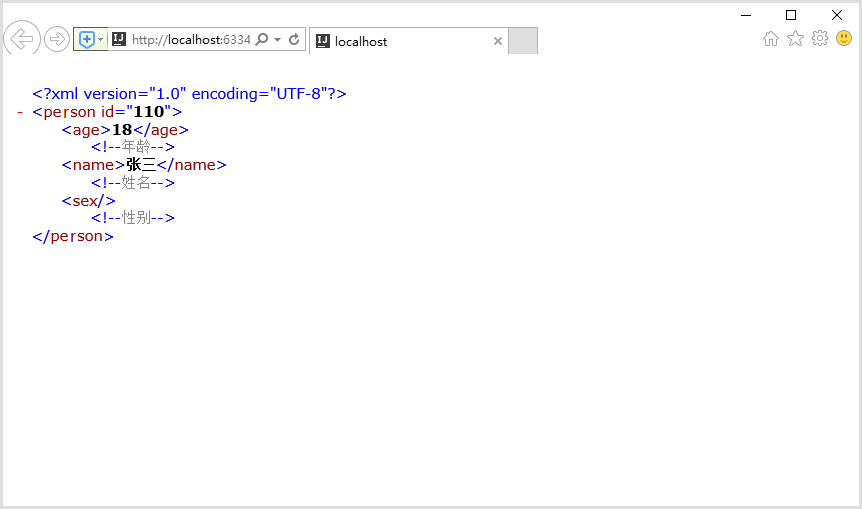
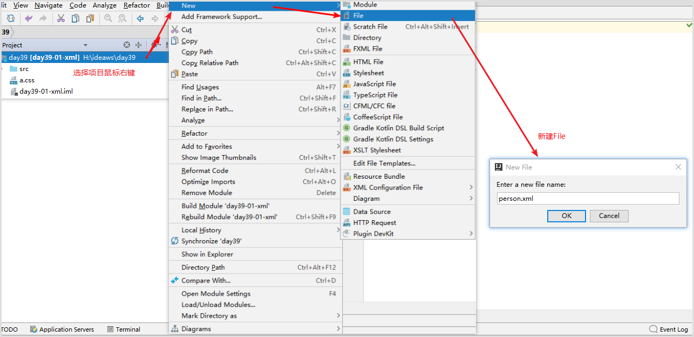
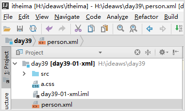
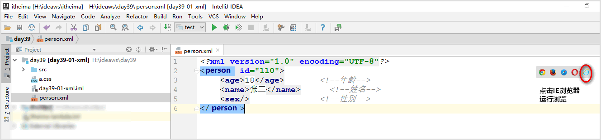
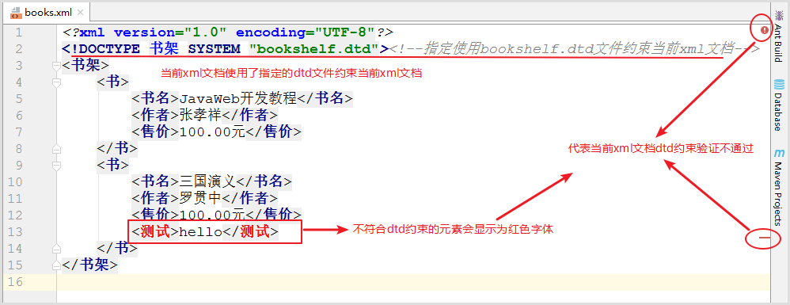
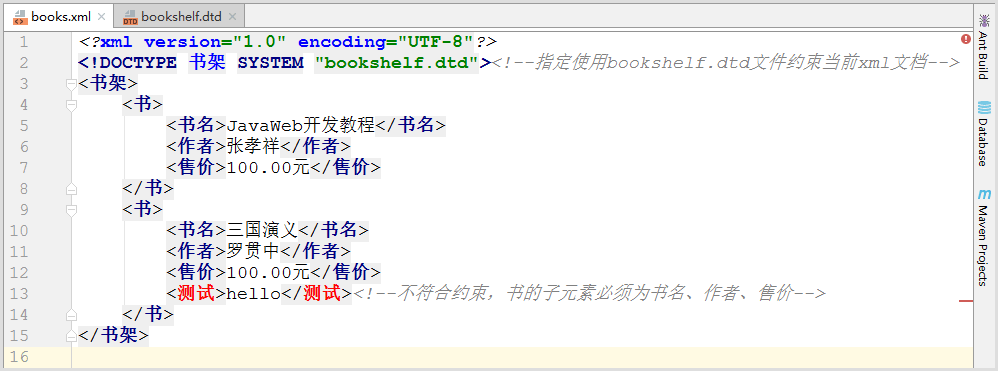
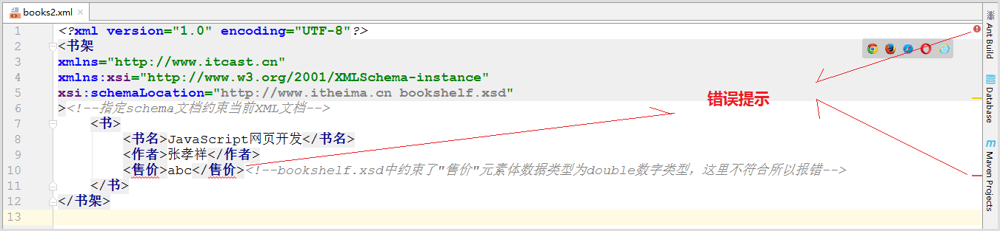
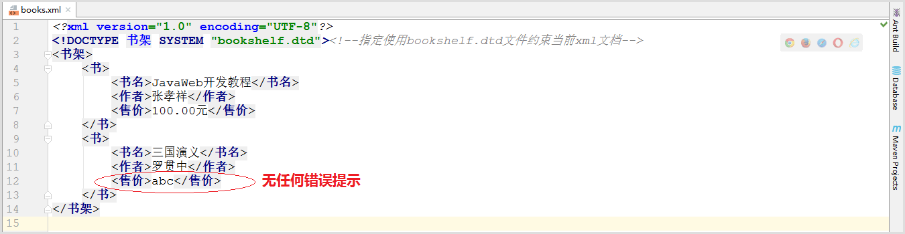
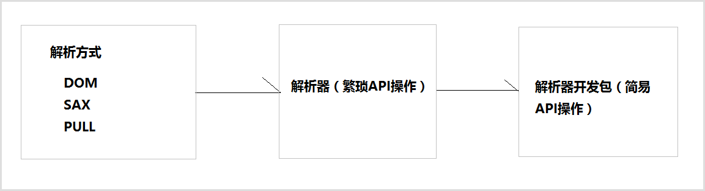
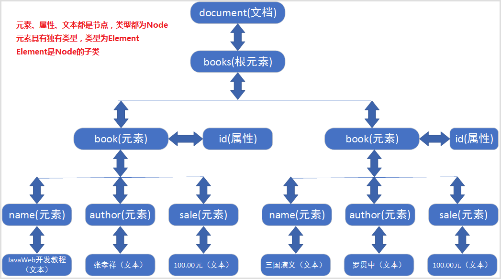

# day13 XML和Dom4j

# 学习目标

- [ ] 能够说出XML的作用
- [ ] 了解XML的组成元素
- [ ] 能够说出有哪些XML约束技术
- [ ] 能够说出解析XML文档DOM方式原理
- [ ] 能够使用dom4j解析XML文档
- [ ] 能够使用xpath解析XML或HTML文档
- [ ] 能够理解正则表达式的作用
- [ ] 能够使用正则表达式的字符类
- [ ] 能够使用正则表达式的逻辑运算符
- [ ] 能够使用正则表达式的预定义字符类
- [ ] 能够使用正则表达式的限定符
- [ ] 能够使用正则表达式的分组
- [ ] 能够在String的split方法中使用正则表达式

# 第一章 XML

## 1.1 XML介绍

### 1.1.1 什么是XML

- XML 指可扩展标记语言（**EXtensible Markup Language**）
- XML 是一种**标记语言**，很类似 HTML，HTML文件也是XML文档
- XML 的设计宗旨是**传输数据**，而非显示数据
- XML 标签没有被预定义。您需要**自行定义标签**。
- XML 被设计为具有**自我描述性(就是易于阅读)**。
- XML 是 **W3C 的推荐标准**

  W3C在1988年2月发布1.0版本，2004年2月又发布1.1版本，单因为1.1版本不能向下兼容1.0版本，所以1.1没有人用。同时，在2004年2月W3C又发布了1.0版本的第三版。我们要学习的还是1.0版本。

### 1.1.2 XML 与 HTML 的主要差异

- XML 不是 HTML 的替代。
- XML 和 HTML 为不同的目的而设计。
- XML 被设计为传输和存储数据，其焦点是数据的内容。
- HTML 被设计用来显示数据，其焦点是数据的外观。
- HTML 旨在显示信息，而 XML 旨在传输信息。

### 1.1.3 XML文件案例编写person.xml文件

#### 1.1.3.1 需求

​	编写xml文档，用于描述人员信息，person代表一个人员，id是人员的属性代表人员编号。人员信息包括age年龄、name姓名、sex性别信息。

#### 1.1.3.2 效果

使用浏览器运行person.xml文件效果如下



#### 1.1.3.3 实现步骤

步骤1：使用idea开发工具，选择当前项目鼠标右键新建“”，如图





步骤2：编写文件person.xml文件，内容如下：

```xml
<?xml version="1.0" encoding="UTF-8"?>
<person id="110">
	<age>18</age>		<!--年龄-->
	<name>张三</name>	  <!--姓名-->
	<sex/>				<!--性别-->
</person>
```

步骤3：如图点击浏览器运行



步骤4：浏览器运行效果如下


## 1.2 XML作用

XML在企业开发中主要有两种应用场景：

1）XML可以存储数据 , 作为数据交换的载体(使用XML格式进行数据的传输)。

2）XML也可以作为配置文件，例如后面框架阶段我们学习的Spring框架的配置(applicationContext.xml)都是通过XML进行配置的（企业开发中经常使用的）

## 1.3 XML的组成元素

XML文件中常见的组成元素有:文档声明、元素、属性、注释、转义字符、字符区。

### 1.3.1 文档声明

```xml
<?xml version="1.0" encoding="utf-8" ?>
```

1. 使用IDE创建xml文件时就带有文档声明.
2. 文档声明必须为<?xml开头，以？>结束
3. 文档声明必须从文档的0行0列位置开始
4. 文档声明中常见的两个属性：
   - version：指定XML文档版本。必须属性，这里一般选择1.0；
   - enconding：指定当前文档的编码，可选属性，默认值是utf-8；

### 1.3.2 元素element

```xml
格式1:<person></person>
格式2:<person/>
```

1. 元素是XML文档中最重要的组成部分；
2. 普通元素的结构由开始标签、元素体、结束标签组成。
3. 元素体：元素体可以是元素，也可以是文本，例如：``<person><name>张三</name></person>``
4. 空元素：空元素只有标签，而没有结束标签，但元素必须自己闭合，例如：``<sex/>``
5. 元素命名
   - 区分大小写
   - 不能使用空格，不能使用冒号
   - 不建议以XML、xml、Xml开头
6. 格式化良好的XML文档，有且仅有一个根元素。

### 1.3.3 属性

```xml
<person id="110">
```

1. 属性是元素的一部分，它必须出现在元素的开始标签中
2. 属性的定义格式：属性名=“属性值”，其中属性值必须使用单引或双引号括起来
3. 一个元素可以有0~N个属性，但一个元素中不能出现同名属性
4. 属性名不能使用空格 , 不要使用冒号等特殊字符，且必须以字母开头

### 1.3.4 注释

```xml
<!--注释内容-->
```

XML的注释与HTML相同，既以``<!--``开始，``-->``结束。

### 1.3.5 转义字符

​	XML中的转义字符与HTML一样。因为很多符号已经被文档结构所使用，所以在元素体或属性值中想使用这些符号就必须使用转义字符（也叫实体字符），例如：">"、"<"、"'"、"""、"&"。

|  字符  |  预定义的转义字符   |  说明  |
| :--: | :---------: | :--: |
|  <   |  ``&lt;``   |  小于  |
|  >   |  `` &gt;``  |  大于  |
|  "   | `` &quot;`` | 双引号  |
|  '   | `` &apos;`` | 单引号  |
|  &   | `` &amp;``  |  和号  |

*注意：严格地讲，在 XML 中仅有字符 "<"和"&" 是非法的。省略号、引号和大于号是合法的，但是把它们替换为实体引用是个好的习惯。*

转义字符应用示例：

​	假如您在 XML 文档中放置了一个类似 "<" 字符，那么这个文档会产生一个错误，这是因为解析器会把它解释为新元素的开始。因此你不能这样写：

```xml
<message>if salary < 1000 then</message>
```

为了避免此类错误，需要把字符 "<" 替换为实体引用，就像这样：

```xml
<message>if salary &lt; 1000 then</message>
```

### 1.3.6 字符区(了解)

```xml
<![CDATA[
	文本数据
]]>
```

1.  CDATA 指的是不应由 XML 解析器进行解析的文本数据（Unparsed Character Data）
2.  CDATA 部分由 "<![CDATA[" 开始，由 "]]>" 结束；
3.  当大量的转义字符出现在xml文档中时，会使XML文档的可读性大幅度降低。这时如果使用CDATA段就会好一些。

*注意：*

​	CDATA 部分不能包含字符串 "]]>"。也不允许嵌套的 CDATA 部分。

​	标记 CDATA 部分结尾的 "]]>" 不能包含空格或折行。

## 1.4 XML文件的约束

在XML技术里，可以编写一个文档来约束一个XML文档的书写规范，这称之为XML约束。

常见的xml约束：DTD、Schema

> 注意:我们对于约束的要求是能通过已写好的约束文件编写xml文档.

### 1.4.1 DTD约束

#### 1.4.1.1 概念

​	DTD是文档类型定义（Document Type Definition）。DTD 可以定义在 XML 文档中出现的元素、这些元素出现的次序、它们如何相互嵌套以及XML文档结构的其它详细信息。

#### 1.4.1.2 约束体验

体验效果说明：当编写xml文档时不符合指定dtd约束时，进行提示xml编写错误，如下图：



体验步骤:

步骤1：复制bookshelf.dtd文件

步骤2：bookshelf.dtd文件内容如下

```dtd
<!ELEMENT 书架 (书+)>
<!ELEMENT 书 (书名,作者,售价)><!--约束元素书的子元素必须为书名、作者、售价-->
<!ELEMENT 书名 (#PCDATA)>
<!ELEMENT 作者 (#PCDATA)>
<!ELEMENT 售价 (#PCDATA)>
```

步骤三：新建books.xml，代码如下

```xml
<?xml version="1.0" encoding="UTF-8"?>
<!DOCTYPE 书架 SYSTEM "bookshelf.dtd"><!--指定使用bookshelf.dtd文件约束当前xml文档-->
<书架>
    <书>
        <书名>JavaWeb开发教程</书名>
        <作者>张孝祥</作者>
        <售价>100.00元</售价>
    </书>
    <书>
        <书名>三国演义</书名>
        <作者>罗贯中</作者>
        <售价>100.00元</售价>
        <测试>hello</测试><!--不符合约束，书的子元素必须为书名、作者、售价-->
    </书>
</书架>
```

步骤四：idea开发工具books.xml的dtd约束验证不通过的效果如下



#### 1.4.1.3 dtd学习要求

​	在企业实际开发中，我们很少自己编写DTD约束文档，通常情况下通过框架提供的DTD约束文档编写对应的XML文档。所以这一知识点的要求是可以根据DTD约束文档内容编写XML文档。

#### 1.4.1.4 语法(了解)

#####文档声明(了解)

1. 内部DTD，在XML文档内部嵌入DTD，只对当前XML有效。

   ```xml
   <?xml version="1.0" encoding="UTF-8"?>
   <!DOCTYPE 根元素 [...//具体语法]><!--内部DTD-->
   <根元素>
   </根元素>
   ```

2. 外部DTD—本地DTD，DTD文档在本地系统上，企业内部自己项目使用。

   ```xml
   <?xml version="1.0" encoding="UTF-8"?>
   <!DOCTYPE 根元素 SYSTEM "bookshelf.dtd"><!--外部本地DTD-->
   <根元素>
   </根元素>
   ```

3. 外部DTD—公共DTD，DTD文档在网络上，一般都有框架提供 , 也是我们使用最多的.

   ```xml
   <?xml version="1.0" encoding="UTF-8"?>
   <!DOCTYPE web-app PUBLIC "-//Sun Microsystems, Inc.//DTD Web Application 2.3//EN" "http://java.sun.com/dtd/web-app_2_3.dtd">
   <web-app>
   </web-app>
   ```

##### 元素声明(了解)

1. 约束元素的嵌套层级

   语法

   ```
   <!ELEMENT 父标签 （子标签1，子标签2，…）>
   ```

   代码

   ```dtd
   <!ELEMENT 书架 (书+)>  <!--约束根元素是"书架"，"书架"子元素为"书"，“+”为数量词，请看下面介绍-->
   <!ELEMENT 书 (书名,作者,售价)><!--约束"书"子元素依次为“书名”、“作者”、“售价”，“+”书元素至少1次-->
   ```

2. 约束元素体里面的数据

   语法

   ```
   <!ELEMENT 标签名字 标签类型>
   ```

   标签类型

   | 标签类型   | 代码写法      | 说明            |
   | ------ | --------- | ------------- |
   | PCDATA | (#PCDATA) | 被解释的字符串数据     |
   | EMPTY  | EMPTY     | 即空元素，例如\<hr/> |
   | ANY    | ANY       | 即任意类型         |

   代码

   ```dtd
   <!ELEMENT 书名 (#PCDATA)>  	<!--"书名"元素体为字符串数据-->
   <!ELEMENT 作者 (#PCDATA)>		<!--"作者"元素体为字符串数据-->
   <!ELEMENT 售价 (#PCDATA)>		<!--"售价"元素体为字符串数据-->
   <!ELEMENT 出版日期 ANY>		   <!--"出版日期"元素体为任意类型-->
   <!ELEMENT 版本号 EMPTY>		<!--"版本号"元素体为空元素-->
   ```

3. **数量词(掌握)**

   | 数量词符号 | 含义             |
   | ----- | -------------- |
   | *     | 表示元素可以出现0到多个   |
   | +     | 表示元素可以出现至少1个   |
   | ?     | 表示元素可以是0或1个    |
   | ,     | 表示元素需要按照顺序显示   |
   | \|    | 表示元素需要选择其中的某一个 |

##### 属性声明(了解)

语法

```dtd
<!ATTLIST 标签名称 
		属性名称1 属性类型1 属性说明1
		属性名称2 属性类型2 属性说明2
		…
>
```

属性类型

| 属性类型       | 含义                                       |
| ---------- | ---------------------------------------- |
| CDATA      | 代表属性是文本字符串， eg:<!ATTLIST 属性名 CDATA 属性说明> |
| ID         | 代码该属性值唯一，不能以数字开头， eg:<!ATTLIST 属性名 ID 属性说明> |
| ENUMERATED | 代表属性值在指定范围内进行枚举 Eg:<!ATTLIST属性名 (社科类\|工程类\|教育类) "社科类"> "社科类"是默认值，属性如果不设置默认值就是"社科类" |

属性说明

| 属性说明      | 含义                                       |
| --------- | ---------------------------------------- |
| #REQUIRED | 代表属性是必须有的                                |
| #IMPLIED  | 代表属性可有可无                                 |
| #FIXED    | 代表属性为固定值，实现方式：book_info CDATA #FIXED "固定值" |

代码

```dtd
<!ATTLIST 书									<!--设置"书"元素的的属性列表-->
		id ID #REQUIRED						 <!--"id"属性值为必须有-->
		编号 CDATA #IMPLIED				    <!--"编号"属性可有可无-->
		出版社 (清华|北大|传智播客) "传智播客"   <!--"出版社"属性值是枚举值，默认为“传智播客”-->
		type CDATA #FIXED "IT"                <!--"type"属性为文本字符串并且固定值为"IT"-->
>
```

### 1.4.2 schema约束

#### 1.4.2.1 概念

Schema 语言也可作为 XSD（XML Schema Definition）。

Schema 比DTD强大，是DTD代替者。

Schema 本身也是XML文档，单Schema文档扩展名为xsd，而不是xml。

Schema 功能更强大，数据类型约束更完善。

#### 1.4.2.1 约束体验

体验效果说明：体验schema约束XML文档中对元素体数据类型的约束。效果如下：



DTD约束无法对具体数据类型进行约束,所以开发工具没有任何错误提示，如下效果：



实现步骤

步骤1：复制schema约束文件bookshelf.xsd，其中已对售价约束了数据类型，代码如下

```scheme
<?xml version="1.0" encoding="UTF-8" ?>
<!--
	传智播客DTD教学实例文档.将注释中的以下内容复制到要编写的xml的声明下面
	复制内容如下:
	<书架 xmlns="http://www.itcast.cn"
		  xmlns:xsi="http://www.w3.org/2001/XMLSchema-instance"
		  xsi:schemaLocation="http://www.itcast.cn bookshelf.xsd"
    >
 -->
<xs:schema xmlns:xs="http://www.w3.org/2001/XMLSchema"
           targetNamespace="http://www.itcast.cn"
           elementFormDefault="qualified">
        <xs:element name='书架' >
                <xs:complexType>
                        <xs:sequence maxOccurs='unbounded' >
                                <xs:element name='书' >
                                        <xs:complexType>
                                                <xs:sequence>
                                                     <xs:element name='书名' type='xs:string' />
                                                     <xs:element name='作者' type='xs:string' />
                                                     <xs:element name='售价' type='xs:double' />
                                                </xs:sequence>
                                        </xs:complexType>
                                </xs:element>
                        </xs:sequence>
                </xs:complexType>
        </xs:element>
</xs:schema>

```

步骤2：新建books2.xml使用schema约束文件bookshelf.xsd，代码如下

```xml
<?xml version="1.0" encoding="UTF-8"?>
<书架
xmlns="http://www.itcast.cn"
xmlns:xsi="http://www.w3.org/2001/XMLSchema-instance"
xsi:schemaLocation="http://www.itcast.cn bookshelf.xsd"
><!--指定schema文档约束当前XML文档-->
    <书>
        <书名>JavaScript网页开发</书名>
        <作者>张孝祥</作者>
        <售价>abc</售价>
    </书>
</书架>
```

步骤3：开发工具提示效果


#### 1.4.2.2 名称空间

​	一个XML文档最多可以使用一个DTD文件,但一个XML文档中使用多个Schema文件，若这些Schema文件中定义了相同名称的元素时,使用的时候就会出现名字冲突。这就像一个Java文件中使用了`import java.util.*`和`import java.sql.*`时，在使用Date类时，那么就不明确Date是哪个包下的Date了。同理 , 在XML文档中就需要通过名称空间(namespace)来区分元素和属性是来源于哪个约束中的。名称空间就在在根元素后面的内容 , 使用xmlns到引入约束 。

​	当一个XML文档中需要使用多个Schema文件的时候 , 有且仅有一个使用缺省的 , 其他的名称空间都需要起别名 。参考资料中的 applicationContext.xml文件(spring框架的配置文件)

```schema
 xmlns="http://www.itcast.cn"    
 	<!-- 缺省的名称空间.使用此约束中的元素的时候只需要写元素名即可 例如:<书></书> -->
 
 xmlns:aa="http://java.sun.com"
 	<!-- aa就是此约束的别名,使用此约束中的元素的时候就需要加上别名 例如:<aa:书></aa:书> -->
```

​	总之名称空间就是用来处理元素和属性的名称冲突问题，与Java中的包是同一用途。如果每个元素和属性都有自己的名称空间，那么就不会出现名字冲突问题，就像是每个类都有自己所在的包一样，那么类名就不会出现冲突。

#### 1.4.2.3 schema学习要求

​	虽然schema功能比dtd强大，但是编写要比DTD复杂，同样以后我们在企业开发中也很少会自己编写schema文件。

​	xml编写与约束内容已经完成了，根据xml的作用我们了解到，无论是xml作为配置文件还是数据传输，我们的程序都要获取xml文档中的数据以便我们进行具体的业务操作，接下来我们就要学习XML解析技术Dom4j。

# 第二章 Dom4j

## 2.1 XML解析

### 2.1.1 解析概述

​	当将数据存储在XML后，我们就希望通过程序获取XML的内容。如果我们使用Java基础所学的IO知识是可以完成的，不过你学要非常繁琐的操作才可以完成，且开发中会遇到不同问题（只读、读写）。人们为不同问题提供不同的解析方式，使用不同的解析器进行解析，方便开发人员操作XML。

### 2.1.2 解析方式和解析器

- 开发中比较常见的解析方式有三种，如下：

  1. DOM：要求解析器把整个XML文档装载到内存，并解析成一个Document对象

     a）优点：元素与元素之间保留结构关系，故可以进行增删改查操作。

     b）缺点：XML文档过大，可能出现内存溢出

  2. SAX：是一种速度更快，更有效的方法。她逐行扫描文档，一边扫描一边解析。并以事件驱动的方式进行具体解析，没执行一行，都触发对应的事件。（了解）

     a）优点：处理速度快，可以处理大文件

     b）缺点：只能读，逐行后将释放资源，解析操作繁琐。

  3. PULL：Android内置的XML解析方式，类似SAX。（了解）

- 解析器，就是根据不同的解析方式提供具体实现。有的解析器操作过于繁琐，为了方便开发人员，有提供易于操作的解析开发包

  

- 常见的解析开发包

  - JAXP：sun公司提供支持DOM和SAX开发包
  - Dom4j：比较简单的的解析开发包(常用)
  - JDom：与Dom4j类似
  - Jsoup：功能强大DOM方式的XML解析开发包，尤其对HTML解析更加方便(项目中讲解)

## 2.3 Dom4j的基本使用

### 2.3.1 DOM解析原理及结构模型

- 解析原理

  XML DOM 和 HTML DOM一样，XML DOM 将整个XML文档加载到内存，生成一个DOM树，并获得一个Document对象，通过Document对象就可以对DOM进行操作。以下面books.xml文档为例。

  ```xml
  <?xml version="1.0" encoding="UTF-8"?>
  <books>
      <book id="0001">
          <name>JavaWeb开发教程</name>
          <author>张孝祥</author>
          <sale>100.00元</sale>
      </book>
      <book id="0002">
          <name>三国演义</name>
          <author>罗贯中</author>
          <sale>100.00元</sale>
      </book>
  </books>
  ```

- 结构模型

  

  DOM中的核心概念就是节点，在XML文档中的元素、属性、文本，在DOM中都是节点！所有的节点都封装到了Document对象中。

- 引入dom4j的jar包

  需要引入“jar/dom4j-1.6.1.jar” , 在IDEA中，选择项目鼠标右键--->弹出菜单-->open Module settings”-->Dependencies-->+-->JARs or directories...   

  找到dom4j-1.6.1.jar,成功添加之后点击"OK" 即可.

  


- dom4j 必须使用核心类SaxReader加载xml文档获得Document，通过Document对象获得文档的根元素，然后就可以操作了。

### 2.3.2 常用的方法

#### SaxReader对象

| 方法                        | 作用        |
| ------------------------- | --------- |
| new SaxReader()           | 构造器       |
| Document read(String url) | 加载执行xml文档 |

#### Document对象

| 方法                       | 作用    |
| ------------------------ | ----- |
| Element getRootElement() | 获得根元素 |

#### Element对象

| 方法                                     | 作用                   |
| -------------------------------------- | -------------------- |
| List elements([String ele] )           | 获得指定名称的所有子元素。可以不指定名称 |
| Element element([String ele])          | 获得指定名称第一个子元素。可以不指定名称 |
| String getName()                       | 获得当前元素的元素名           |
| String attributeValue(String attrName) | 获得指定属性名的属性值          |
| String elementText(Sting ele)          | 获得指定名称子元素的文本值        |
| String getText()                       | 获得当前元素的文本内容          |

### 2.3.3 方法演示

复制资料下的常用xml中"books.xml",内容如下:

```xml
<?xml version="1.0" encoding="UTF-8"?>
<books>
    <book id="0001">
        <name>JavaWeb开发教程</name>
        <author>张孝祥</author>
        <sale>100.00元</sale>
    </book>
    <book id="0002">
        <name>三国演义</name>
        <author>罗贯中</author>
        <sale>100.00元</sale>
    </book>
</books>
```

> 注意:为了便于解析,此xml中没有添加约束

解析此文件,获取每本书的id值,以及书本名称,作者名称和价格.

```java
public class Demo {
    public static void main(String[] args) throws DocumentException {
        SAXReader reader = new SAXReader();
        Document document = reader.read(Demo.class.getResourceAsStream("/books.xml"));
        //获取根元素 books
        Element elemRoot = document.getRootElement();

        //获取根元素的所有子元素 book
        List<Element>list = elemRoot.elements();
        //遍历集合 获取每一个book
        for(Element element : list){
            //获取book的id属性
            String id =element.attributeValue("id");
            System.out.println("id : "+ id);

            //获取book下的所有子元素 name,author,sale
            List<Element>listElem = element.elements();
            //遍历集合 获取每一个子元素
            for(Element elem : listElem){
                //元素名
                String name = elem.getName();
                //文本值
                String text = elem.getText();
                System.out.println("--- " + name + " : " + text);
            }
        }
    }
}
```

## 2.4 Dom4J结合XPath解析XML

### 2.4.1 介绍

​	XPath 使用路径表达式来选取HTML 文档中的元素节点或属性节点。节点是通过沿着路径 (path) 来选取的。XPath在解析HTML文档方面提供了一独树一帜的路径思想。

### 2.4.2 XPath使用步骤

步骤1：导入jar包(dom4j和jaxen-1.1-beta-6.jar)

步骤2：通过dom4j的SaxReader获取Document对象

步骤3： 利用Xpath提供的api,结合xpaht的语法完成选取XML文档元素节点进行解析操作。

document常用的api

| 方法                               | 作用           |
| -------------------------------- | ------------ |
| List<Element> selectNodes("表达式") | 获取符合表达式的元素集合 |
| Element selectSingleNode("表达式")  | 获取符合表达式的唯一元素 |
### 2.4.3 XPath语法(了解)

- XPath表达式，就是用于选取HTML文档中节点的表达式字符串。

  获取XML文档节点元素一共有如下4种XPath语法方式：

  1. 绝对路径表达式方式	     例如: /元素/子元素/子子元素...
  2. 相对路径表达式方式          例如: 子元素/子子元素..  或者 ./子元素/子子元素..
  3. 全文搜索路径表达式方式  例如: //子元素//子子元素
  4. 谓语（条件筛选）方式      例如: //元素[@attr1=value]


- 获取不同节点语法

  | 获取类型   | 语法代码  |
  | ------ | ----- |
  | 获取元素节点 | 元素名称  |
  | 获取属性节点 | @属性名称 |

#### 2.4.3.1 绝对路径表达式(了解)

- 绝对路径介绍

  格式：	String xpath="/元素/子元素/子子元素...";

  ​		绝对路径是以“/”开头，一级一级描述标签的层级路径就是绝对路径，***这里注意不可以跨层级***

  ​		绝对路径是从根元素开始写路径的，***这里开头的“/”代表HTML文档根元素***，所以在绝对路径中不可以写根元素路径


- 演示需求(解析XML文档为"资料\常用xml文件\index.html")

  ```
  需求：采用绝对路径获取从根节点开始逐层的html/body/div/ul/li节点列表并打印信息
  ```
#### 2.4.3.2 相对路径表达式(了解)

- 相对路径介绍

  格式：	String xpath1="子元素/子子元素...";//获取相对当前路径元素里面的子元素的选取

  ​		String xpath2="./子元素/子子元素";//"./"代表当前元素路径位置

  ​                String xpath3="/子元素/子子元素";//功能与xpath1格式功能一样

  ​		相对路径就是相对当前节点元素位置继续查找节点，需要使用JXNode.sel（xpath）进行执行相对路径表达式。

#### 2.4.3.3 全文搜索路径表达式(了解)

- 全文搜索路径介绍

  格式：	String xpath1="//子元素//子子元素";

  ​		一个“/”符号，代表逐级写路径

  ​		2个“//”符号，不用逐级写路径，可以直接选取到对应的节点，是全文搜索匹配的不需要按照逐层级

#### 2.4.3.4 谓语（条件筛选 了解）

- 介绍

  谓语，又称为条件筛选方式，就是根据条件过滤判断进行选取节点

  格式：	
  ​	String xpath1="//元素[@attr1=value]";//获取元素属性attr1=value的元素

  ​	String xpath2="//元素[@attr1>value]/@attr1"//获取元素属性attr1>value的d的所有attr1的值

  ​	String xpath3="//元素[@attr1=value]/text()";//获取符合条件元素体的自有文本数据

   	String xpath4="//元素[@attr1=value]/html()";//获取符合条件元素体的自有html代码数据。

  ​	 String xpath3="//元素[@attr1=value]/allText()";//获取符合条件元素体的所有文本数据（包含子元素里面的文本）

### 2.4.4 演示

```java
public class DemoXpath {
    public static void main(String[] args) throws Exception {
        SAXReader reader = new SAXReader();
        Document document = reader.read(Demo.class.getResourceAsStream("/books.xml"));
        //获取所有的book元素
        List<Element> list = document.selectNodes("//book");
        for (Element ele: list) {
            System.out.println(ele.attributeValue("id"));
        }

       //获取id为0002的指定book元素的子标签name的内容
        Element ele = (Element)document.selectSingleNode("//book[@id='0002']/name");
        System.out.println(ele.getText());
    }
}
```


# 第三章 工厂设计模式

## 3.1.工厂模式概述:

​	工厂模式（Factory Pattern）是 Java 中最常用的设计模式之一。这种类型的设计模式属于创建型模式，它提供了一种创建对象的方式。之前我们创建类对象时, 都是使用new 对象的形式创建, 除new 对象方式以外, 工厂模式也可以创建对象。

## 3.2.工厂模式作用:

​	解决类与类之间的耦合问题

## 3.3.工厂模式实现步骤:

1. 编写一个Car接口, 提供run方法
2. 编写一个Falali类实现Car接口,重写run方法
3. 编写一个Benchi类实现Car接口
4. 提供一个CarFactory(汽车工厂),用于生产汽车对象
5. 定义CarFactoryTest测试汽车工厂

## 3.4.工厂模式实现代码:

1.编写一个Car接口, 提供run方法

```java
public interface Car {
    public void run();
}
```

2.编写一个Falali类实现Car接口,重写run方法

```java
public class Falali implements Car {
    @Override
    public void run() {
        System.out.println("法拉利以每小时500公里的速度在奔跑.....");
    }
}
```

3.编写一个Benchi类实现Car接口

```java
public class Benchi implements Car {
    @Override
    public void run() {
        System.out.println("奔驰汽车以每秒1米的速度在挪动.....");
    }
}
```

4.提供一个CarFactory(汽车工厂),用于生产汽车对象

```java
public class CarFactory {
    /**
     * @param id : 车的标识
     *           benchi : 代表需要创建Benchi类对象
     *           falali : 代表需要创建Falali类对象
     *           如果传入的车标识不正确,代表当前工厂生成不了当前车对象,则返回null
     * @return
     */
    public Car createCar(String id){
        if("falali".equals(id)){
            return new Falali();
        }else if("benchi".equals(id)){
            return new Benchi();
        }
        return null;
    }
}
```

5.定义CarFactoryTest测试汽车工厂

```java
public class CarFactoryTest {
    public static void main(String[] args) {
        CarFactory carFactory = new CarFactory();
        Car benchi = carFactory.createCar("benchi");
        benchi.run();
        Car falali = carFactory.createCar("falali");
        falali.run();
    }
}
```

## 3.5.工厂模式小结

工厂模式的存在可以改变创建类的方式,解决类与类之间的耦合.

实现步骤:

1. 编写一个Car接口, 提供run方法
2. 编写一个Falali类实现Car接口,重写run方法
3. 编写一个Benchi类实现Car接口
4. 提供一个CarFactory(汽车工厂),用于生产汽车对象
5. 定义CarFactoryTest测试汽车工厂

# 第四章 装饰设计模式

在我们所学的缓冲流中涉及到java的一种设计模式，叫做装饰模式，我们来认识并学习一下这个设计模式。

## 4.1 装饰模式概述

​	装饰模式指的是在不改变原类, 不使用继承的基础上，动态地扩展一个对象的功能。

## 4.2 案例演示

### 准备环境:

1. 编写一个Star接口, 提供sing 和 dance抽象方法
2. 编写一个LiuDeHua类,实现Star接口,重写抽象方法

```java
public interface Star {
    public void sing();
    public void dance();
}
```

```java
public class LiuDeHua implements Star {
    @Override
    public void sing() {
        System.out.println("刘德华在唱忘情水...");
    }
    @Override
    public void dance() {
        System.out.println("刘德华在跳街舞...");
    }
}
```

### 需求:

​	在不改变原类的基础上对LiuDeHua类的sing方法进行扩展

### 实现步骤:

1. 编写一个LiuDeHuaWarpper类, 实现Star接口,重写抽象方法
2. 提供LiuDeHuaWarpper类的有参构造, 传入LiuDeHua类对象
3. 在LiuDeHuaWarpper类中对需要增强的sing方法进行增强
4. 在LiuDeHuaWarpper类对不需要增强的方法调用LiuDeHua类中的同名方法

### 实现代码如下

LiuDeHua类: 被装饰类。

LiuDeHuaWarpper类: 我们称之为装饰类。

```java
/*
	装饰模式遵循原则:
		装饰类和被装饰类必须实现相同的接口
		在装饰类中必须传入被装饰类的引用
		在装饰类中对需要扩展的方法进行扩展
		在装饰类中对不需要扩展的方法调用被装饰类中的同名方法
*/
public class LiuDeHuaWarpper implements Star {
    // 存放被装饰类的引用
    private LiuDeHua liuDeHua;
    // 通过构造器传入被装饰类对象
    public LiuDeHuaWarpper(LiuDeHua liuDeHua){
        this.liuDeHua = liuDeHua;
    }
    @Override
    public void sing() {
        // 对需要扩展的方法进行扩展增强
        System.out.println("刘德华在鸟巢的舞台上演唱忘情水.");
    }
    @Override
    public void dance() {
        // 不需要增强的方法调用被装饰类中的同名方法
        liuDeHua.dance();
    }
}
```

### 测试结果

```java
public static void main(String[] args) {
    // 创建被装饰类对象
    LiuDeHua liuDeHua = new LiuDeHua();
    // 创建装饰类对象,被传入被装饰类
    LiuDeHuaWarpper liuDeHuaWarpper = new LiuDeHuaWarpper(liuDeHua);
    // 调用装饰类的相关方法,完成方法扩展
    liuDeHuaWarpper.sing();
    liuDeHuaWarpper.dance();
}
```

## 4.3 装饰模式小结

装饰模式可以在不改变原类的基础上对类中的方法进行扩展增强,实现原则为:

1. 装饰类和被装饰类必须实现相同的接口
2. 在装饰类中必须传入被装饰类的引用
3. 在装饰类中对需要扩展的方法进行扩展
4. 在装饰类中对不需要扩展的方法调用被装饰类中的同名方法

# 第五章 commons-io工具包|Base64

## 5.1 commons-io工具包

### 5.1.1  概述

commons-io是apache开源基金组织提供的一组有关IO操作的类库，可以挺提高IO功能开发的效率。commons-io工具包提供了很多有关io操作的类，见下表：

| 包                                  | 功能描述                                     |
| ----------------------------------- | :------------------------------------------- |
| org.apache.commons.io               | 有关Streams、Readers、Writers、Files的工具类 |
| org.apache.commons.io.input         | 输入流相关的实现类，包含Reader和InputStream  |
| org.apache.commons.io.output        | 输出流相关的实现类，包含Writer和OutputStream |
| org.apache.commons.io.serialization | 序列化相关的类                               |

### 5.1.2 使用

步骤：

1. 下载commons-io相关jar包；http://commons.apache.org/proper/commons-io/
2. 把commons-io-2.6.jar包复制到指定的Module的lib目录中
3. 将commons-io-2.6.jar加入到classpath中

### 5.1.3 常用API介绍

- commons-io提供了一个工具类  org.apache.commons.io.IOUtils，封装了大量IO读写操作的代码。其中有两个常用方法：

> 1. public static int copy(InputStream in, OutputStream out)； 把input输入流中的内容拷贝到output输出流中，返回拷贝的字节个数(适合文件大小为2GB以下)
> 2. public static long copyLarge(InputStream in, OutputStream out)；把input输入流中的内容拷贝到output输出流中，返回拷贝的字节个数(适合文件大小为2GB以上)

文件复制案例演示：

```java
 public static void main(String[] args) throws Exception {
     // 文件路径需要修改,改成自己文件的路径
     File file = new File("src/test.txt");
     FileInputStream is = new FileInputStream(file);
	 // 文件路径需要修改
     File file1 = new File("src/test1.txt");
     FileOutputStream os = new FileOutputStream(file1);
     // 文件复制
     IOUtils.copy(is, os);
 }
```

- commons-io还提供了一个工具类org.apache.commons.io.FileUtils，封装了一些对文件操作的方法：

> 1. public static void copyFileToDirectory(final File srcFile, final File destFile) //复制文件到另外一个目录下。
> 2. public static void copyDirectoryToDirectory( file1 , file2 );//复制file1目录到file2位置。

案例演示：

```java
public static void main(String[] args) throws IOException {
		//1.将d:\\视频.itcast文件复制到e:\\下
        FileUtils.copyFileToDirectory(new File("d:\\视频.itcast"), new File("e:\\"));
        //2.将"d:\\多级目录"复制到"e:\\"下。
        FileUtils.copyDirectoryToDirectory(new File("d:\\多级目录"), new File("e:\\"));
    }
```

## 5.2 Base64

### 5.2.1 Base64概述

Base64是网络上最常见的用于传输8Bit字节码的编码方式之一，Base64就是一种基于64个可打印字符来表示二进制数据的方法。

在Java 8中，Base64编码已经成为Java类库的标准。

Java 8 内置了 Base64 编码的编码器和解码器。

Base64工具类提供了一套静态方法获取下面三种BASE64编解码器：

- **基本：**输出被映射到一组字符A-Za-z0-9+/，编码不添加任何行标，输出的解码仅支持A-Za-z0-9+/。
- **URL：**输出映射到一组字符A-Za-z0-9+_，输出是URL和文件。
- **MIME：**输出隐射到MIME友好格式。输出每行不超过76字符，并且使用'\r'并跟随'\n'作为分割。编码输出最后没有行分割。

### 5.2.2 Base64内嵌类和方法描述

**内嵌类**

| 序号 | 内嵌类 & 描述                                                |
| :--- | :----------------------------------------------------------- |
| 1    | **static class Base64.Decoder**该类实现一个解码器用于，使用 Base64 编码来解码字节数据。 |
| 2    | **static class Base64.Encoder**该类实现一个编码器，使用 Base64 编码来编码字节数据 |

**方法**

| 序号 | 方法名 & 描述                                                |
| :--- | :----------------------------------------------------------- |
| 1    | **static Base64.Decoder getDecoder()**返回一个 Base64.Decoder ，解码使用基本型 base64 编码方案。 |
| 2    | **static Base64.Encoder getEncoder()**返回一个 Base64.Encoder ，编码使用基本型 base64 编码方案。 |
| 3    | **static Base64.Decoder getMimeDecoder()**返回一个 Base64.Decoder ，解码使用 MIME 型 base64 编码方案。 |
| 4    | **static Base64.Encoder getMimeEncoder()**返回一个 Base64.Encoder ，编码使用 MIME 型 base64 编码方案。 |
| 5    | **static Base64.Encoder getMimeEncoder(int lineLength, byte[] lineSeparator)**返回一个 Base64.Encoder ，编码使用 MIME 型 base64 编码方案，可以通过参数指定每行的长度及行的分隔符。 |
| 6    | **static Base64.Decoder getUrlDecoder()**返回一个 Base64.Decoder ，解码使用 URL 和文件名安全型 base64 编码方案。 |
| 7    | **static Base64.Encoder getUrlEncoder()**返回一个 Base64.Encoder ，编码使用 URL 和文件名安全型 base64 编码方案。 |

> **注意：**Base64 类的很多方法从 **java.lang.Object** 类继承。

### 5.2.3 Base64代码演示

```java
public static void main(String args[]) {
        try {

            // 使用基本编码
			String base64encodedString = Base64.getEncoder().encodeToString("itheima?java8".getBytes("utf-8"));
            System.out.println("Base64 编码字符串 (基本) :" + base64encodedString);

            // 解码
            byte[] base64decodedBytes = Base64.getDecoder().decode(base64encodedString);
            System.out.println("原始字符串: " + new String(base64decodedBytes, "utf-8"));
            
            // URL
            base64encodedString = Base64.getUrlEncoder().encodeToString("itheima?java8".getBytes("utf-8"));
            System.out.println("Base64 编码字符串 (URL) :" + base64encodedString);

            // MIME
            StringBuilder stringBuilder = new StringBuilder();

            for (int i = 0; i < 10; ++i) {
                stringBuilder.append(UUID.randomUUID().toString());
            }

            byte[] mimeBytes = stringBuilder.toString().getBytes("utf-8");
            String mimeEncodedString = Base64.getMimeEncoder().encodeToString(mimeBytes);
            System.out.println("Base64 编码字符串 (MIME) :" + mimeEncodedString);

        }catch(UnsupportedEncodingException e){
            System.out.println("Error :" + e.getMessage());
        }
    }
```

运行结果：

```java
Base64 编码字符串 (基本) :aXRoZWltYT9qYXZhOA==
原始字符串: itheima?java8
Base64 编码字符串 (URL) :aXRoZWltYT9qYXZhOA==
Base64 编码字符串 (MIME) :ODM1MWI4MzMtZGZmZi00MDAwLTkwNTAtZjUxMjkzODMwY2E2YTVjZmMwN2QtYzM0My00ZjdhLTll
MDktMDFkMWZmZjA0MWRkOTE5Nzk0YzMtNTkyOC00Yjk0LThhYWEtMmIyNmFhN2Y3YzFmY2I2NDNl
ZmEtY2ZmNC00NTU4LWIzZDktZjAzMmE1M2FiOWM1ZDAyMzAyYzktZTM3MS00MDk3LWI2YWEtZTMz
MzZlMjE4NDdkZmEzYTA0NjktYWFhZC00M2ZiLTkzYTQtYTA0ZDIzMjIxY2RiMTMxYTU1MzgtZjZi
OS00NDcyLWJjOTYtZjViODVkNzdkNjMyODNhZTJhNDktZmU0Ni00ZDI5LWI0MDUtZWRkZGFmYjM2
MDliZTcyNWMxY2ItMWE3Ny00NmM4LTk2ZWUtZjBhYjY4YzgwMzU3N2Q3YWFiMTYtNzBjYi00MzNh
LTkxN2UtNzJmNWE0MjQzMGUx
```

# 