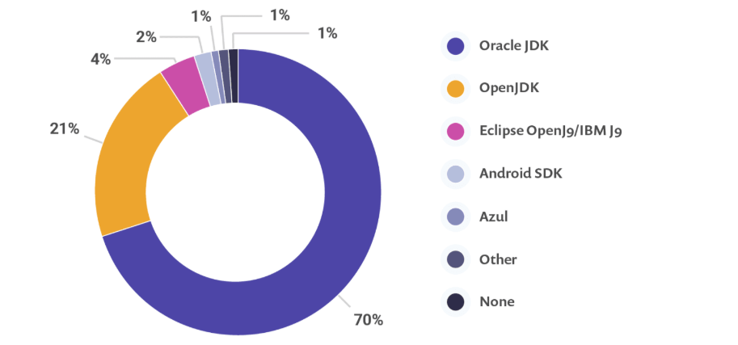
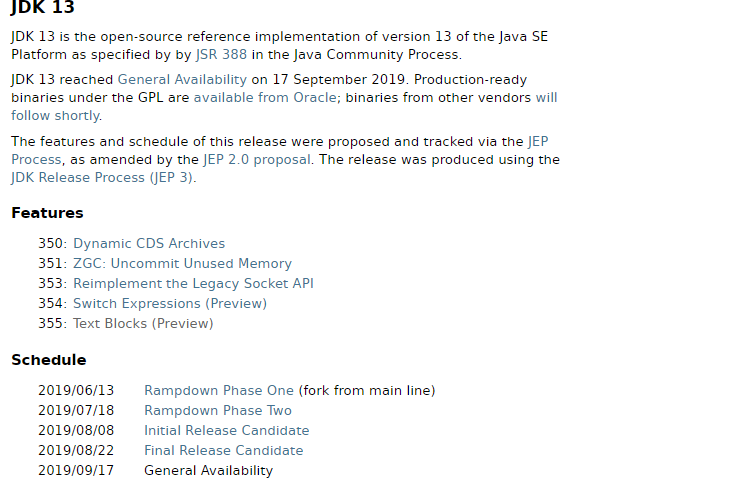

# JDK 13 新特性讲解课程

# 第一章 JDK 13新特性介绍

## 1.1 JDK 各版本主要特性回顾

### JDK Version 1.0

***1996-01-23 Oak(橡树)***

* 初代版本，伟大的一个里程碑，但是是纯解释运行，使用外挂JIT，性能比较差，运行速度慢。

### JDK Version 1.1

*1997-02-19*

* JDBC(Java DataBase Connectivity);
* 支持内部类;
* RMI(Remote Method Invocation) ;
* 反射;
* Java Bean;

### **JDK Version 1.2**

* 集合框架;
* JIT(Just In Time)编译器;
* 对打包的Java文件进行数字签名;
* JFC(Java Foundation Classes), 包括Swing 1.0, 拖放和Java2D类库;
* Java插件;
* JDBC中引入可滚动结果集,BLOB,CLOB,批量更新和用户自定义类型;
* Applet中添加声音支持.
* 同时，Sun发布了 JSP/Servlet、EJB规范，以及将Java分成了 J2EE、J2SE和J2ME。 这表明了 Java开始向企业、桌面
* 应用和移动设备应用3大领域挺进。

### JDK Version 1.3

2000-05-08 Kestrel(红隼)

* Java Sound API;
* jar文件索引;
* 对Java的各个方面都做了大量优化和增强;

### JDK Version 1.4

2004-02-06 Merlin(隼)

* XML处理;
* Java打印服务;
* Logging API;
* Java Web Start;
* JDBC 3.0 API;
* 断言;
* Preferences API;
* 链式异常处理;
* 支持IPV6;
* 支持正则表达式;
* 引入Imgae I/O API.

### JAVA 5

2004-09-30 Tiger(老虎)

* 泛型;
* 增强循环,可以使用迭代方式;
* 自动装箱与自动拆箱;
* 类型安全的枚举;
* 可变参数;
* 静态引入;
* 元数据(注解);
* Instrumentation;

### JAVA 6

2006-12-11 Mustang(野马)

* 支持脚本语言;
* JDBC 4.0API;
* Java Compiler API;
* 可插拔注解;
* 增加对Native PKI(Public Key Infrastructure), Java GSS(Generic Security Service),Kerberos和LDAP(Lightweight Directory Access Protocol)支持;
* 继承Web Services;

### JAVA 7

2011-07-28 Dolphin(海豚)

* switch语句块中允许以字符串作为分支条件;
* 在创建泛型对象时应用类型推断;
* 在一个语句块中捕获多种异常;
* 支持动态语言;
* 支持try-with-resources(在一个语句块中捕获多种异常);
* 引入Java NIO.2开发包;
* 数值类型可以用二进制字符串表示,并且可以在字符串表示中添加下划线;
  钻石型语法(在创建泛型对象时应用类型推断);
* null值得自动处理;

### JAVA 8

**2014-03-18** 

* Lambda 表达式 − Lambda允许把函数作为一个方法的参数（函数作为参数传递进方法中。
* 方法引用 − 方法引用提供了非常有用的语法，可以直接引用已有Java类或对象（实例）的方法或构造器。与lambda联合使用，方法引用可以使语言的构造更紧凑简洁，减少冗余代码。
* 默认方法 − 默认方法就是一个在接口里面有了一个实现的方法。
* 新工具 − 新的编译工具，如：Nashorn引擎 jjs、 类依赖分析器jdeps。
* Stream API −新添加的Stream API（java.util.stream） 把真正的函数式编程风格引入到Java中。
* Date Time API − 加强对日期与时间的处理。
* Optional 类 − Optional 类已经成为 Java 8 类库的一部分，用来解决空指针异常。
* Nashorn, JavaScript 引擎 − Java 8提供了一个新的Nashorn javascript引擎，它允许我们在JVM上运行特定的javascript应用。

### JAVA 9

2017-09-22

* 模块系统：模块是一个包的容器，Java 9 最大的变化之一是引入了模块系统（Jigsaw 项目）。
  REPL (JShell)：交互式编程环境。
* HTTP 2 客户端：HTTP/2标准是HTTP协议的最新版本，新的 HTTPClient API 支持 WebSocket 和 HTTP2 流以及服务器推送特性。
* 改进的 Javadoc：Javadoc 现在支持在 API 文档中的进行搜索。另外，Javadoc 的输出现在符合兼容 HTML5 标准。
* 多版本兼容 JAR 包：多版本兼容 JAR 功能能让你创建仅在特定版本的 Java 环境中运行库程序时选择使用的 class 版本。
* 集合工厂方法：List，Set 和 Map 接口中，新的静态工厂方法可以创建这些集合的不可变实例。
* 私有接口方法：在接口中使用private私有方法。我们可以使用 private 访问修饰符在接口中编写私有方法。
* 进程 API: 改进的 API 来控制和管理操作系统进程。引进 java.lang.ProcessHandle 及其嵌套接口 Info 来让开发者逃离时常因为要获取一个本地进程的 PID 而不得不使用本地代码的窘境。
* 改进的 Stream API：改进的 Stream API 添加了一些便利的方法，使流处理更容易，并使用收集器编写复杂的查询。
* 改进 try-with-resources：如果你已经有一个资源是 final 或等效于 final 变量,您可以在 try-with-resources 语句中使用该变量，而无需在 try-with-resources 语句中声明一个新变量。
* 改进的弃用注解 @Deprecated：注解 @Deprecated 可以标记 Java API 状态，可以表示被标记的 API 将会被移除，或者已经破坏。
* 改进钻石操作符(Diamond Operator) ：匿名类可以使用钻石操作符(Diamond Operator)。
  改进 Optional 类：java.util.Optional 添加了很多新的有用方法，Optional 可以直接转为 stream。
* 多分辨率图像 API：定义多分辨率图像API，开发者可以很容易的操作和展示不同分辨率的图像了。
  改进的 CompletableFuture API ： CompletableFuture 类的异步机制可以在 ProcessHandle.onExit 方法退出时执行操作。
* 轻量级的 JSON API：内置了一个轻量级的JSON API
* 响应式流（Reactive Streams) API: Java 9中引入了新的响应式流 API 来支持 Java 9 中的响应式编程。

### JAVA 10

2018-03-21

根据官网的公开资料，共有12个重要特性，如下：

* JEP286，var 局部变量类型推断。
* JEP296，将原来用 Mercurial 管理的众多 JDK 仓库代码，合并到一个仓库中，简化开发和管理过程
* JEP304，统一的垃圾回收接口。
* JEP307，G1 垃圾回收器的并行完整垃圾回收，实现并行性来改善最坏情况下的延迟。
* JEP310，应用程序类数据 (AppCDS) 共享，通过跨进程共享通用类元数据来减少内存占用空间，和减少启动时间。
* JEP312，ThreadLocal 握手交互。在不进入到全局 JVM 安全点 (Safepoint) 的情况下，对线程执行回调。优化可以只停止单个线程，而不是停全部线程或一个都不停。
* JEP313，移除 JDK 中附带的 javah 工具。可以使用 javac -h 代替。
* JEP314，使用附加的 Unicode 语言标记扩展。
* JEP317，能将堆内存占用分配给用户指定的备用内存设备。
* JEP317，使用 Graal 基于 Java 的编译器，可以预先把 Java 代码编译成本地代码来提升效能。
* JEP318，在 OpenJDK 中提供一组默认的根证书颁发机构证书。开源目前 Oracle 提供的的 Java SE 的根证书，这样 OpenJDK 对开发人员使用起来更方便。
* JEP322，基于时间定义的发布版本，即上述提到的发布周期。版本号为\$FEATURE.\$INTERIM.\$UPDATE.\$PATCH，分j别是大版本，中间版本，升级包和补丁版本。

### JAVA 11

2018-09-25 

翻译后的新特性有：

* 181:Nest-Based访问控制
* 309:动态类文件常量
* 315:改善Aarch64 intrinsic
* 318:无操作垃圾收集器
* 320:消除Java EE和CORBA模块
* 321:HTTP客户端(标准)
* 323:局部变量的语法λ参数
* 324:Curve25519和Curve448关键协议
* 327:Unicode 10
* 328:飞行记录器
* 329:ChaCha20和Poly1305加密算法
* 330:发射一列纵队源代码程序
* 331:低开销堆分析
* 332:传输层安全性(Transport Layer Security,TLS)1.3
* 333:动作:一个可伸缩的低延迟垃圾收集器 (实验)
* 335:反对Nashorn JavaScript引擎
* 336:反对Pack200工具和API

### JAVA 12

2018-09-25 

翻译后的新特性有：

* 189: Shenandoah: A Low-Pause-Time Garbage Collector (Experimental) ：新增一个名为 Shenandoah 的垃圾回收器，它通过在 Java 线程运行的同时进行疏散 (evacuation) 工作来减少停顿时间。
* 230: Microbenchmark Suite：新增一套微基准测试，使开发者能够基于现有的 Java Microbenchmark Harness（JMH）轻松测试 JDK 的性能，并创建新的基准测试。
* 325: Switch Expressions (Preview) ：对 switch 语句进行扩展，使其可以用作语句或表达式，简化日常代码。
* 334: JVM Constants API ：引入一个 API 来对关键类文件 (key class-file) 和运行时工件的名义描述（nominal descriptions）进行建模，特别是那些可从常量池加载的常量。
* 340: One AArch64 Port, Not Two ：删除与 arm64 端口相关的所有源码，保留 32 位 ARM 移植和 64 位 aarch64 移植。
* 341: Default CDS Archives ：默认生成类数据共享（CDS）存档。
* 344: Abortable Mixed Collections for G1 ：当 G1 垃圾回收器的回收超过暂停目标，则能中止垃圾回收过程.
* 346: Promptly Return Unused Committed Memory from G1 ：改进 G1 垃圾回收器，以便在空闲时自动将 Java 堆内存返回给操作系统。


## 1.2 JDK 各版本支持周期


为了更快地迭代，Java的更新从传统的以特性驱动的发布周期，转变为以时间驱动的（6 个月为周期）发布模式 
每半年发布一个大版本，每个季度发布一个中间特性版本，并且承诺不会食言。通过这样的方式，开发团队可以把
些关键特性尽早合并到 JDK 之中，以快速得到开发者反馈，按照官方的说法，新的发布周期会严格遵循时间点，将于每年的3月份和9月份发布。所以 Java 11 的版本号是18.9(LTS，long term support)。Oracle 直到2023年9月都会为 Java 11 提供技术支持，而补丁和安全警告等扩展支持将持续到2026年。新的长期支持版本每三年发布一次，根据后续的发布计划，下一个长期支持版 Java 17 将于2021年发布

## 1.3 目前企业JDK版本使用现状

​		在 JDK 版本的世界里，从来都是 Oracle 发他的新版本，我们继续用我们的老版本。三年之前用 JDK 7，后来终于升级到了 JDK 8。自从升级了没多久，JDK 就开始了半年发一个新版本的节奏，陆续发布了 9 、10、11、12，直到(2019年9月17日)发布了 JDK13。

​		开发人员在生产中为其应用程序使用了哪些产品？我们可以看到Oracle JDK和OpenJDK在其他所有人的主导地位。2018年12月，由 Snyk 和 The Java Magazine 联合推出发布的 [2018 JVM 生态调查报告](https://snyk.io/blog/jvm-ecosystem-report-2018) 显示有 70% 的用户使用 Oracle JDK，21% 的用户使用 OpenJDK。



Java 9中的JDK进行了重大的结构更改，许多人预测这将影响迁移和采用。从结果中我们可以看到（请注意，调查是在Java 10和Java 11发行之间进行的），Java 8仍然是Java的最主要版本-十分之八的受访者表示，他们的主要应用程序在生产中使用了Java 8。同样重要的是，使用更新版本的非Java 8受访者不到一半。2018 JVM 生态调查报告](https://snyk.io/blog/jvm-ecosystem-report-2018)，[其中 Java 8 的使用者占到了 79%。


## 1.4  JDK 13详细概述

​	2019年9月17日，国际知名的OpenJDK开源社区发布了Java编程语言环境的最新版本OpenJDK 13，此次更新是继半年前 Java 12 这大版本发布之后的一次常规版本更新，在这一版中，主要带来了 ZGC 增强、更新 Socket 实现、`Switch` 表达式，文本块更新等方面的改动、增强。

## 1.5 JDK 13 新特性更新列表介绍

```properties
网站：http://openjdk.java.net/projects/jdk/13/
```


​	

## 1.6 启动IDEA创建模块集成JDK 13

* 去官网下载JDK 13
* 下载地址：<https://www.oracle.com/java/technologies/javase-jdk13-downloads.html>
* 启动IDEA创建一个模块集成JDK 13

# 第二章 JDK 13新特性详解

## 2.1 JEP 354 switch表达式（预览）

### 引入

扩展switch分支选择语句的写法。Switch表达式在经过JDK 12的预览之后，在JDK 13中可以继续使用。

### 设计初衷

Java的switch语句是一个变化较大的语法（可能是因为Java的switch语句一直不够强大、熟悉swift或者js语言的同学可与swift的switch语句对比一下，就会发现Java的switch相对较弱），因为Java的很多版本都在不断地改进switch语句：JDK 12扩展了switch语句，使其可以用作语句或者表达式，并且传统的和扩展的简化版switch都可以使用。

JDK 12对于switch的增强主要在于简化书写形式，提升功能点。
下面简单回顾一下switch的进化阶段：

- 从Java 5+开始，Java的switch语句可使用枚举了。
- 从Java 7+开始，Java的switch语句支持使用String类型的变量和表达式了。
- 从Java 11+开始，Java的switch语句会自动对省略break导致的贯穿提示警告。
- 但从JDK12开始，Java的switch语句有了很大程度的增强。
- JDK 13的该JEP是从[JEP 325](https://openjdk.java.net/jeps/325)]演变而来的。

### 以前的switch程序

代码如下：

```java
public class Demo01{
    public static void main(String[] args){
        // 声明变量score，并为其赋值为'C'
        var score = 'C';
        // 执行switch分支语句
        switch (score) {
            case 'A':
                System.out.println("优秀");
                break;
            case 'B':
                System.out.println("良好");
                break;
            case 'C':
                System.out.println("中");
                break;
            case 'D':
                System.out.println("及格");
                break;
            case 'E':
                System.out.println("不及格");
                break;
            default:
                System.out.println("数据非法！");
        }
    }
}
```

这是经典的Java 11以前的switch写法 ，这里不能忘记写break，否则switch就会贯穿、导致程序出现错误（JDK 11会提示警告）。

### JDK 13不需要break了

在JDK 12之前如果switch忘记写break将导致贯穿，在JDK 12对switch的这一贯穿性做了改进。你只要将case后面的冒号（:）改成箭头，那么你即使不写break也不会贯穿了，因此上面程序可改写如下形式：

```java
public class Demo02{
    public static void main(String[] args){
        // 声明变量score，并为其赋值为'C'
        var score = 'C';
        // 执行switch分支语句
        switch (score){
            case 'A' -> System.out.println("优秀");
            case 'B' -> System.out.println("良好");
            case 'C' -> System.out.println("中");
            case 'D' -> System.out.println("及格");
            case 'E' -> System.out.println("不及格");
            default -> System.out.println("成绩数据非法！");
        }
    }
}
```

上面代码简洁很多了。

### JDK 13的switch表达式

JDK 12之后的switch甚至可作为表达式了——不再是单独的语句。例如如下程序。

```java
public class Demo03 {
    public static void main(String[] args) {
		// 声明变量score，并为其赋值为'C'
        var score = 'C';
		// 执行switch分支语句
        String s = switch (score)
                {
                    case 'A' -> "优秀";
                    case 'B' -> "良好";
                    case 'C' -> "中";
                    case 'D' -> "及格";
                    case 'F' -> "不及格";
                    default -> "成绩输入错误";
                };
        System.out.println(s);
    }
}
```

上面程序直接将switch表达式的值赋值给s变量，这样switch不再是一个语句，而是一个表达式.

### JDK 13中switch的多值匹配

当你把switch中的case后的冒号改为箭头之后，此时switch就不会贯穿了，但在某些情况下，程序本来就希望贯穿比如我就希望两个case共用一个执行体！JDK 12之后的switch中的case也支持多值匹配，这样程序就变得更加简洁了。例如如下程序。

```java
public class Demo04
{
    public static void main(String[] args)
    {
// 声明变量score，并为其赋值为'C'
        var score = 'B';
// 执行switch分支语句
        String s = switch (score)
                {
                    case 'A', 'B' -> "上等";
                    case 'C' -> "中等";
                    case 'D', 'E' -> "下等";
                    default -> "成绩数据输入非法！";
                };
        System.out.println(s);
    }
}
```

### JDK 13的Yielding a value

当使用箭头标签时，箭头标签右边可以是表达式、`throw`语句或是代码块。如果是代码块，需要使用`yield`语句来返回值。下面代码中的print方法中的`default`语句的右边是一个代码块。在代码块中使用`yield`来返回值。，JDK 13引入了一个新的`yield`语句来产生一个值，该值成为封闭的switch表达式的值。


```java
public void print(int days) {
  // 声明变量score，并为其赋值为'C'
  var score = 'B';
  String result = switch (score) {
      case 'A', 'B' -> "上等";
      case 'C' -> "中等";
      case 'D', 'E' -> "下等";
      default -> {
          if (score > 100) {
            yield "数据不能超过100";
          } else {
            yield score + "此分数低于0分";
          }
      }
  };
  System.out.println(result);
}
```

​	在`switch`表达式中不能使用`break`。`switch`表达式的每个标签都必须产生一个值，或者抛出异常。`switch`表达式必须穷尽所有可能的值。这意味着通常需要一个`default`语句。一个例外是枚举类型。如果穷尽了枚举类型的所有可能值，则不需要使用`default`。在这种情况下，编译器会自动生成一个`default`语句。这是因为枚举类型中的枚举值可能发生变化。比如，枚举类型`Color` 中原来只有3个值：`RED`、`GREEN`和`BLUE`。使用该枚举类型的`switch`表达式穷尽了3种情况并完成编译。之后`Color`中增加了一个新的值`YELLOW`，当用这个新的值调用之前的代码时，由于不能匹配已有的值，编译器产生的`default`会被调用，告知枚举类型发生改变

### 小结

从以上案例可以看出JDK 12到JDK 13对switch的功能做了很大的改进，代码也十分的简化，目前来看switch依然是不支持区间匹配的，未来是否可以支持，我们拭目以待。

## 2.2 JEP 355 文本块升级（预览）

### 引入

在Java中，在字符串文字中嵌入HTML，XML，SQL或JSON片段`"..."`通常需要先进行转义和串联的大量编辑，然后才能编译包含该片段的代码。该代码段通常难以阅读且难以维护，因此，如果具有一种语言学机制，可以比多行文字更直观地表示字符串，而且可以跨越多行，而且不会出现转义的视觉混乱，那么这将提高广泛Java类程序的可读性和可写性。从JDK 13到JDK 13开始文本块新特性的提出，提高了Java程序书写大段字符串文本的可读性和方便性。

### HTML示例

使用“一维”字符串文字*

```java
String html = "<html>\n" +
              "    <body>\n" +
              "        <p>Hello, world</p>\n" +
              "    </body>\n" +
              "</html>\n";
```

*使用“二维”文本块*

```java
String html = """
              <html>
                  <body>
                      <p>Hello, world</p>
                  </body>
              </html>
              """;
    
System.out.println("""
    Hello,
    itheima
    text blocks!
    """);
```

文本块是Java语言的新语法，可以用来表示任何字符串，具有更高的表达能力和更少的复杂度。文本块的开头定界符是由三个双引号 **"""** 开始，从新的一行开始字符串的内容。这里的新起的这行不属于字符串，只表示内容开始，是语法的一部分。以 **"""** 结束。 **"""** 可以紧跟字符串内容，也可以另起一行。另起一行时，字符串内容最后会留有一新行。

```java
"""
line 1
line 2
line 3
"""
```

等效于字符串文字：

```java
"line 1\nline 2\nline 3\n"
```

或字符串文字的串联：

```java
"line 1\n" +
"line 2\n" +
"line 3\n"
```

如果在字符串的末尾不需要行终止符，则可以将结束定界符放在内容的最后一行。例如，文本块：

```java
"""
line 1
line 2
line 3"""
```

等效于字符串文字：

```java
"line 1\nline 2\nline 3"
```

文本块可以表示空字符串，尽管不建议这样做，因为它需要两行源代码：

```java
String empty = """
""";
```

以下是一些格式错误的文本块的示例：

```java
String a = """""";   // no line terminator after opening delimiter
String b = """ """;  // no line terminator after opening delimiter
String c = """
           ";        // no closing delimiter (text block continues to EOF)
String d = """
           abc \ def
           """;      // unescaped backslash (see below for escape processing)
```

### HTML

使用原始字符串语法：

```java
String html = "<html>\n" +
              "    <body>\n" +
              "        <p>Hello, world</p>\n" +
              "    </body>\n" +
              "</html>\n";
```

使用文本块文本块语法：

```java
String html = """
              <html>
                  <body>
                      <p>Hello, world</p>
                  </body>
              </html>
              """;
```

### SQL

使用原始的字符串语法：

```java
String query = "SELECT `EMP_ID`, `LAST_NAME` FROM `EMPLOYEE_TB`\n" +
               "WHERE `CITY` = 'INDIANAPOLIS'\n" +
               "ORDER BY `EMP_ID`, `LAST_NAME`;\n";
```

使用文本块语法：

```java
String query = """
               SELECT `EMP_ID`, `LAST_NAME` FROM `EMPLOYEE_TB`
               WHERE `CITY` = 'INDIANAPOLIS'
               ORDER BY `EMP_ID`, `LAST_NAME`;
               """;
```

### 多语言示例

使用原始的字符串语法：

```java
ScriptEngine engine = new ScriptEngineManager().getEngineByName("js");
Object obj = engine.eval("function hello() {\n" +
                         "    print('\"Hello, world\"');\n" +
                         "}\n" +
                         "\n" +
                         "hello();\n");
```

使用文本块语法：

```java
ScriptEngine engine = new ScriptEngineManager().getEngineByName("js");
Object obj = engine.eval("""
                         function hello() {
                             print('"Hello, world"');
                         }
                         
                         hello();
                         """);
```

### 缩进

java编译器会自动删除不需要的缩进：

- 每行结尾的空格都会删除
- 每行开始的共有的空格会自动删除
- 只保留相对缩进。

```python
System.out.println("""
    Hello,
    itheima
    text blocks!
    """);
// 结果
// > Hello,
// > itheima
// > text blocks!
// >

System.out.println("""
    Hello,
      itheima
    text blocks!
    """);
// 结果
// > Hello,
// >   itheima
// > text blocks!
// >
```

- 新行 **"""** 结束时，将 **"""** 向左调整，则可以给所有行前加相应数量的空格。将 **"""** 向右调整，没有作用。

```python
System.out.println("""
        Hello,
        multiline
        text blocks!
    """);
// 结果
// >     Hello,
// >     multiline
// >     text blocks!
```

## 2.3 JEP 350  动态类数据共享归档

**作用：允许在Java应用程序执行结束时动态归档类。归档的类将包括默认基层CDS归档中不存在的所有已加载应用程序类和库类。**

CDS，是java 12的特性了，可以让不同 Java 进程之间共享一份类元数据，减少内存占用，它还能加快应用的启动速度。而JDK13的这个特性支持在Java application执行之后进行动态archive。存档类将包括默认的基础层CDS存档中不存在的所有已加载的应用程序和库类。也就是说，在Java 13中再使用AppCDS的时候，就不再需要这么复杂了。该提案处于目标阶段，旨在提高AppCDS的可用性，并消除用户进行试运行以创建每个应用程序的类列表的需要。

### 目标

JDK13这次对CDS增强的主要目的

- 改善AppCDS的可用性，减少用户每次都要创建一个类列表的需要
- 通过开启， `-Xshare:dump` 选项来开启静态归档，使用类列表仍然行得通。会包含内置的类加载信息和用户定义的类加载信息

### 意义

在JDK13中做的增强，可以只开启命令行选项完成上面过程，在程序运行的时候，动态评估那些类需要归档，同时支持内置的类加载器和用户定义的类加载器。

在第一次程序执行完成之后，会自动的将类进行归档，后续在启动项目的时候也无需指定要使用哪些归档，整个过程看起来更加的透明。

## 2.4 JEP 351 ZGC 增强： ZGC 释放未使用内存

### 目标

**作用：将未使用的堆内存还给系统（即未提交的内存空间）**

### 详解

ZGC 是 Java 11 中引入的最为瞩目的垃圾回收特性，是一种可伸缩、低延迟的垃圾收集器，不过在 Java 11 中是实验性的引入，主要用来改善 GC 停顿时间，并支持几百 MB 至几个 TB 级别大小的堆，并且应用吞吐能力下降不会超过 15%，目前只支持 Linux/x64 位平台的这样一种新型垃圾收集器。

通过在实际中的使用，发现 ZGC 收集器中并没有像 Hotspot 中的 G1 和 Shenandoah 垃圾收集器一样，能够主动将未使用的内存释放给操作系统的功能。对于大多数应用程序来说，CPU 和内存都属于有限的紧缺资源，特别是现在使用的云上或者虚拟化环境中。如果应用程序中的内存长期处于空闲状态，并且还不能释放给操作系统，这样会导致其他需要内存的应用无法分配到需要的内存，而这边应用分配的内存还处于空闲状态，处于"忙的太忙，闲的太闲"的非公平状态，并且也容易导致基于虚拟化的环境中，因为这些实际并未使用的资源而多付费的情况。由此可见，将未使用内存释放给系统主内存是一项非常有用且亟需的功能。

Java 13 中对 ZGC 的改进，主要体现在下面几点：

- 释放未使用内存给操作系统
- 支持最大堆大小为 16TB

Java 13 中，ZGC 内存释放功能，默认情况下是开启的，不过可以使用参数：`-XX：-ZUncommit` 显式关闭。

## 2.5 JEP 353 重新实现旧版Socket API

### 引入

现在已有的 java.net.Socket 和 java.net.ServerSocket 以及它们的实现类，都可以回溯到 JDK 1.0 时代了。原始socket的维护和调试都很痛苦。实现类还使用了线程栈作为 I/O 的缓冲，导致在某些情况下还需要增加线程栈的大小。该实现还存在几个并发问题，需要彻底解决。在未来的网络世界，要快速响应，不能阻塞本地方法线程，当前的实现不适合使用了。

### 详解

新的实现类

在 Java 13 之前，通过使用 `PlainSocketImpl` 作为 `SocketImpl` 的具体实现。

Java 13 中的新底层实现，引入 `NioSocketImpl` 的实现用以替换 `SocketImpl` 的 `PlainSocketImpl` 实现，此实现与 NIO（新 I/O）实现共享相同的内部基础结构，并且与现有的缓冲区高速缓存机制集成在一起，因此不需要使用线程堆栈。除了这些更改之外，还有其他一些更便利的更改，如使用 `java.lang.ref.Cleaner` 机制来关闭套接字（如果 `SocketImpl` 实现在尚未关闭的套接字上被进行了垃圾收集），以及在轮询时套接字处于非阻塞模式时处理超时操作等方面。

全新实现的 NioSocketImpl 来替换JDK1.0的PlainSocketImpl。

- 它便于维护和调试，与 NewI/O (NIO) 使用相同的 JDK 内部结构，因此不需要使用系统本地代码。
- 它与现有的缓冲区缓存机制集成在一起，这样就不需要为 I/O 使用线程栈。
- 它使用 java.util.concurrent 锁，而不是 synchronized 同步方法，增强了并发能力。
- 新的实现是Java 13中的默认实现，但是旧的实现还没有删除，可以通过设置系统属性
  jdk.net.usePlainSocketImpl来切换到旧版本。

### 代码说明

运行一个实例化Socket和ServerSocket的类将显示这个调试输出。这是默认的(新的)。

```java
Module java.base
Package java.net
Class SocketImpl
public abstract class SocketImpl implements SocketOptions {
  private static final boolean USE_PLAINSOCKETIMPL = usePlainSocketImpl();
  private static boolean usePlainSocketImpl() {
    PrivilegedAction<String> pa = () ->
NetProperties.get("jdk.net.usePlainSocketImpl");
    String s = AccessController.doPrivileged(pa);
    return (s != null) && !s.equalsIgnoreCase("false");
 }
  /**

Creates an instance of platform's SocketImpl
*/
  @SuppressWarnings("unchecked")static <S extends SocketImpl & PlatformSocketImpl> S
createPlatformSocketImpl(boolean server) {
    if (USE_PLAINSOCKETIMPL) {
      return (S) new PlainSocketImpl(server);
   } else {
      return (S) new NioSocketImpl(server);
   }
 }
}
```


SocketImpl的USE_PLAINSOCKETIMPL取决于usePlainSocketImpl方法，而它会从NetProperties读取
dk.net.usePlainSocketImpl配置，如果不为null且不为false，则usePlainSocketImpl方法返回true；
createPlatformSocketImpl会根据USE_PLAINSOCKETIMPL来创建PlainSocketImpl或者NioSocketImpl。

通过这些更改，Java Socket API 将更易于维护，更好地维护将使套接字代码的可靠性得到改善。同时 NIO 实现也可以在基础层面完成，从而保持 Socket 和 ServerSocket 类层面上的不变。

## 2.6 其他特性

上面列出的是大方面的特性，除此之外还有一些api的更新及废弃，主要见 JDK 13 Release Notes，这里举几个例
子。
https://jdk.java.net/13/release-notes

### 增加项

添加FileSystems.newFileSystem(Path, Map<String, ?>) Method
新的java.nio.ByteBuffer Bulk get/put Methods Transfer Bytes Without Regard to Buffer Position
支持Unicode 12.1
添加-XX:SoftMaxHeapSize Flag，目前仅仅对ZGC起作用
ZGC的最大heap大小增大到16TB

### 移除项

移除awt.toolkit System Property
移除Runtime Trace Methods
移除-XX:+AggressiveOpts
移除Two Comodo Root CA Certificates、Two DocuSign Root CA Certificates
移除内部的com.sun.net.ssl包

### 废弃项

废弃-Xverify:none及-noverify
废弃rmic Tool并准备移除
废弃javax.security.cert并准备移除

### 已知问题

不再支持Windows 2019 Core Server
使用ZIP File System (zipfs) Provider来更新包含Uncompressed Entries的ZIP或JAR可能造成文件损坏

## 2.7 课程总结与展望

Java 在更新发布周期为每半年发布一次之后，在合并关键特性、快速得到开发者反馈等方面，做得越来越好。从 Java 11 到 Java 13，目前确实是严格保持半年更新的节奏。Java 13 版本的发布带来了些新特性和功能增强、性能提升和改进尝试。

以上包含的5个特性，能够改变开发者的编码风格的主要有Text Blocks和Switch Expressions两个新特性，但是这两个特性还处于预览阶段。

而且，JDK13并不是LTS（长期支持）版本，如果你正在使用Java 8（LTS）或者Java 11（LTS），暂时可以不必升级到Java 13。