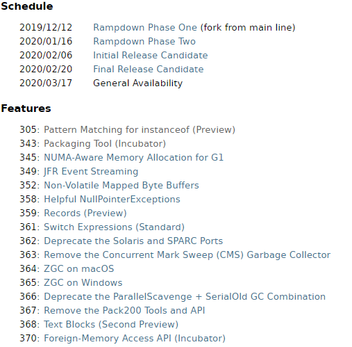

# 1 JDK 14新特性即将发布

## 1.1 JDK 14详细概述

JDK 8 已经在 2014年 3月 18日正式可用，JDK 8作为长期支持(Long-Term-Support)版本，距离现在已经 5年多时间过去了。5年时间里很多企业也都换上了 JDK 8，2018年09月25日作为下一个LTS的JDK版本：JDK 11也应运而生，Oracle表示会对JDK 11提供大力支持、长期支持。之后陆续发布了JDK 12 和JDK 13，**JDK 14即将在 2020年 3月17日正式发布，在JDK 14发布在即，让我们先来提前“尝尝先”。**

我们可以在openjdk官网中观察到JDK 14发布的详细官方计划和具体的新特性详情，地址如下：

```http
https://openjdk.java.net/projects/jdk/14/
```
**网站详情如下：**


## 1.2 JDK 14官方计划 

**Schedule**

| 2019/12/12 |      | Rampdown Phase One (初始预备阶段)                            |
| ---------- | ---- | ------------------------------------------------------------ |
| 2020/01/16 |      | Rampdown Phase Two（加速第二阶段）                           |
| 2020/02/06 |      | Initial Release Candidate（初始阶段确定哪些新特性作为发行备选） |
| 2020/02/20 |      | Final Release Candidate（最终确定哪些新特性作为发行备选）    |
| 2020/03/17 |      | General Availability(一般通用性，可视为发行出稳定版本的JDK新特性) |

## 1.3 JDK 14新特性预览

JDK 14一共发行了16个JEP（JDK Enhancement Proposals，JDK 增强提案），即是筛选出的JDK 14新特性。

- 305:  instanceof 的模式匹配 (预览，预览版本意味着暂时可以先尝试)
- 343:  打包工具 (Incubator)
- 345:  G1的NUMA内存分配优化
- 349:  JFR事件流
- 352:  非原子性的字节缓冲区映射
- 358:  友好的空指针异常
- 359:  Records (预览)
- 361:  Switch表达式 (标准)
- 362:  弃用Solaris和SPARC端口
- 363:  移除CMS（Concurrent Mark Sweep）垃圾收集器
- 364:  macOS系统上的ZGC
- 365:  Windows系统上的ZGC
- 366:  弃用ParallelScavenge + SerialOld GC组合
- 367:  移除Pack200 Tools 和 API
- 368:  文本块 (第二个预览版)
- 370:  外部存储器API (Incubator)

# 2 JDK 14新特性深入理解

本章，我们来针对JDK 14准备发行的一些显著新特性做一些讲解，让大家提前了解一下JDK 14的一些重要的新特性，其它新特性我们将在后期的视频中做详细的讲解梳理。

## JEP 305: instanceof的模式匹配 (预览)

**305:	Pattern Matching for instanceof (Preview)**

### 引入

JEP 305新增了使instanceof运算符具有模式匹配的能力。模式匹配能够使程序的通用逻辑更加简洁，代码更加简单，同时在做类型判断和类型转换的时候也更加安全，接下来我们来详细讲解一下。

### 设计初衷

几乎每个程序员都见过如下代码，在包含判断表达式是否具有某种类型的逻辑时，程序会对不同类型进行不同的处理。我么来看一下熟悉的`instanceof-and-cast`用法：

```java
// 在方法的入口接收一个对象
public void beforeWay(Object obj) {
    // 通过instanceof判断obj对象的真实数据类型是否是String类型
    if (obj instanceof String) {
        // 如果进来了，说明obj的类型是String类型，直接进行强制类型转换。
        String str = (String) obj;
        // 输出字符串的长度
        System.out.println(str.length());
    }
}
```

这段程序做了3件事：

* 1. 先判断obj的真实数据类型
* 2. 判断成立后进行了强制类型转换（将对象obj强制类型转换为String）
* 3. 声明一个新的本地变量str，指向上面的obj 

这种模式的逻辑并不复杂，并且几乎所有Java程序员都可以理解。但是出于以下原因，上述做法并不是最理想的：

* 1. 语法臃肿乏味
* 2. 同时执行类型检测校验和类型转换。
* 3. String类型在程序中出现了3次，但是最终要的可能只是一个字符串类型的对象变量而已。
* 4. 重复的代码过多，冗余度较高。

JDK 14提供了新的解决方案：新的instanceof模式匹配 ，新的模式匹配的用法如下所示，在`instanceof`的类型之后添加了变量`str`。如果`instanceof`对`obj`的类型检查通过，`obj`会被转换成`str`表示的`String`类型。在新的用法中，`String`类型仅出现一次。

具体描述

示例代码：

```java
public void patternMatching(Object obj) {
    if (obj instanceof String str) {
   	   // can use str here
        System.out.println(str.length());
    } else {
        // can't use str here
    }
}

```

**上述代码需要注意：**

如果obj是String类型，则将obj类型转换为String，并将其赋值给变量str。绑定的变量作用域为if语句内部，并不在false语句块内。

**接下来我们看一下它的另一个做法：**

通常`equals()`方法的实现都会先检查目标对象的类型。`instanceof`的模式匹配可以简化`equals()`方法的实现逻辑。下面代码中的Student类展示了相关的用法。

```java
public class Student {
  private  String name ;

  public Student(String name) {
    this.name = name;
  }

//    @Override
//    public boolean equals(Object o) {
//        if (this == o) return true;
//        if (o == null || getClass() != o.getClass()) return false;
//        Student student = (Student) o;
//        return Objects.equals(name, student.name);
//    }
    
  // 简化后做法！  
  @Override
  public boolean equals(Object obj) {
    return (obj instanceof Student s) && Objects.equals(this.name, s.name);
  }

    @Override
    public int hashCode() {
        return Objects.hash(name);
    }

}
```

### 小结

instanceof运算符“匹配”规则如下：

- 如果obj是String类型，则将obj类型转换为String，并将其赋值给变量str。绑定的变量作用域为if语句内部，并不在false语句块内。
- 到这儿，有一定Java基础的同学应该看出来的JDK 14后的instanceof的模式匹配极大的简化了类型检查和转型的问题。

## JEP 361: Switch表达式 (标准)

**JEP 361: Switch Expressions (Standard)**

### 引入

扩展switch分支选择语句的写法。Switch表达式在经过JDK 12（JEP 325）和JDK（JEP 354）的预览之后，在JDK 14中已经稳定可用。

### 设计初衷
Java的switch语句是一个变化较大的语法（可能是因为Java的switch语句一直不够强大、熟悉swift或者js语言的同学可与swift的switch语句对比一下，就会发现Java的switch相对较弱），因为Java的很多版本都在不断地改进switch语句：JDK 12扩展了switch语句，使其可以用作语句或者表达式，并且传统的和扩展的简化版switch都可以使用。

JDK 12对于switch的增强主要在于简化书写形式，提升功能点。
下面简单回顾一下switch的进化阶段：

* 从Java 5+开始，Java的switch语句可使用枚举了。
* 从Java 7+开始，Java的switch语句支持使用String类型的变量和表达式了。
* 从Java 11+开始，Java的switch语句会自动对省略break导致的贯穿提示警告（以前需要使用-X:fallthrough选项才能显示出来) 。
* 但从JDK12开始，Java的switch语句有了很大程度的增强。
* JDK 14的该JEP是从[JEP 325](https://openjdk.java.net/jeps/325)和[JEP 354](https://openjdk.java.net/jeps/354)演变而来的。但是，此JEP 361 Switch表达式 (标准)是独立的，并且不依赖于这两个JEP。

### 以前的switch程序

代码如下：

```java
public class Demo01{
    public static void main(String[] args){
        // 声明变量score，并为其赋值为'C'
        var score = 'C';
        // 执行switch分支语句
        switch (score) {
            case 'A':
                System.out.println("优秀");
                break;
            case 'B':
                System.out.println("良好");
                break;
            case 'C':
                System.out.println("中");
                break;
            case 'D':
                System.out.println("及格");
                break;
            case 'E':
                System.out.println("不及格");
                break;
            default:
                System.out.println("数据非法！");
        }
    }
}
```

这是经典的Java 11以前的switch写法 ，这里不能忘记写break，否则switch就会贯穿、导致程序出现错误（JDK 11会提示警告）。

### JDK 14不需要break了

在JDK 12之前如果switch忘记写break将导致贯穿，在JDK 12对switch的这一贯穿性做了改进。你只要将case后面的冒号（:）改成箭头，那么你即使不写break也不会贯穿了，因此上面程序可改写如下形式：

```java
public class Demo02{
    public static void main(String[] args){
        // 声明变量score，并为其赋值为'C'
        var score = 'C';
        // 执行switch分支语句
        switch (score){
            case 'A' -> System.out.println("优秀");
            case 'B' -> System.out.println("良好");
            case 'C' -> System.out.println("中");
            case 'D' -> System.out.println("及格");
            case 'E' -> System.out.println("不及格");
            default -> System.out.println("成绩数据非法！");
        }
    }
}
```

上面代码简洁很多了。

### JDK 14的switch表达式

JDK 12之后的switch甚至可作为表达式了——不再是单独的语句。例如如下程序。

```java
public class Demo03 {
    public static void main(String[] args) {
		// 声明变量score，并为其赋值为'C'
        var score = 'C';
		// 执行switch分支语句
        String s = switch (score)
                {
                    case 'A' -> "优秀";
                    case 'B' -> "良好";
                    case 'C' -> "中";
                    case 'D' -> "及格";
                    case 'F' -> "不及格";
                    default -> "成绩输入错误";
                };
        System.out.println(s);
    }
}
```

上面程序直接将switch表达式的值赋值给s变量，这样switch不再是一个语句，而是一个表达式.

### JDK 14中switch的多值匹配

当你把switch中的case后的冒号改为箭头之后，此时switch就不会贯穿了，但在某些情况下，程序本来就希望贯穿比如我就希望两个case共用一个执行体！JDK 12之后的switch中的case也支持多值匹配，这样程序就变得更加简洁了。例如如下程序。

```java
public class Demo04
{
    public static void main(String[] args)
    {
// 声明变量score，并为其赋值为'C'
        var score = 'B';
// 执行switch分支语句
        String s = switch (score)
                {
                    case 'A', 'B' -> "上等";
                    case 'C' -> "中等";
                    case 'D', 'E' -> "下等";
                    default -> "成绩数据输入非法！";
                };
        System.out.println(s);
    }
}
```

### JDK 14的Yielding a value

当使用箭头标签时，箭头标签右边可以是表达式、`throw`语句或是代码块。如果是代码块，需要使用`yield`语句来返回值。下面代码中的print方法中的`default`语句的右边是一个代码块。在代码块中使用`yield`来返回值。，JDK 14引入了一个新的`yield`语句来产生一个值，该值成为封闭的switch表达式的值。


```java
public void print(int days) {
  // 声明变量score，并为其赋值为'C'
  var score = 'B';
  String result = switch (score) {
      case 'A', 'B' -> "上等";
      case 'C' -> "中等";
      case 'D', 'E' -> "下等";
      default -> {
          if (score > 100) {
            yield "数据不能超过100";
          } else {
            yield score + "此分数低于0分";
          }
      }
  };
  System.out.println(result);
}
```

​	在`switch`表达式中不能使用`break`。`switch`表达式的每个标签都必须产生一个值，或者抛出异常。`switch`表达式必须穷尽所有可能的值。这意味着通常需要一个`default`语句。一个例外是枚举类型。如果穷尽了枚举类型的所有可能值，则不需要使用`default`。在这种情况下，编译器会自动生成一个`default`语句。这是因为枚举类型中的枚举值可能发生变化。比如，枚举类型`Color` 中原来只有3个值：`RED`、`GREEN`和`BLUE`。使用该枚举类型的`switch`表达式穷尽了3种情况并完成编译。之后`Color`中增加了一个新的值`YELLOW`，当用这个新的值调用之前的代码时，由于不能匹配已有的值，编译器产生的`default`会被调用，告知枚举类型发生改变

### 小结

从以上案例可以看出JDK 12到JDK 14对switch的功能做了很大的改进，代码也十分的简化，目前来看switch依然是不支持区间匹配的，未来是否可以支持，我们拭目以待。

## JEP 368: 文本块 (JDK 13后的第二个预览版)

**JEP 368: Text Blocks (Second Preview)**

### 引入

在Java的开发过程中，通常需要进行大量字符串文字的拼接，等相关组织操作，从JDK 13到JDK 14开始文本块新特性的提出，提高了Java程序书写大段字符串文本的可读性和方便性。

### 设计初衷

文本块功能在JDK 13中作为预览功能（JEP 355）被引入。这个功能在JDK 14中得到了更新。文本块是使用3个引号分隔的多行字符串。

### 描述

文本块是Java语言的新语法，可以用来表示任何字符串，具有更高的表达能力和更少的复杂度。文本块的开头定界符是由三个双引号字符（"""）组成的序列，后面跟0个或多个空格，最后跟一个行终止符。内容从开头定界符的行终止符之后的第一个字符开始。结束定界符是三个双引号字符的序列。内容在结束定界符的第一个双引号之前的最后一个字符处结束。与字符串文字中的字符不同，文本块的内容中可以直接包含双引号字符。当然也允许在文本块中使用\“，但不是必需的或不建议使用。与字符串文字中的字符不同，内容可以直接包含行终止符。允许在文本块中使用\n，但不是必需或不建议使用。例如，文本块：

```java
"""
line 1
line 2
line 3
"""
```

等效于字符串文字：

```java
"line 1\nline 2\nline 3\n"
```

或字符串文字的串联：

```java
"line 1\n" +
"line 2\n" +
"line 3\n"
```

文本块功能在JDK 13中作为预览功能（JEP 355）被引入。这个功能在JDK 14中得到了更新。文本块是使用3个引号分隔的多行字符串。根据文本块在源代码中的出现形式，多余的用于缩进的白字符会被去掉。相应的算法会在每一行中去掉同样数量的白字符，直到其中任意的一行遇到非白字符为止。每一行字符串末尾的白字符会被自动去掉。

下面代码中的文本块`xml`会被去掉前面的2个白字符的缩进。

```java
String xml = """
  <root>
    <a>Hello</a>
    <b>
      <c>
        <d>World</d>
      </c>
    </b>
  </root>
  """;
```

需要注意的是，缩进的去除是要考虑到作为结束分隔符的3个引号的位置的。如果把上面的文本块改成下面代码的格式，则没有缩进会被去掉。注意最后一行中3个引号的位置。去除的白字符的数量需要考虑到全部行中前导的白字符数量，包括最后一行。最终去除的白字符数量是这些行中前导白字符数量的最小值。

```java
String xml2 = """
  <root>
    <a>Hello</a>
    <b>
      <c>
        <d>World</d>
      </c>
    </b>
  </root>
""";
```

在文本块中同样可以使用`\n`和`\r`这样的转义字符。除了`String`本身支持的转义字符之外，文本块还支持2个特殊的转义字符：

- `\`：阻止插入换行符。
- `\s`：表示一个空格。可以用来避免末尾的白字符被去掉。

由于`\`的使用，下面代码中的`longString`实际上只有一行。

```java
String longString = """
    hello \
    world \
    goodbye
    """;
```

在下面的代码中，通过使用`\s`，每一行的长度都为10。

```java
String names = """
    alex     \s
    bob      \s
    long name\s
    """;
```

### HTML

使用原始字符串语法：

```java
String html = "<html>\n" +
              "    <body>\n" +
              "        <p>Hello, world</p>\n" +
              "    </body>\n" +
              "</html>\n";
```

使用文本块文本块语法：

```java
String html = """
              <html>
                  <body>
                      <p>Hello, world</p>
                  </body>
              </html>
              """;
```

### SQL

使用原始的字符串语法：

```java
String query = "SELECT `EMP_ID`, `LAST_NAME` FROM `EMPLOYEE_TB`\n" +
               "WHERE `CITY` = 'INDIANAPOLIS'\n" +
               "ORDER BY `EMP_ID`, `LAST_NAME`;\n";
```

使用文本块语法：

```java
String query = """
               SELECT `EMP_ID`, `LAST_NAME` FROM `EMPLOYEE_TB`
               WHERE `CITY` = 'INDIANAPOLIS'
               ORDER BY `EMP_ID`, `LAST_NAME`;
               """;
```

### 多语言示例

使用原始的字符串语法：

```java
ScriptEngine engine = new ScriptEngineManager().getEngineByName("js");
Object obj = engine.eval("function hello() {\n" +
                         "    print('\"Hello, world\"');\n" +
                         "}\n" +
                         "\n" +
                         "hello();\n");
```

使用文本块语法：

```java
ScriptEngine engine = new ScriptEngineManager().getEngineByName("js");
Object obj = engine.eval("""
                         function hello() {
                             print('"Hello, world"');
                         }
                         
                         hello();
                         """);
```

# 3.总结

对Java开发人员来说，最重要的无疑是：switch语句、文本块，intanceof的模式匹配操作，JDK 14还有更多的JEP新特性，我们将在后续的视频资源中做进行进一步的详细深入介绍，请读者持续关注。

