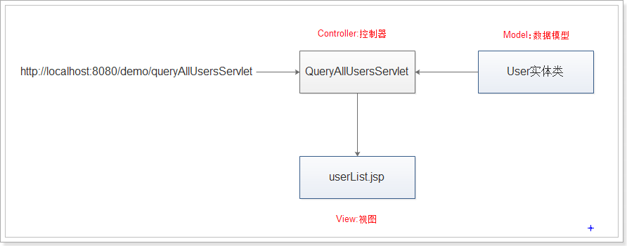
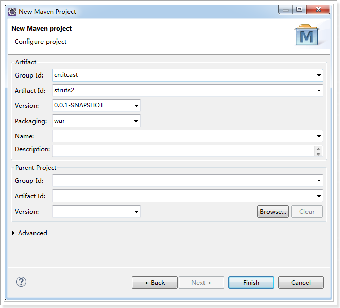
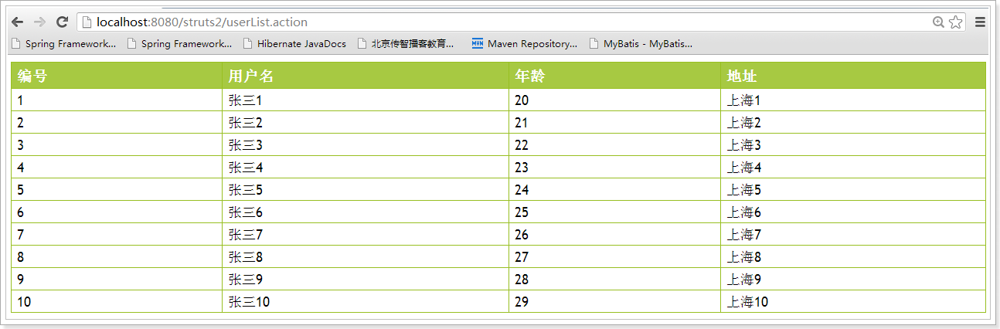
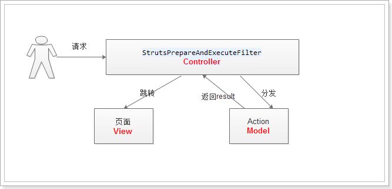
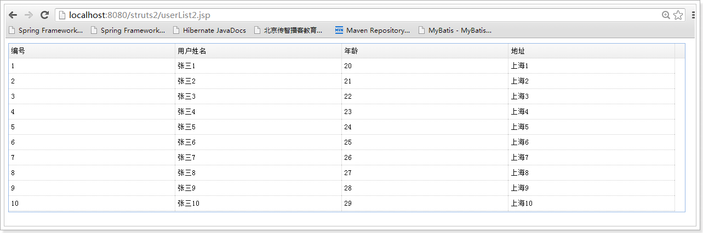

# 基于struts2拦截器实现数据和视图的分离

## 1、MVC概述

MVC,全名是Model View Controller，是一种软件设计模式，或软件设计思想。以下是MVC的具体含义：

Model:数据模型，用来处理数据，一般是一个实体类，例如User类；

View:视图，用来呈现数据模型，可以是JSP或Html等；

Controller:控制器，用来决定哪个界面来呈现数据模型；

我们可以采用Jsp+Servlet+JavaBean的方式来实现MVC设计模式：

但是以上这种MVC的实现方式，在servlet中会出现代码冗余的问题，因为大部分的servlet都需要接收参数、完成页面跳转。所以，市场上有多种MVC框架，struts2就是一款经典的MVC框架。

## 2、struts2中的MVC

### 2.1、创建maven工程，引入依赖

 

引入struts2依赖，pom.xml内容如下：

```xml
<project xmlns="http://maven.apache.org/POM/4.0.0" xmlns:xsi="http://www.w3.org/2001/XMLSchema-instance" xsi:schemaLocation="http://maven.apache.org/POM/4.0.0 http://maven.apache.org/xsd/maven-4.0.0.xsd">
  <modelVersion>4.0.0</modelVersion>
  <groupId>cn.itcast</groupId>
  <artifactId>struts2</artifactId>
  <version>0.0.1-SNAPSHOT</version>
  <packaging>war</packaging>
  <dependencies>
  	<dependency>
  		<groupId>org.apache.struts</groupId>
  		<artifactId>struts2-core</artifactId>
  		<version>2.3.24</version>
  	</dependency>
  	<dependency>
  		<groupId>javax.servlet</groupId>
  		<artifactId>servlet-api</artifactId>
  		<version>2.5</version>
  		<scope>provided</scope>
  	</dependency>
  	<dependency>
  		<groupId>javax.servlet</groupId>
  		<artifactId>jsp-api</artifactId>
  		<version>2.0</version>
  		<scope>provided</scope>
  	</dependency>
  </dependencies>
  <build>
  	<plugins>
  		<plugin>
  			<groupId>org.apache.maven.plugins</groupId>
  			<artifactId>maven-compiler-plugin</artifactId>
  			<version>3.5.1</version>
  			<configuration>
  				<source>1.7</source>
  				<target>1.7</target>
  			</configuration>
  		</plugin>
  		<plugin>
  			<groupId>org.apache.tomcat.maven</groupId>
  			<artifactId>tomcat7-maven-plugin</artifactId>
  			<version>2.2</version>
  		</plugin>
  	</plugins>
  </build>
</project>
```

### 2.2、在web.xml中配置struts2核心过滤器

```xml
<?xml version="1.0" encoding="UTF-8"?>
<web-app xmlns:xsi="http://www.w3.org/2001/XMLSchema-instance" xmlns="http://java.sun.com/xml/ns/javaee" xsi:schemaLocation="http://java.sun.com/xml/ns/javaee http://java.sun.com/xml/ns/javaee/web-app_2_5.xsd" version="2.5">

  <display-name>struts2</display-name>

  <welcome-file-list>
		<welcome-file>index.html</welcome-file>
		<welcome-file>index.htm</welcome-file>
		<welcome-file>index.jsp</welcome-file>
		<welcome-file>default.html</welcome-file>
		<welcome-file>default.htm</welcome-file>
		<welcome-file>default.jsp</welcome-file>
  </welcome-file-list>

  <!-- struts2核心过滤器，用于启动struts2框架 -->

  <filter>

  	<filter-name>struts2</filter-name>

  	<filter-class>org.apache.struts2.dispatcher.ng.filter.StrutsPrepareAndExecuteFilter</filter-class>

  </filter>

  <filter-mapping>

  	<filter-name>struts2</filter-name>

  	<url-pattern>/*</url-pattern>

  </filter-mapping>

</web-app>

```
### 2.3、创建struts2的核心配置文件struts.xml

```xml
<?xml version="1.0" encoding="UTF-8"?>
<!DOCTYPE struts PUBLIC
"-//Apache Software Foundation//DTD Struts Configuration 2.3//EN"
"http://struts.apache.org/dtds/struts-2.3.dtd">
<struts>
	
</struts>
```
### 2.4、创建Action类

UserAction类：


```java
public class UserAction extends ActionSupport {

	private static final long serialVersionUID = 1L;
	
	private List<User> users;
	
	public String list(){
		users = new ArrayList<User>();
		for (int i = 0; i < 10; i++) {
			User user = new User();
			user.setId(i+1L);
			user.setUsername("张三" + (i+1));
			user.setAge(20 + i);
			user.setAddress("上海" + (i+1));
			users.add(user);
		}
		return SUCCESS;
	}

	public List<User> getUsers() {
		return users;
	}

}
```

### 2.5、配置Action类

在struts.xml中配置UserAction

```xml
<?xml version="1.0" encoding="UTF-8"?>
<!DOCTYPE struts PUBLIC
"-//Apache Software Foundation//DTD Struts Configuration 2.3//EN"
"http://struts.apache.org/dtds/struts-2.3.dtd">
<struts>
  	<constant name="struts.devMode" value="true"></constant>
	<package name="default" namespace="/" extends="struts-default">
		<action name="userList" class="cn.itcast.action.UserAction" method="list">
			<result name="success">
				/userList.jsp
			</result>
		</action>
	</package>
</struts>
```
### 2.6、测试

打开浏览器，访问地址：http://localhost:8080/struts2/userList.action，效果如下：

 

### 2.7、分析程序	

在上面程序中，StrutsPrepareAndExecuteFilter是C（控制器），所有的请求先经过该过滤器，由该过滤器来决定调用哪个Action，在Action中准备好要显示的数据（数据模型）；接着，由核心过滤器跳转到对应的页面（视图）来展示Action中的数据。



## 3、案例：实现数据和视图的分离

需求：假设A公司是一个数据提供商，A公司自己写了一套jsp页面来展示数据；B公司也需要用A公司的数据，但B公司需要的是json格式的数据，我们要保证在不修改Action的情况下，能够根据不同的请求用不同的视图来展示数据。

### 3.1、创建easyui的页面

我们需要再创建一个页面userList2.jsp，充当第三方公司的页面，需要的是json格式的数据：

```jsp
<%@ page language="java" contentType="text/html; charset=UTF-8"
pageEncoding="UTF-8"%>
<!DOCTYPE html PUBLIC "-//W3C//DTD HTML 4.01 Transitional//EN" "http://www.w3.org/TR/html4/loose.dtd">
<html>
<head>
<TITLE>用户列表</TITLE>
<meta http-equiv="Content-Type" content="text/html; charset=UTF-8">
<link type="text/css" rel="stylesheet"
href="${pageContext.request.contextPath}/css/default/easyui.css">
<link type="text/css" rel="stylesheet"
href="${pageContext.request.contextPath}/css/icon.css">
<script type="text/javascript"
src="${pageContext.request.contextPath }/js/jquery-1.4.4.min.js"></script>
<script type="text/javascript"
src="${pageContext.request.contextPath}/js/jquery.easyui.min.js"></script>
<META content="MSHTML 6.00.2900.3492" name=GENERATOR>
<script type="text/javascript">
$(function() {
  //模拟第三方公司的请求，需要传递一个third参数，请求路径依然是userList.action
	$('#dg').datagrid({
		url : '${pageContext.request.contextPath}/userList.action?third=itcast',
		columns : [ [ {
			field : 'id',
			title : '编号',
			width : 100
		}, {
			field : 'username',
			title : '用户姓名',
			width : 100
		}, {
			field : 'age',
			title : '年龄',
			width : 100
		}, {
			field : 'address',
			title : '地址',
			width : 100
		} ] ],
		fitColumns : true
	});

});
</script>
</HEAD>
<BODY>
<table id="dg" width="98%"></table>
</BODY>
</HTML>


```

### 3.2、改造UserAction

我们的目标是不修改UserAction就能用不同视图来展示数据，所以，list方法的返回值不能写死，可以把返回值放到值栈里，然后在拦截器里修改值栈的值。

```java
public class UserAction extends ActionSupport {

private static final long serialVersionUID = 1L;
private List<User> users;
private String result = "success";

public String list(){
	users = new ArrayList<User>();
	for (int i = 0; i < 10; i++) {
		User user = new User();
		user.setId(i+1L);
		user.setUsername("张三" + (i+1));
		user.setAge(20 + i);
		user.setAddress("上海" + (i+1));
		users.add(user);
	}
	return result;
}

public List<User> getUsers() {
	return users;
}


public String getResult() {
	return result;
}
}
```

### 3.3、编写拦截器

```java
public class ThirdInterceptor extends AbstractInterceptor {

private static final long serialVersionUID = 1L;

@Override
public String intercept(ActionInvocation invocation) throws Exception {
	Map<String, Object> parameters = invocation.getInvocationContext().getParameters();
	//请求来自于第三方
	if(parameters.get("third") != null){
		invocation.getStack().setValue("result", "json");
	}
	return invocation.invoke();
}

}
```

### 3.4、配置拦截器

```xml
<?xml version="1.0" encoding="UTF-8"?>
<!DOCTYPE struts PUBLIC
"-//Apache Software Foundation//DTD Struts Configuration 2.3//EN"
"http://struts.apache.org/dtds/struts-2.3.dtd">
<struts>
<constant name="struts.devMode" value="true"></constant>
<package name="default" namespace="/" extends="json-default">
	<!-- 配置自定义拦截器 -->
	<interceptors>
		<interceptor name="thirdInterceptor" class="cn.itcast.interceptor.ThirdInterceptor">	          </interceptor>
	</interceptors>
	<action name="userList" class="cn.itcast.action.UserAction" method="list">
		<!-- 引入自定义拦截器 -->
		<interceptor-ref name="defaultStack"></interceptor-ref>
		<interceptor-ref name="thirdInterceptor"></interceptor-ref>
		<result name="success">
			/userList.jsp
		</result>
         <!-- 第三方公司需要json数据 -->
		<result name="json" type="json">
			<param name="root">users</param>
		</result>
	</action>
</package>
</struts>
```

### 3.5、测试

在浏览器中访问：http://localhost:8080/struts2/userList2.jsp，效果如下： 

## 4、总结

​	MVC是这一种软件设计模式，里面包含了三大元素：模型、视图及控制器。在没有学习框架之前，我们采用的是jsp+servlet+javabean的写法来体现MVC，但是这种写法不是一种最优的MVC的体现，有很多种优秀的框架都帮我们实现了MVC标准，struts2就是其中一个。

​	在struts2中，控制器由StrutsPrepareAndExecuteFilter充当，数据模型由Action来充当，视图可以是jsp或json。正式因为struts2帮我们把数据和视图分离了，所以同一个数据，我们可以采用jsp的视图来展示，也可以采用json的视图来展示。