# MongoDB学习

## 1.1 MongoDB的下载与安装

### 下载

Mongodb的下载网址为:直接去官网下载即可。[MongoDB 官网地址](https://www.mongodb.com/)

1）进入官网之后，点击右侧的Download按钮。

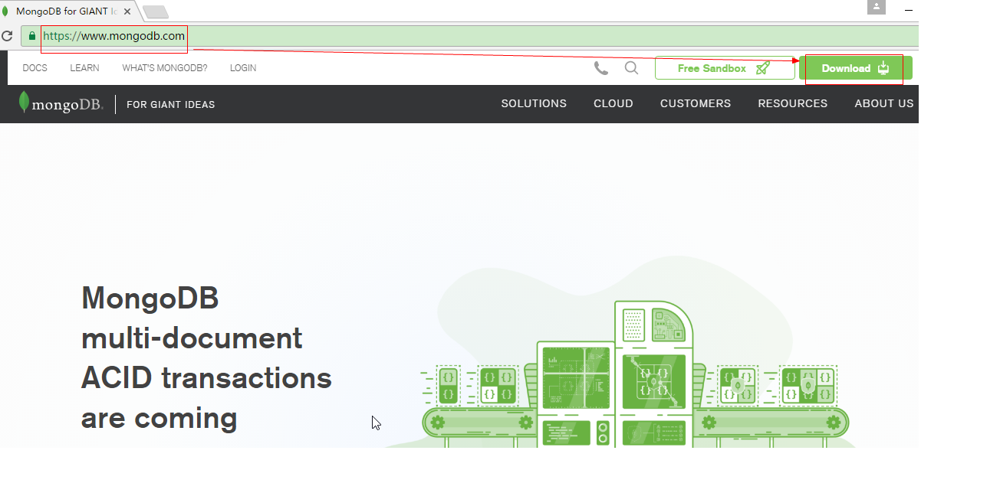

2）然后点击Community Server -----> Windows------>点击All Version Binaries

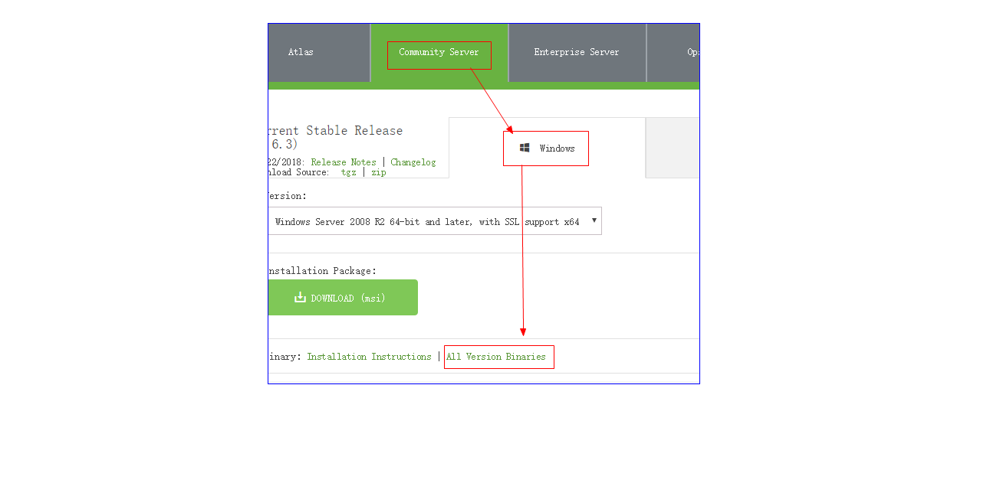

3) 在弹出的页面选择需要的版本：

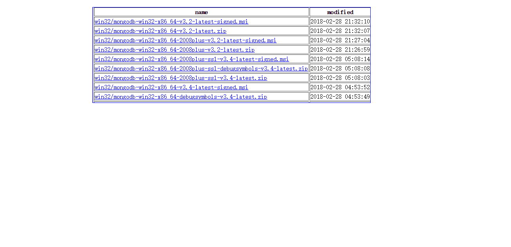 

我这里已经提前下载好，就不在演示。为了考虑稳定性，我们这里不使用最新版本，我们使用2.0版本，如下：

mongodb-win32-x86_64-2.0.6.zip

### 安装

1、 解压下载的MongoDB的包，生成如下目录：

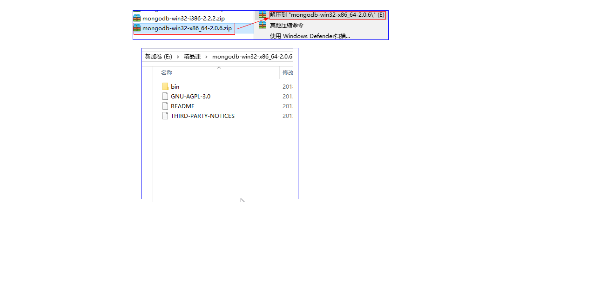 

2、 在电脑的任意硬盘上新建一个MongoDB文件夹，然后将刚才解压的内容复制到该文件夹下

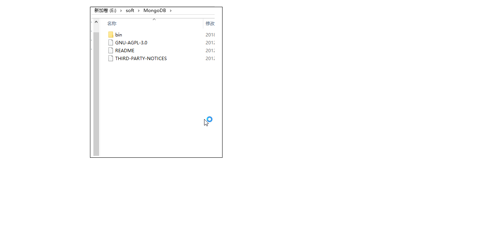 

 

3、 在E盘下在新建一个文件夹MongoDBdata用来存储数据库真正数据的。

4、 启动cmd控制台，然后切换到MongoDB的bin目录，并在bin目录执行如下命令：

mongod.exe --dbpath=存放数据库数据的目录。

例如：mongod.exe --dbpath=E:\soft\MongoDBdata

具体操作如下所示：

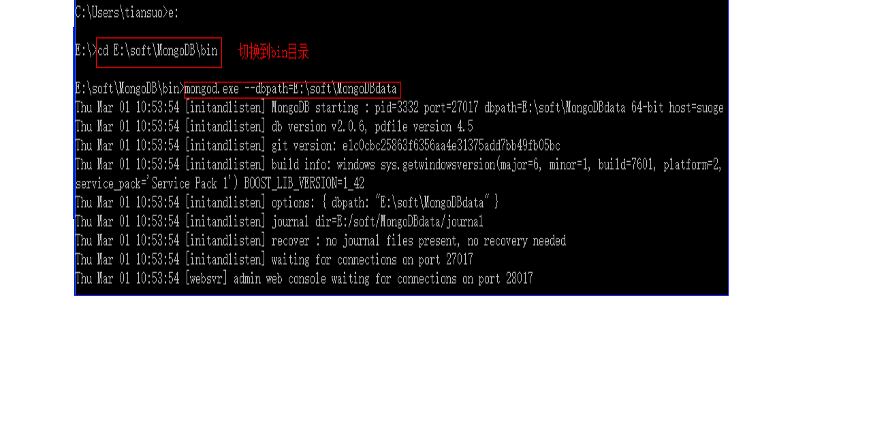 

​	说明：MongoDB数据库默认端口是27017。

​	在MongoDBdata文件夹下会生成如下文件和文件夹：

​	

​	说明：

1）journal文件夹中存储的是文件数据,里面存放的都是json格式的数据模型。

2）mongod.lock表示文件包是锁住的。

​	

5、 配置环境变量，这样不用每次到bin目录来启动MongoDB数据库了。

赋值mongodb的bin目录到环境变量path中：

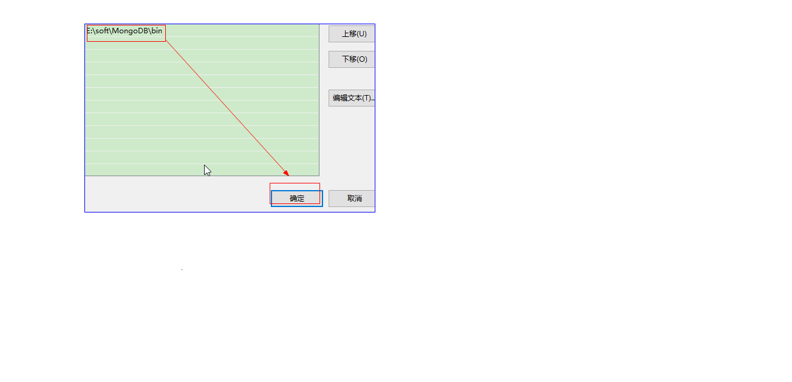

测试是否配置成功，启动cmd,直接运行bin目录下的命令mongod -help：

如果出现如下图所示现象，说明已经配置成功。

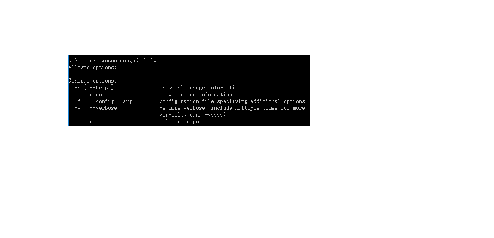 

上述表示对mongodb的配置信息一些说明。

 

6、 启动MongoDB服务：

在桌面新建一个文件夹并创建一个批处理.bat文件，这样每次启动mongodb会很方便。

mongo.bat

在上述批处理文件中输入如下命令：

mongod.exe --dbpath=E:\soft\MongoDBdata

然后点击.bat文件，就可以启动MongoDB数据库了。

 

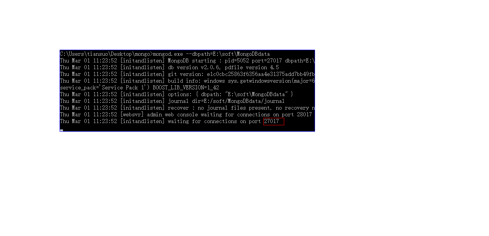 

从上图可以看出默认的端口号是27017

7、 客户端验证链接

打开一个新的cmd窗口，输入mongo 命令,如果有如下的提示，说明能连上数据库服务了。

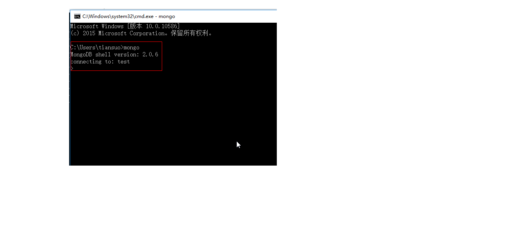 

说明：mongo.exe表示MongoDB数据库的核心命令。

## 1.2 MongoDB的体系结构

一个运行着mongodb的数据库可以看做是一个mongodb server。该server由实例和数据库构成。在一般情况下，一个mongoDB Server机器上包含一个实例和多个与之对应的的数据库。但是在特殊情况下，允许一个mongoDB Server上有多个实例和多个数据库。

Mongodb的结构(集合、文档)构成了mongodb的数据库。这个概念和oracle的系统结构的概念类似。

Mongodb主要是由文档(document)，集合(Collection)、数据库(database)这三部分组成。结构是面向用户的，用户在使用mongodb开发程序的时候，使用的就是该结构。 

MongoDB和关系型数据库的对比图如下所示：

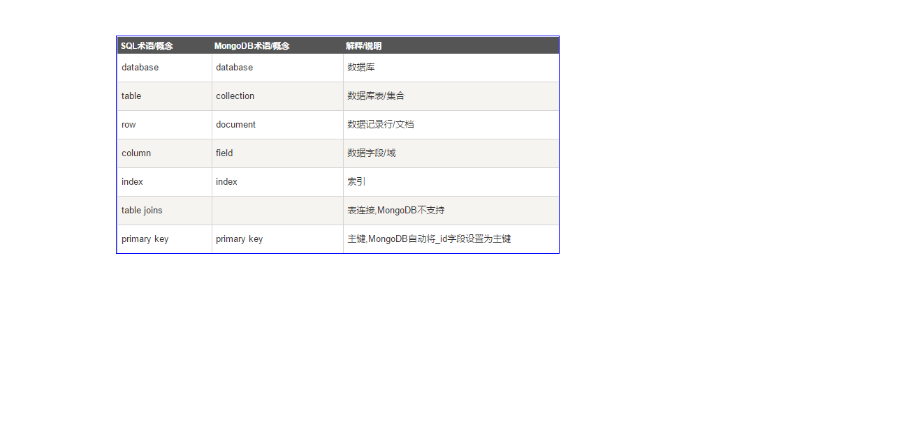 

说明：

1）关系型数据库中表的一条行记录必须保证拥有每一个字段，并且每一个字段都一样。而MongoDB的每一个document中的数据结构有可能是不一样的。可以在程序中随意的动态的定义document的结构。可以随意的自定义document的结构。 document相当于数据库表中的一行记录。

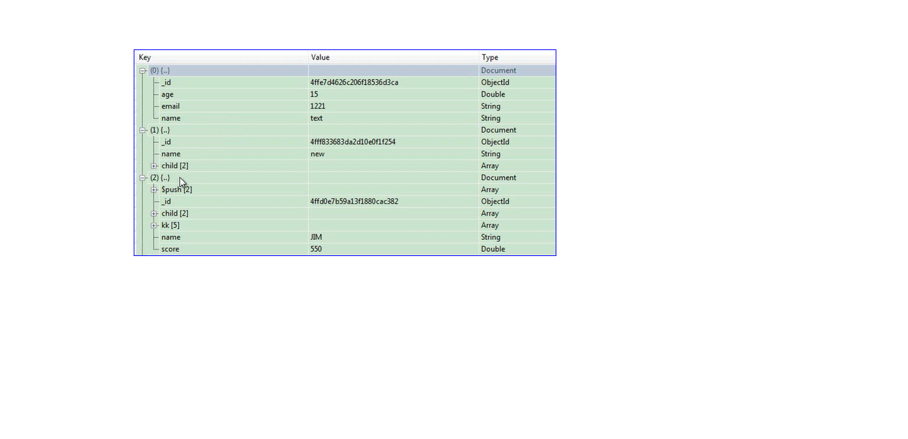 

2）Collection相当于关系数据库中的表，是由多个document组成的。

3）很多collection结合在一起，就形成了db。一个mongodb server支持多个数据库。

4）关系型数据库查询语句使用SQL.MongoDB查询使用内置find函数，即基于BSON的特殊查询工具。

MongoDB的文档(document)，集合(Collection)、数据库(database)这三部分之间的关系如下图所示：

 

## 1.3MongoDB的数据操作

### 启动MongoDB的服务端

双击如下批处理文件：

mongo.bat

### 创建客户端并启动

在创建一个.bat文件：

mongoClient.bat

输入如下命令：

mongo.exe 127.0.0.1:27017/admin

###  help

通过该命令可以查看帮助文档。

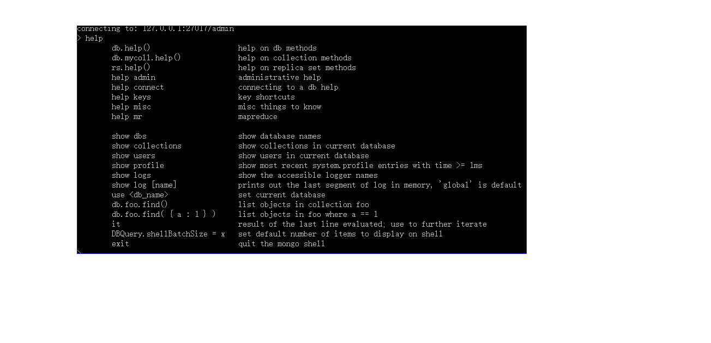

### 练习：

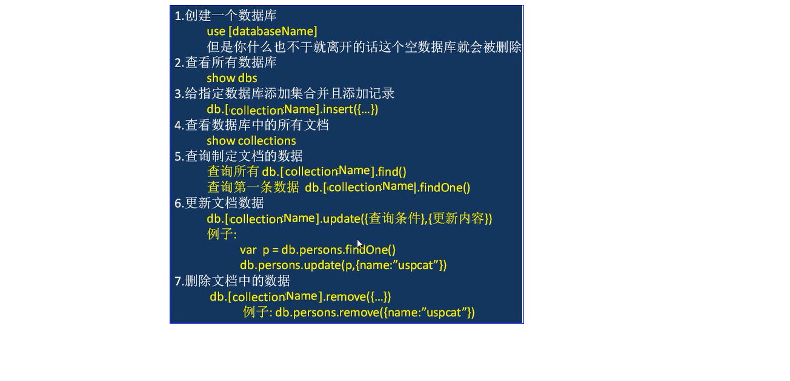


具体的语句演示如下所示：

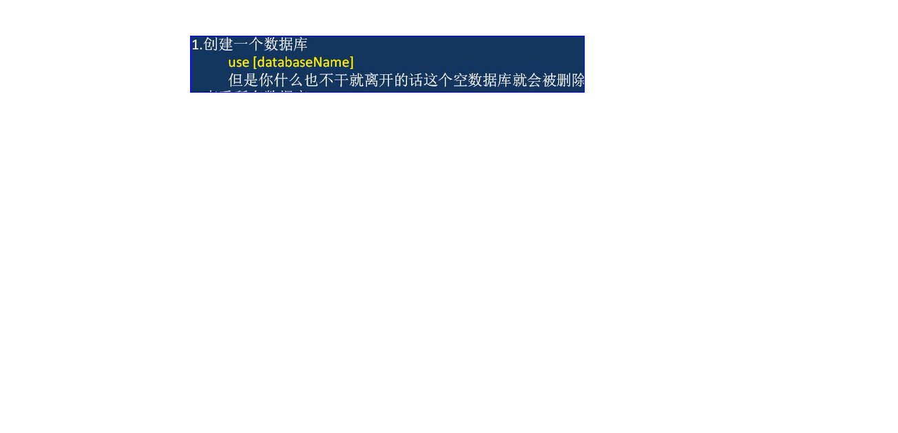 

 

需求：创建一个itcast数据库。


说明：如果没有该数据库，则动态的创建，也就是说只要输入use 数据库名 命令，如果没有该数据库，不用再写任何的命令，系统直接为你创建了一个数据库。如上，开始数据库中是不存在itcast数据库的，则就会创建一个名称为itcast的数据库。如果数据库存在就是切换到该数据库。

注意：创建不存在数据库时，如果什么也不干就离开，那么这个空的数据库就会删除。

 

格式：

db.表名(collectionName集合名).insert({.....})

或者

db.表名(collectionName集合名).insert(对象名)

1、 先用use itcast命令，创建itcast数据库

use itcast

2、 建立两个对象

 

3、 把这两个对象保存到数据库中的某一个张表即集合collection中

 

说明：

-  db属于固定写法，表示数据库itcast的意思。
-  persons代表一张表即集合。而这里为collection.
-  在mongodb中，collection也是可以动态创建的。也就是说当执行这行命令的时候，如果没有该collection，会动态的创建该collection。
-  大家可以看到，有一行记录为person，而另一行记录为animal，这两行记录的key值明显不一样。所以collection的结构是随意的，不受约束的。
-  利用db.集合名.find()方法可以查询到collection中的所有的数据

4、 查看数据库


需求：查看itcast数据库中的所有表。

 

说明：system.indexes是自动生成的表即集合，存储所有索引的。

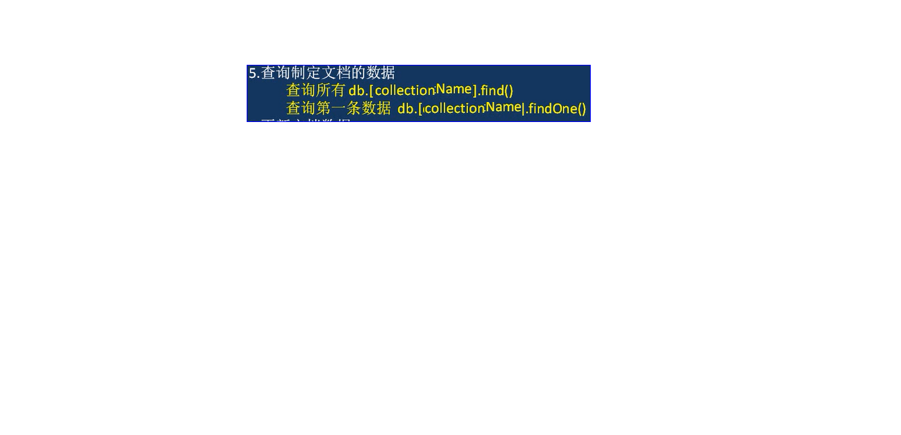 

需求：查询persons集合中的所有数据。

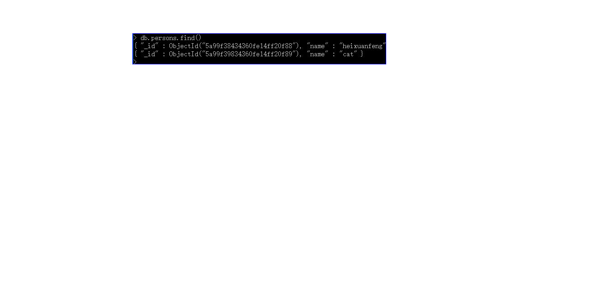 

说明：

1）、当我们向表即集合中添加数据的时候，如果不指定id，那么MongoDB会自动添加一个名字叫_id的id，属于ObjectId对象类型.

2）、_id key

Mongodb支持的数据类型中，_id是内部的。

在mongodb的每一个Document中都有一个默认的主键_id，该主键的名称是固定的。它可

以是mongodb支持的任意数据类型。默认是ObjectId。在关系型数据库中主键能设置为数值类型的。由于mongodb是分布式数据库，所以不支持自动增长。

在一个document中，主键也可以不是ObjectId类型，例如我可以插入一行数据为：

{_id:1,name:’asdf},但是值必须是唯一的。

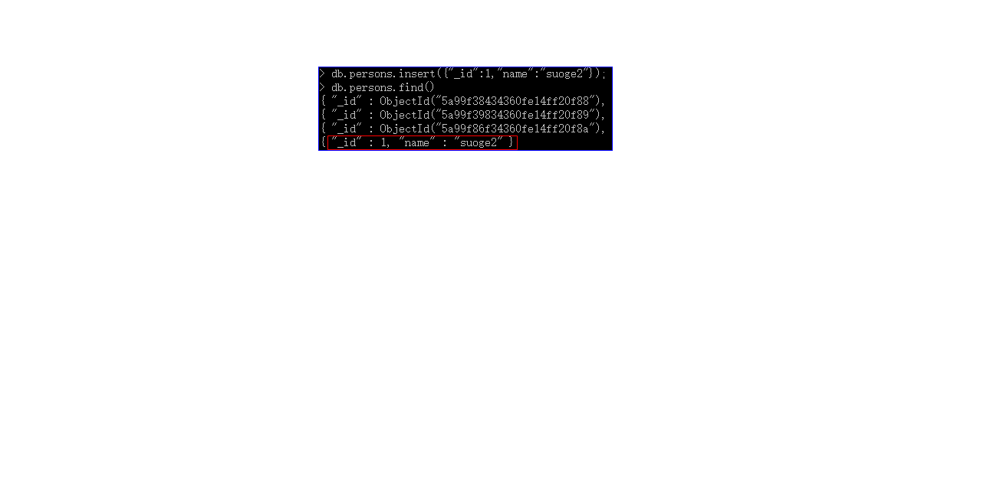 

 

需求：查询persons集合中的第一条数据。

  

需求：将name是zhangsan的名字改为likui.

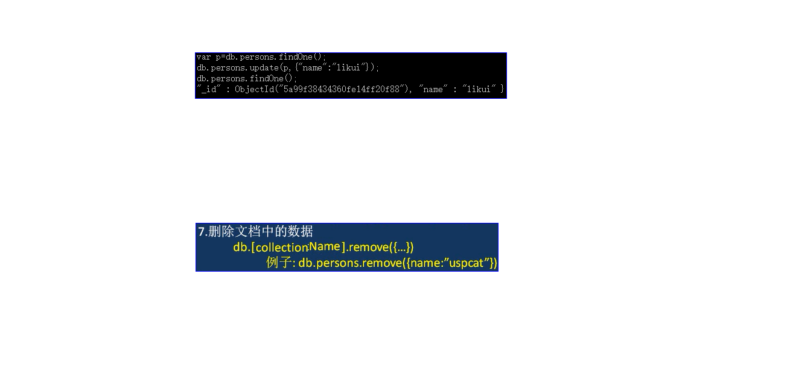 


需求：删除name是likui的数据。

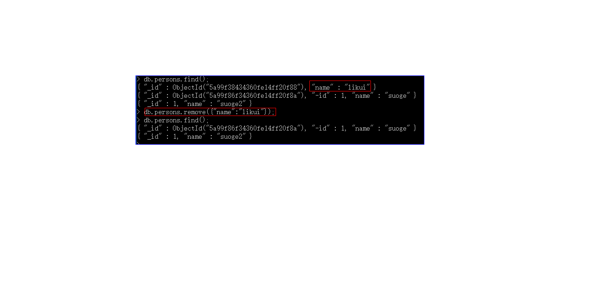

## 1.4 MongoDB的增删改

### 向MongoDB数据库中增加数据

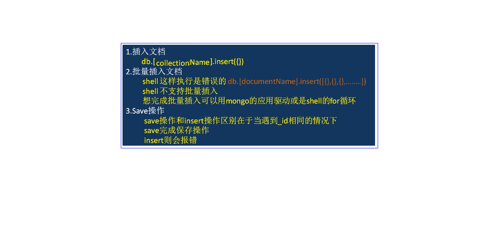

向MongoDB数据库中批量插入数据。

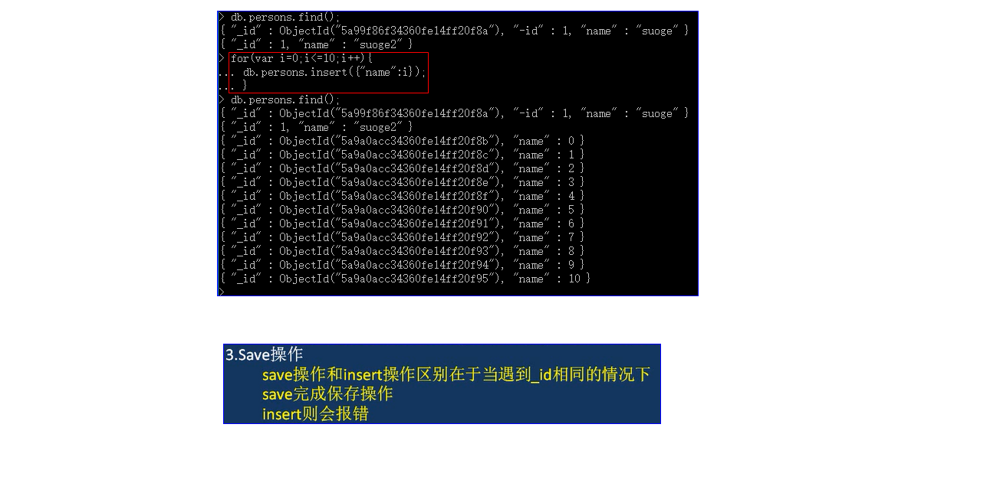 


说明：如果使用save插入数据的时候，如果存在id，那么此时save方法就会变为修改，新值将原来的旧值覆盖。而insert会报错。

演示如下：

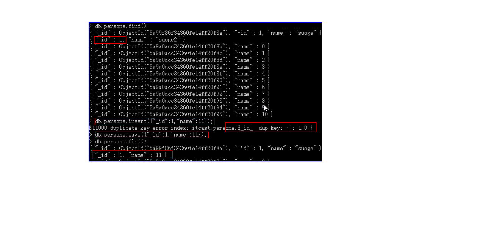 


### 从MongoDB数据库中删除数据

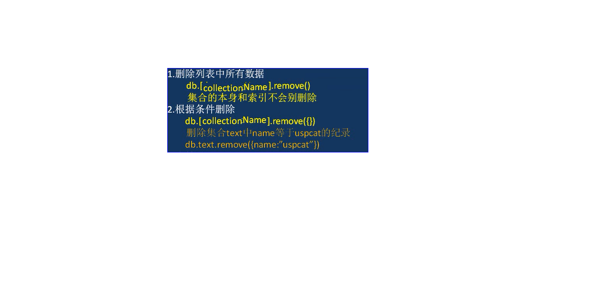

需求：删除name是10的一行数据。

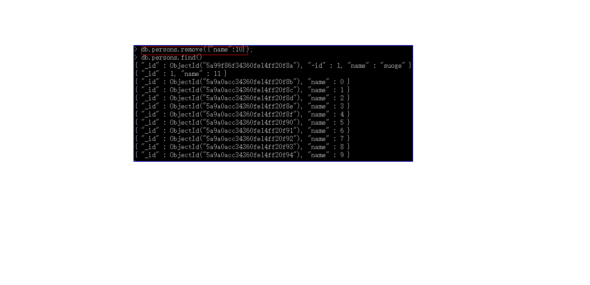

### 更新MongoDB数据库中的数据


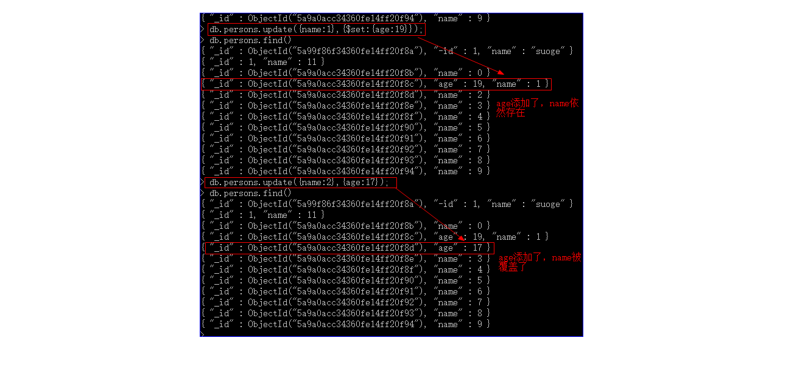 

  

## 1.5 MongoDB数据库的查询

在做查询之前我们先向数据库插入一些数据，在插入之前先删除数据库表persons的以前的数据，然后在插入：

1）删除数据库表persons

db.persons.drop()


2）将如下数据插入到数据库itcast中的表persons:

```MongoDB
db.persons.drop()

var personArr = [{

	name:"zhangsan",

	age:23,

	email:"17161717@qq.com",

	c:89,m:78,e:99,

	country:"china",

	books:["JS","JAVA","MONGODB"]

},

{

	name:"linchong",

	age:20,

	email:"234681717@qq.com",

	c:82,m:38,e:69,

	country:"china",

	books:["JS","PHP","MONGODB"]

},

{

	name:"luzhishen",

	age:23,

	email:"171615151@qq.com",

	c:23,m:98,e:100,

	country:"china",

	books:["Jquery","JAVA","MONGODB"]

},

{

	name:"songjiang",

	age:33,

	email:"1781918717@qq.com",

	c:89,m:78,e:99,

	country:"china",

	books:["mysql","JAVA","MONGODB"]

},

{

	name:"wusong",

	age:28,

	email:"123456@qq.com",

	c:76,m:32,e:99,

	country:"Korea",

	books:["C++","JAVA","C"]

},

{

	name:"likui",

	age:43,

	email:"234567@qq.com",

	c:23,m:46,e:10,

	country:"USA",

	books:["jsp","JAVA","MONGODB"]

},

{

	name:"shiqian",

	age:23,

	email:"81717177@qq.com",

	c:19,m:88,e:99,

	country:"china",

	books:["mysql","oracle","MONGODB"]

},

{

	name:"wuyong",

	age:32,

	email:"17827277@qq.com",

	c:76,m:88,e:99,

	country:"USA",

	books:["C++","hibernate","C"]

}]

for(var i = 0;i<personArr.length;i++){

	db.persons.insert(personArr[i])
}
```

### 查询部分字段

需求：查询上述persons表中的name,country,age字段。

 

分析：由于这里只想查询name,country,age字段，所以第一个参数，条件可以不用书写，表示空对象，表示查询全部。

第二个参数表示要查询谁，如果不想查询谁就设置为0，查询谁，就设置为1。

注意：如果不想查询id，就写id:0.如果不写，那么默认也会查询出来。

具体的代码如下所示：

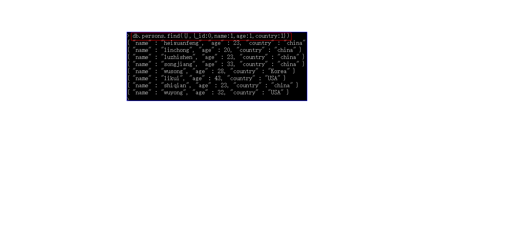 

如果不书写id:0。

### 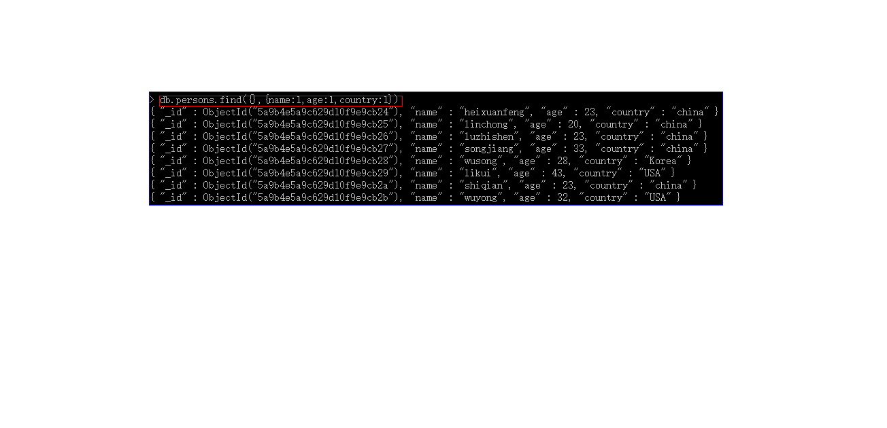 查询条件

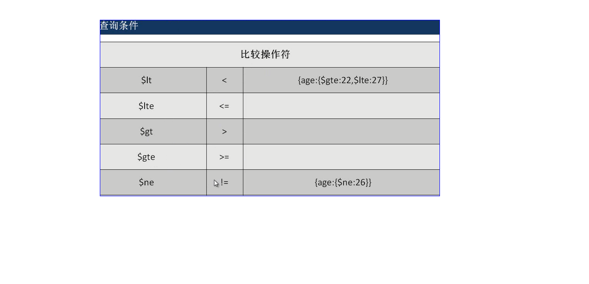

需求：查询年龄在30到45之间的学生。

分析：语法格式：db.persons.find({age:{$gte:30,$lte:45}},{_id:0,name:1,age:1})

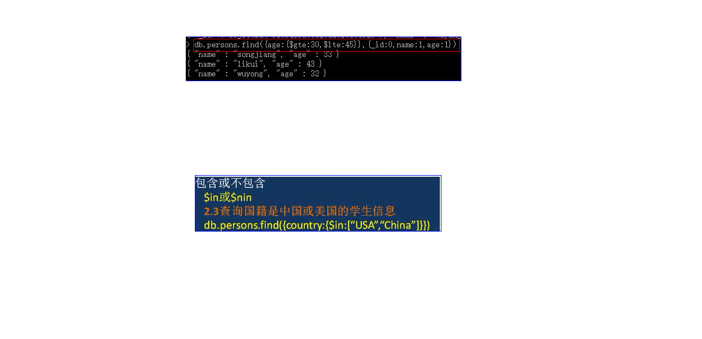 


说明：关于包含或者不包含，要求后面必须是数组。

代码如下所示：

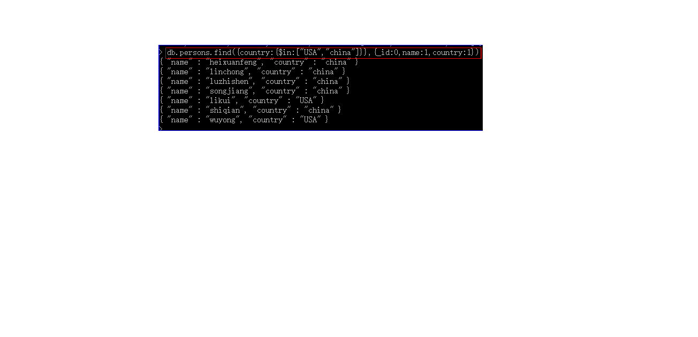

### 类似于关系型数据库中的where查询

需求一：查询age是23的人的信息。

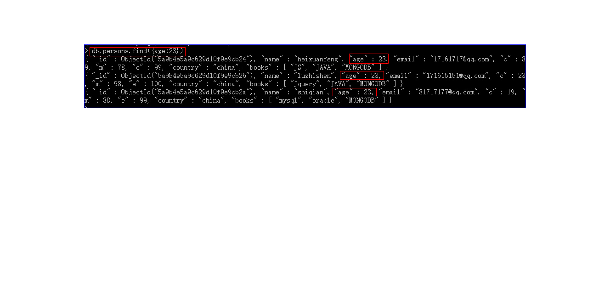

说明：相当于关系型数据库中的语句：select * from persons where age=23;

需求二：查询age是23，并且name是songjiang的人的name，age,country。

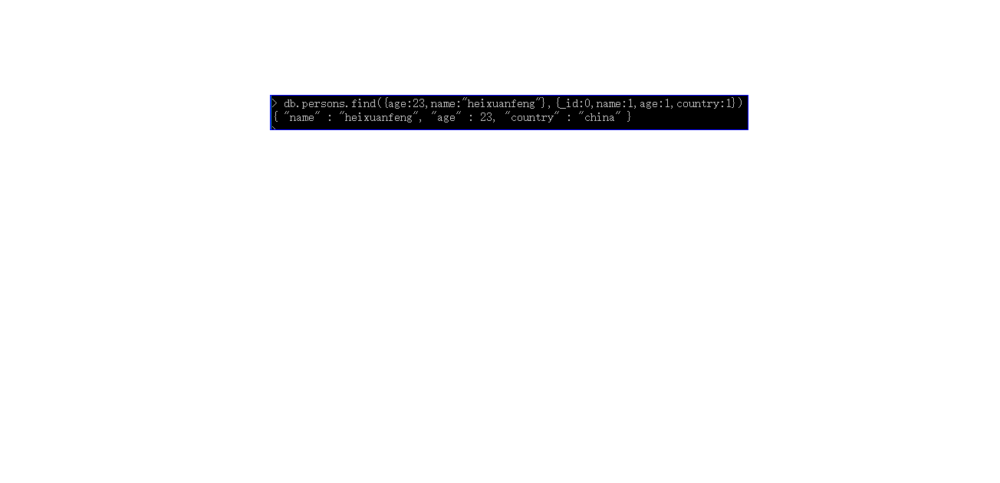 

### 多表查询

在mongodb中，多表查询可以有两种实现方案：嵌套和引用。

#### 嵌套

假设班级和学生之间的关系，属于一对多的关系。一个班级对应多个学生。

同时增加：

代码：

var classes={id:1,name:"java",students:[{sid:1,name:"zhangsan"},{sid:2,name:"lisi"}]};

db.classes.insert(classes);

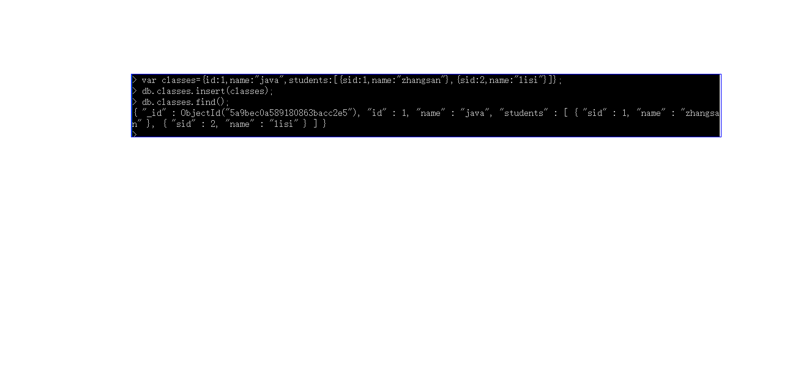

可以看到，在classes中有一个key值为students，而这个students描述了多个学生，所以是数组。这里classes与students就是sql中的一对多的关系。

需求一：查询班级是java的班级中第一个学生的id。

代码：db.classes.find({name:"java"}).forEach(function(e){printjson(e.students[0].sid)});

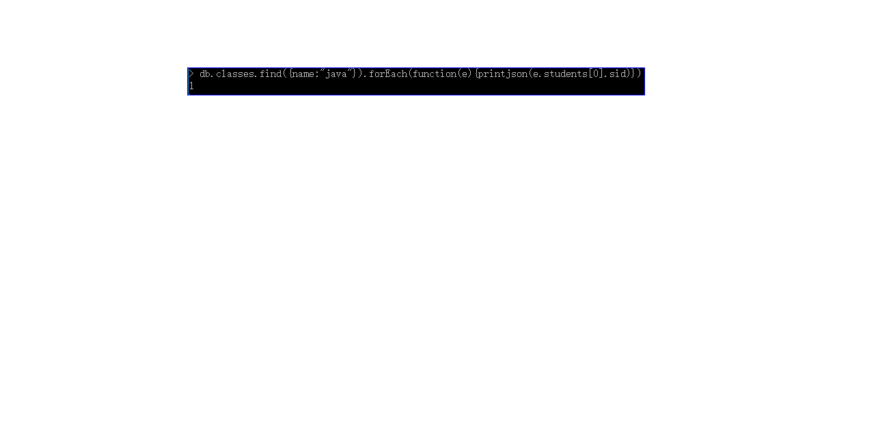 

需求二：查询id为1的班级中的所有的学生。

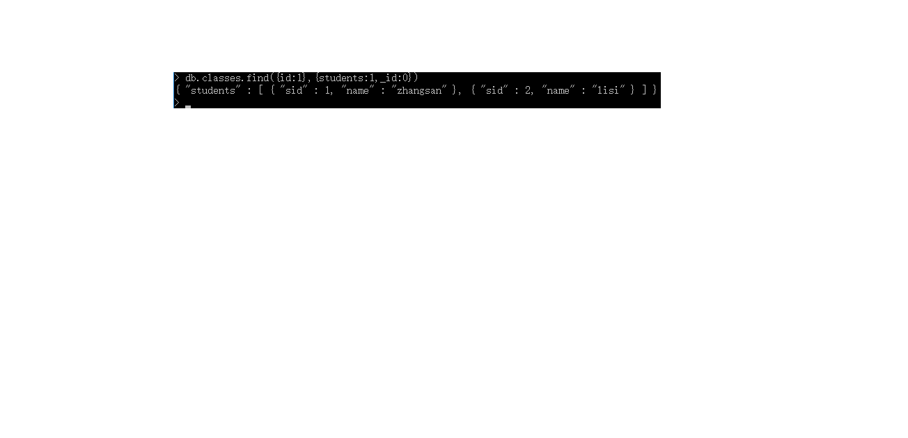 

或者：

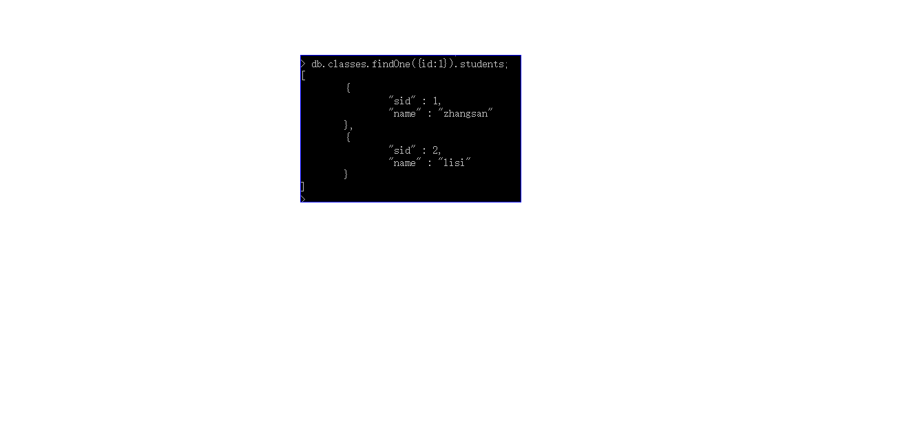

## 1.6 使用MongoDB数据库完成商品管理系统

### 案例需求

由于时间的关系，我们这里使用的不是前端页面，而是控制台来完成的。

具体的需求如下所示：

- 运行

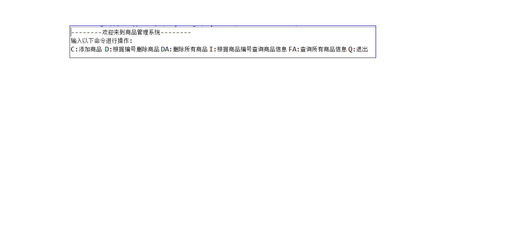

-  查询所有

     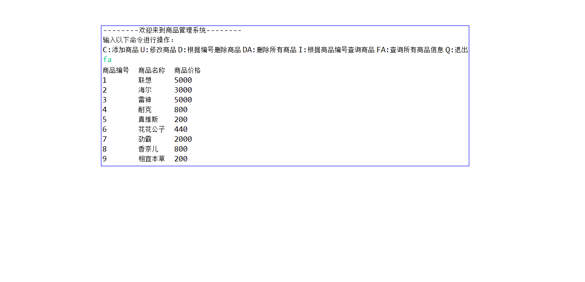


- 通过id查询详情

  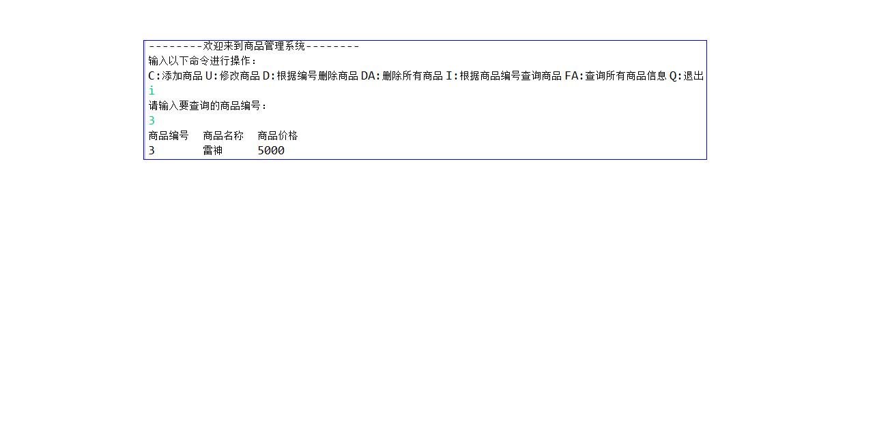

- 添加

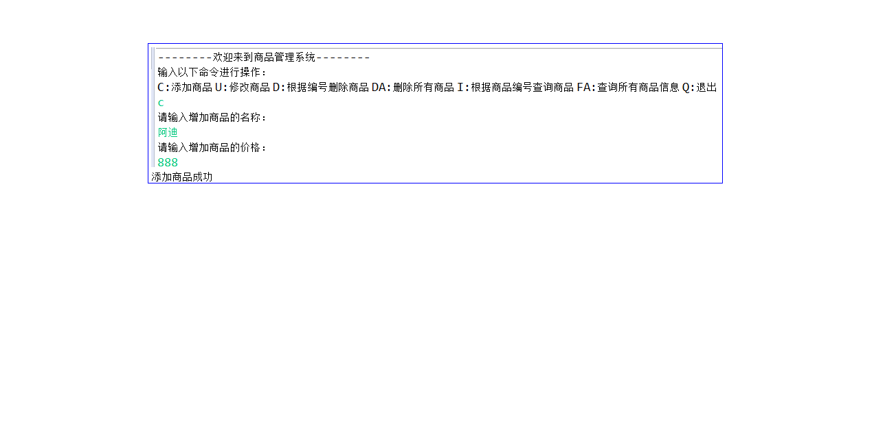

- 通过id删除

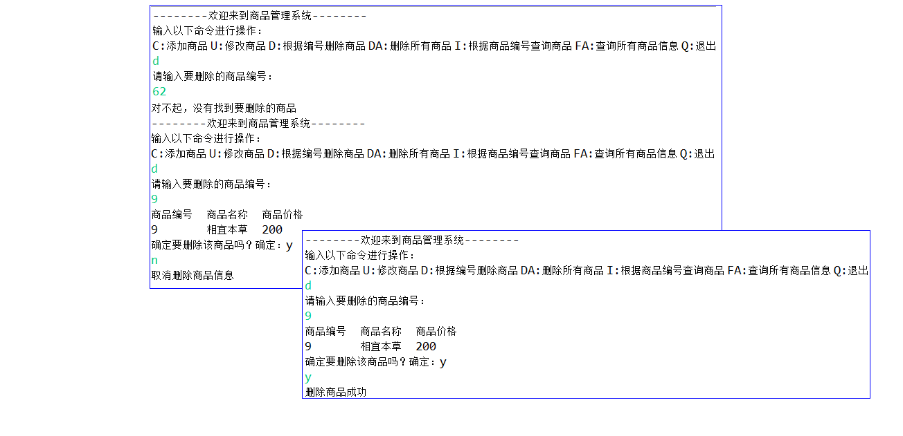 


### 案例分析

- 程序将划分层次

  ​com.itheima.domain 		javaBean

  ​com.itheima.utils			工具类

  com.itheima.web                web层，这里我们使用main方法代替。

  ​com.itheima.service		service层（业务层）

  ​com.itheima.dao			dao层

### 代码实现

#### 准备工作

创建数据库并插入数据：

    var productArr = [{
    	pid:1,
    	pname:"lenovo",
    	price:5000
    },
    {
    	pid:2,
    	pname:"Haier",
    	price:3000
    },
    {
    	pid:3,
    	pname:"Thor",
    	price:5000
    },
    {
    	pid:4,
    	pname:"Nike",
    	price:800
    },
    {
    	pid:5,
    	pname:"Dior",
    	price:2000
    },
    {
    	pid:6,
    	pname:"HERMES",
    	price:2400
    },
    {
    	pid:7,
    	pname:"MK",
    	price:4000
    },
    {
    	pid:8,
    	pname:"CHANEL",
    	price:800
    },
    {
    	pid:9,
    	pname:"BMW",
    	price:20000
    }]
    for(var i = 0;i<productArr.length;i++){
    	db.products.insert(productArr[i])
    }
插入后的数据如下所示：

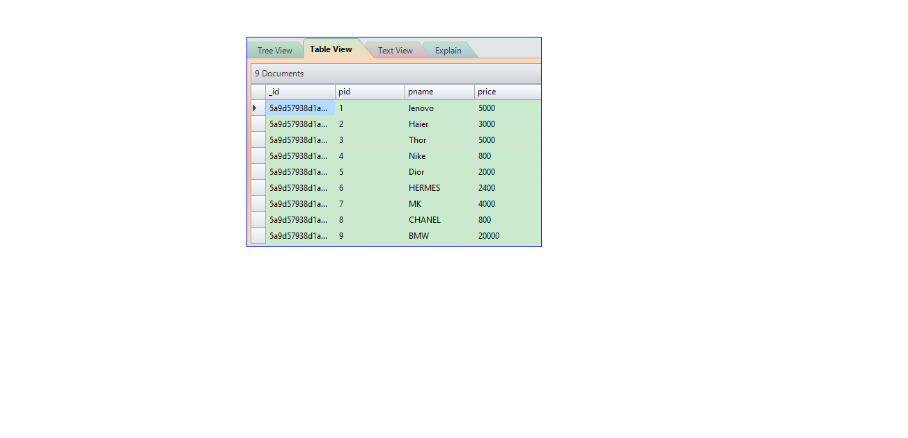 



#### JavaBean的创建


根据数据库表中的字段创建JavaBean，如下所示：

```java
public class Product {
	private ObjectId obj_id;
	private int pid;//商品id
	private String pname;//商品名字
	private int price;//商品价格
	public Product() {
		super();
		// TODO Auto-generated constructor stub
	}
	public Product(ObjectId obj_id, int pid, String pname, int price) {
		super();
		this.obj_id = obj_id;
		this.pid = pid;
		this.pname = pname;
		this.price = price;
	}
	public ObjectId getObj_id() {
		return obj_id;
	}
	public void setObj_id(ObjectId obj_id) {
		this.obj_id = obj_id;
	}
	public int getPid() {
		return pid;
	}
	public void setPid(int pid) {
		this.pid = pid;
	}
	public String getPname() {
		return pname;
	}
	public void setPname(String pname) {
		this.pname = pname;
	}
	public int getPrice() {
		return price;
	}
	public void setPrice(int price) {
		this.price = price;
	}
	@Override
	public String toString() {
		return "Product [obj_id=" + obj_id + ", pid=" + pid + ", pname=" + pname + ", price=" + price + "]";
	}
}
```
**导入MongoDB的驱动包**

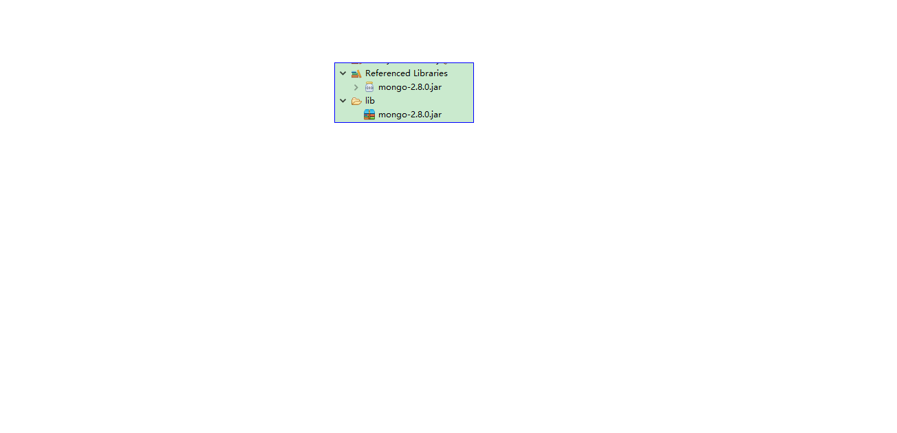

#### 工具类

```java
public class MongoDBUtils {
	// 1.使用connection用来保存Mongo的数据库连接对象
	static Mongo connection = null;
	// 2.使用db接收具体的数据库连接
	static DB db = null;
	public static DB getDB(String dbName) throws Exception {
		//创建一个Mongo的数据库连接对象
		connection = new Mongo("127.0.0.1:27017");
		//通过获取数据库的连接对象connection根据传递的数据库名dbName来连接具体的数据库
		db = connection.getDB(dbName);
		//将具体的数据库连接返回给调用者
		return db;
	}
} 
```
### 控制台输入

--------欢迎来到商品管理系统--------

输入以下命令进行操作：

C:添加商品 D:根据编号删除商品 DA:删除所有商品 I:根据商品编号查询商品信息 FA:查询所有商品信息 Q:退出

```java
public class ProductManager {
	public static void main(String[] args) {
		// 创建键盘录入对象
		Scanner sc = new Scanner(System.in);
		while (true) {
			System.out.println("--------欢迎来到商品管理系统--------");
			System.out.println("输入以下命令进行操作:");
			System.out.println("C:添加商品D:根据编号删除商品 DA:删除所有商品 I:根据商品编号查询商品信息 FA:查询所有商品信息 Q:退出");
			// 获取用户输入的内容
			String s = sc.nextLine();
			switch (s.toUpperCase()) {
			case "C":
				System.out.println("增加商品");
				break;
			case "D":
				System.out.println("根据编号删除商品");
				break;
			case "DA":
				System.out.println("删除所有商品");
				break;
			case "I":
				System.out.println("根据编号查询商品信息");
				break;
			case "FA":
				System.out.println("查询所有商品信息");
				break;
			case "Q":
				// System.out.println("欢迎再次访问!");
				// System.exit(0);
				// break;
			default:
				System.out.println("谢谢，欢迎再次访问!");
				System.exit(0);
			}
		}
	}
}
```
### 查询所有商品信息

查询所有商品信息的业务流程：

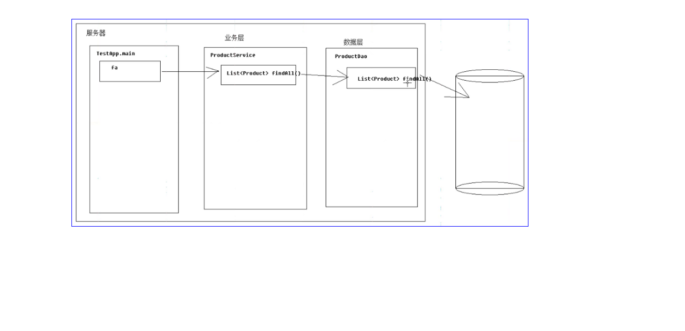 

查询所有商品信息的结果：

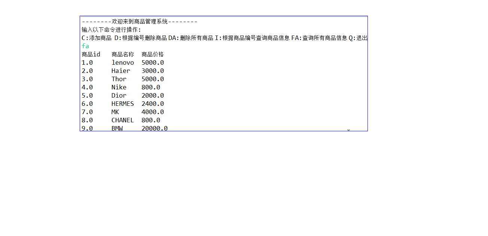

**web层入口**

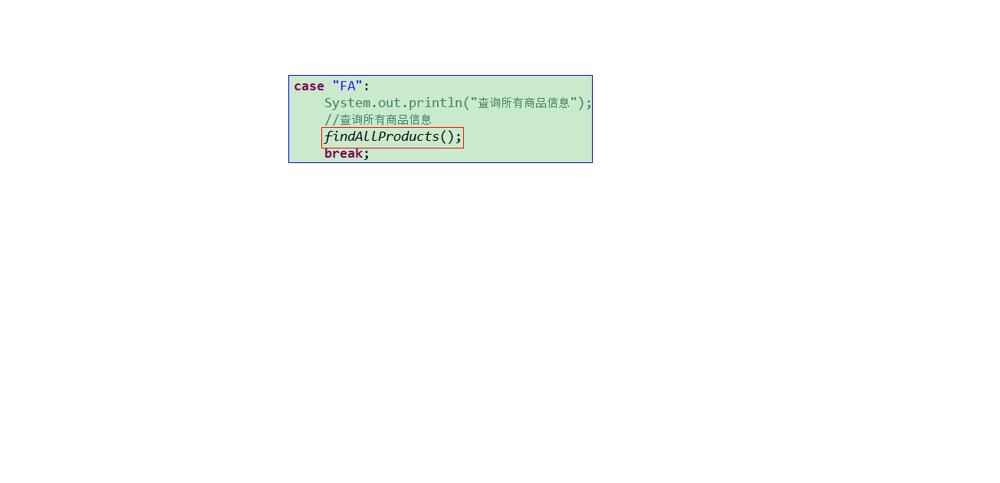

查询所有商品信息的代码如下：

```java
public static void findAllProducts() {
		try {
			// 创建业务层类的对象
			ProductService productService = new ProductService();
			DBCursor cur = productService.findAllProducts();
			// 判断数据库中是否有数据
			if (cur.size() == 0) {
				// 没有数据
				System.out.println("没有任何商品信息");
			} else {
				// 有数据
				System.out.println("商品id\t商品名称\t商品价格");
				//对于光标使用while循环控制获取数据的次数 cur.hasNext()表示判断在光标对象中是否含有数据
				while (cur.hasNext()) {
					//DBObject相当于 "{"BMW":"181887"}"对象
					//cur.next() 获取每一行数据放到product中
					DBObject product = cur.next();
					//product.get("") 表示取出每一行数据 
					System.out.println(product.get("pid") + "\t" + product.get("pname") + "\t" + product.get("price"));
				}
			}
		} catch (Exception e) {
			e.printStackTrace();
		}
	}
}
```
**service层**


```java
public DBCursor findAllProducts() throws Exception {
		DBCursor cur = productDao.findAllProducts();
		return cur;
	}
```
#### dao层

```java
    //查询所有商品
	public DBCursor findAllProducts() throws Exception {
		//通过工具类获取到具体的数据库连接
		DB db = MongoDBUtils.getDB("itcast");
		//根据数据库连接获取具体某张表即集合的对象
		DBCollection coll = db.getCollection("products");
		//根据集合对象调用方法查找集合中的所有数据，放到返回值cur，可以理解为光标
		DBCursor cur =coll.find();
		//将获取的光标返回给调用者
		return cur;
	}
```
### 通过id查询商品详情

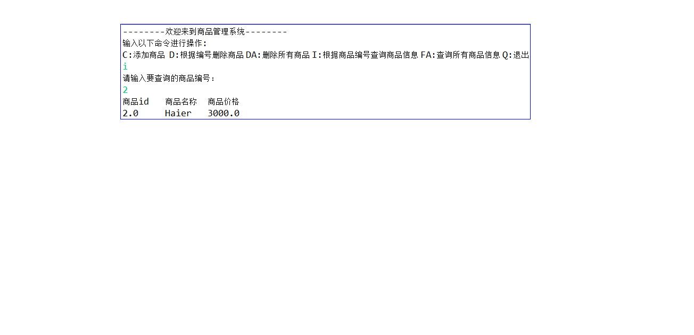

根据商品id查询商品的业务流程如下图所示：

#### 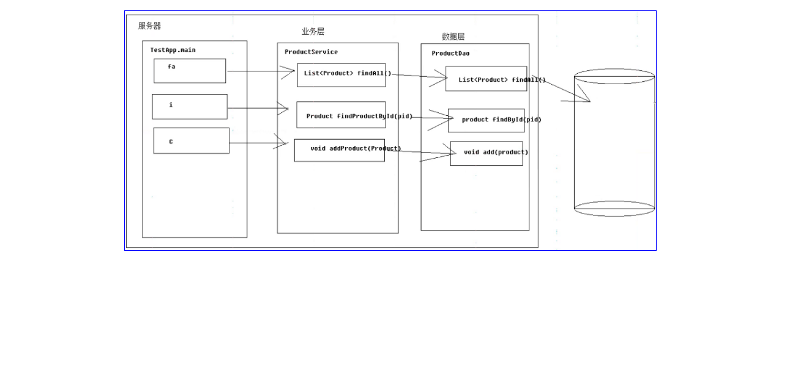 

#### web层入口

方法代码如下所示：

```java
// 根据编号查询商品信息
	public static void findProductById() {
		try {
			// 创建键盘录入对象
			Scanner sc = new Scanner(System.in);
			System.out.println("请输入要查询的商品编号：");
			// 获取键盘录入的商品编号
			String pidStr = sc.nextLine();
			// 将pidStr解析为int类型 如果输入的不是数字，就会抛异常
			int pid = Integer.parseInt(pidStr);
			// 调用业务层根据编号查询商品信息
			ProductService productService = new ProductService();
			DBCursor cur = productService.findProductById(pid);
			//判断光标cur中是否含有数据
			if (cur.size()!=0) {
				// 根据id查询到了商品信息
				System.out.println("商品id\t商品名称\t商品价格");
				while (cur.hasNext()) {
					DBObject product = cur.next();
					System.out.println(product.get("pid") + "\t" + product.get("pname") + "\t" + product.get("price"));
				}
			} else {
				System.out.println("此商品编号没有对应的商品信息");
			}
		} catch (Exception e) {
			System.out.println("根据编号查询商品信息出现异常");
		}
	}
```
**service层**


```java
public DBCursor findProductById(int pid) throws Exception {
		DBCursor cur = productDao.findProductById(pid);
		return cur;
	}
```
#### dao层

```java
public DBCursor findProductById(int pid) throws Exception {
		//通过工具类获取到具体的数据库连接
		DB db = MongoDBUtils.getDB("itcast");
		//根据数据库连接获取具体某张表即集合的对象
		DBCollection coll = db.getCollection("products");
		//DBObject是BasicDBObject类的父接口 
		//BasicDBObject 底层其实实现原理就是HashMap key-value形式
		DBObject dbs = new BasicDBObject();//存在形式：{"pid":pid}
		dbs.put("pid",pid);//将要查询的pid的值放到dbs中
		//根据dbs中的pid的值到数据库中查询数据，使用光标接收
		//DBCursor 类似于java中的Iterator迭代器接口，属于一个类
		DBCursor cur = coll.find(dbs);
		//返回光标
		return cur;
	}
```
### 添加商品

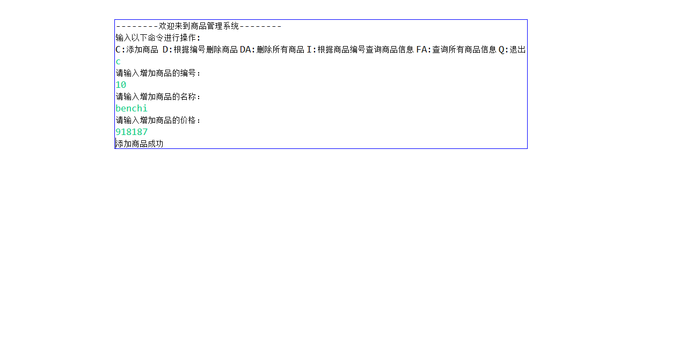


添加商品的业务流程如下图所示：

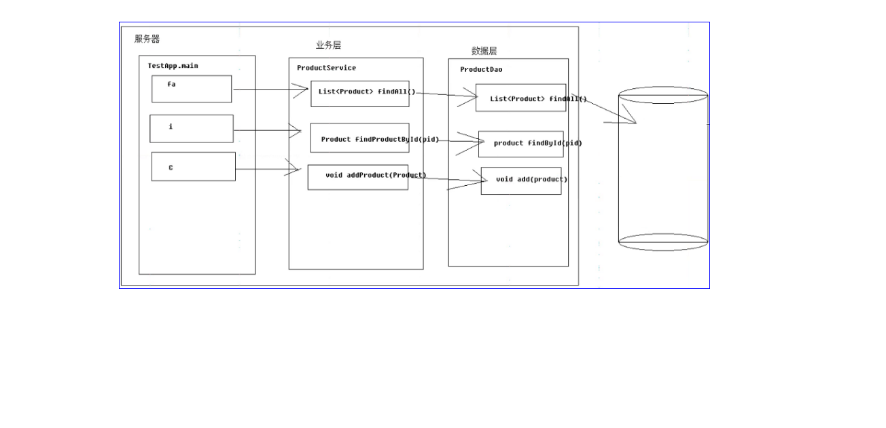

升级版本的工具类：

```java
public class MongoDBUtils {
	// 1.使用connection用来保存Mongo的数据库连接对象
	static Mongo connection = null;
	// 2.使用db接收具体的数据库连接
	static DB db = null;
	// 3.定义coll接收数据表的连接
	static DBCollection coll = null;

	public static DB getDB(String dbName) throws Exception {
		// 创建一个Mongo的数据库连接对象
		connection = new Mongo("127.0.0.1:27017");
		// 通过获取数据库的连接对象connection根据传递的数据库名dbName来连接具体的数据库
		db = connection.getDB(dbName);
		// 将具体的数据库连接返回给调用者
		return db;
	}
	public static DBCollection getCollection(String dbName, String collName) throws Exception {
		// 创建一个Mongo的数据库连接对象
		connection = new Mongo("127.0.0.1:27017");
		// 通过获取数据库的连接对象connection根据传递的数据库名dbName来连接具体的数据库
		db = connection.getDB(dbName);
		coll = db.getCollection(collName);
		// 将具体的数据库连接返回给调用者
		return coll;
	}
}
```
**web层入口**

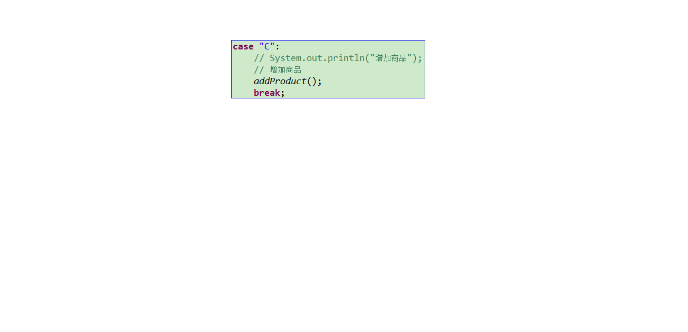

添加商品的方法代码如下所示：

```java
// 增加商品
	public static void addProduct() {
		try {
			// 创建键盘录入对象
			Scanner sc = new Scanner(System.in);
			System.out.println("请输入增加商品的编号：");
			String pidStr = sc.nextLine();
			// 将字符串的价格转换为int类型
			int pid = Integer.parseInt(pidStr);
			System.out.println("请输入增加商品的名称：");
			String pname = sc.nextLine();
			System.out.println("请输入增加商品的价格：");
			String priceStr = sc.nextLine();
			// 将字符串的价格转换为int类型
			int price = Integer.parseInt(priceStr);
			/*
			 * 我们这里需要将商品名称和商品价格封装到Product类的对象中， 这样只需要将商品类Product的对象作为参数传递即可
			 */
			Product p = new Product();
			// 封装到p对象中
			p.setPname(pname);
			p.setPrice(price);
			p.setPid(pid);
			// 创建业务层对象
			ProductService productService = new ProductService();
			// 调用业务层方法将商品传递到业务层
			productService.addProduct(p);
			System.out.println("添加商品成功");
		} catch (Exception e) {
			System.out.println("添加商品出现异常");
		}
	}
```
说明：

我们这里需要将商品名称和商品价格封装到Product类的对象中，这样只需要将商品类Product的对象作为参数传递即可。这样就不会导致如果商品信息有多个时，添加商品时，需要传递参数比较多的情况发生。

#### service层


```java
public void addProduct(Product p) throws Exception {
		productDao.addProduct(p);
	}
```
说明：

由于这里我们需要将Product的对象p传递到dao层，所以还得创建dao层对象，那么这里就产生代码重复性了，我们可以将创建dao层的对象代码 拿到类的成员位置进行创建。

#### dao层

```java
public void addProduct(Product p) throws Exception {
//		//通过工具类获取到具体的数据库连接
//		DB db = MongoDBUtils.getDB("itcast");
//		//根据数据库连接获取具体某张表即集合的对象
//		DBCollection coll = db.getCollection("products");
		//根据数据库连接获取具体某张表即集合的对象  "itcast" 表示数据库名 "products" 表示数据库中的表名
		DBCollection coll = MongoDBUtils.getCollection("itcast", "products");
		DBObject dbs = new BasicDBObject();
		//向dbs中存放key-value数据 {"pname","BMW"}
		dbs.put("pid", p.getPid());
		dbs.put("pname", p.getPname());
		dbs.put("price", p.getPrice());
		//插入操作
		coll.insert(dbs);
	}
```
### 通过id删除

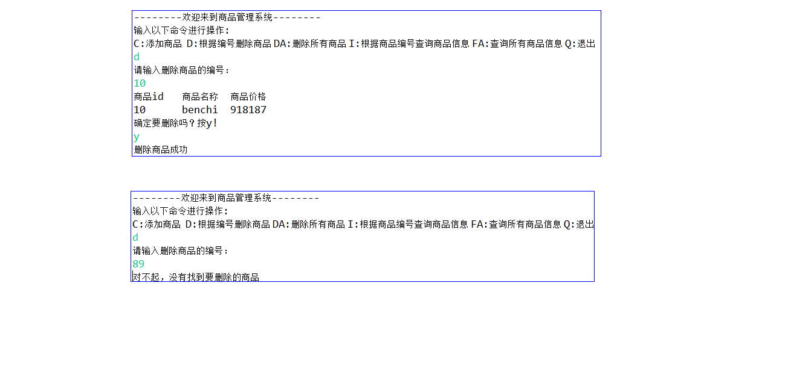

根据商品id删除商品的具体流程如下图所示：

说明：要想删除商品，必须先根据用户输入的商品编号去数据库中查询该商品信息，如果该商品编号不存在，则提示商品不存在，然后再重新选择操作。

如果商品编号存在，则查询出商品信息，然后提示确定删除吗，因为有可能会误删，所以以防万一，我们这里需要作出提示。最后，如果删除成功，则提示删除成功。

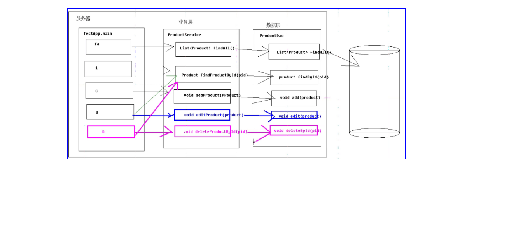 

**web层入口**

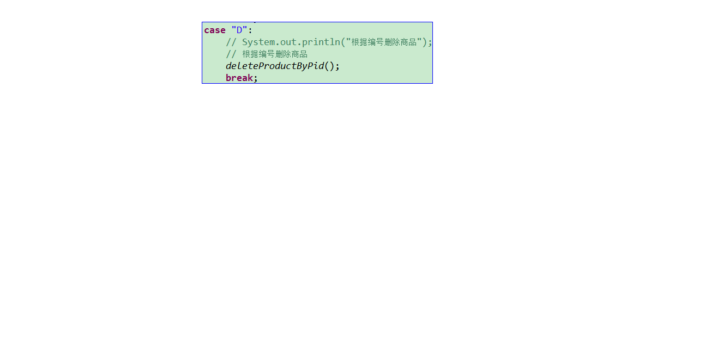

方法中的代码如下所示：

```java
// 根据编号删除商品
		public static void deleteProductByPid() {
			try {
				// 创建键盘录入对象
				Scanner sc = new Scanner(System.in);
				System.out.println("请输入删除商品的编号：");
				String pidStr = sc.nextLine();
				int pid = Integer.parseInt(pidStr);
				// 根据商品编号查询商品信息
				// 调用业务层根据编号查询商品信息
				ProductService productService = new ProductService();
				DBCursor cur = productService.findProductById(pid);
				//判断是否查找到该商品，如果没有该商品，则提示没有找到要删除的商品 结束方法
				if(cur.size() == 0)
				{
					System.out.println("对不起，没有找到要删除的商品");
					return;
				}
				//如果程序能够运行到这里，说明根据编号已经找到该商品信息
				System.out.println("商品id\t商品名称\t商品价格");
				while (cur.hasNext()) {
					DBObject product = cur.next();
					System.out.println(product.get("pid") + "\t" + product.get("pname") + "\t" + product.get("price"));
				}
				//防止误删
				System.out.println("确定要删除吗？按y!");
				//获取录入的字母
				String yes = sc.nextLine();
				//判断是否确定删除
				if("y".equals(yes))
				{
					//确定删除 调用业务层根据商品编号进行删除
					productService.deleteProductByPid(pid);
					//提示删除成功
					System.out.println("删除商品成功");
				}else
				{
					//误删
					System.out.println("取消删除商品信息！");
				}
			}catch (Exception e) {
				System.out.println("根据编号删除商品出现异常");
			}
		}
```
#### service层


```java
	public void deleteProductByPid(int pid) throws Exception {
		productDao.deleteProductByPid(pid);
	}
```
#### dao层

删除商品信息代码：

```java
public void deleteProductByPid(int pid) throws Exception {
		//根据数据库连接获取具体某张表即集合的对象  "itcast" 表示数据库名 "products" 表示数据库中的表名
		DBCollection coll = MongoDBUtils.getCollection("itcast", "products");
		DBObject dbs = new BasicDBObject("pid", pid);
		coll.remove(dbs);
	}
```





### 


### 


 


