# Oracle单行函数和多行函数的使用

课程安排:

​	1.oracle常用单行函数的分类和使用

​	2.oracle常用多行函数的使用


## 1.1. 单行函数

### 1.1.1.  函数的分类

Oracle的内置函数分为单行函数和多行函数（多行函数还称之为组函数、聚集函数等）。

​                              

 

### 1.1.2.  单行函数的概念

1. 操作数据对象
2. 接受参数并只返回一个结果
3. 只对一行数据进行处理
4. 每行返回一个结果
5. 可以转换数据类型
6. 可以嵌套 
7. 参数是一个列或是一个具体的值


### 1.1.3.  单行函数的分类

 单行函数总体分为五个小类:  字符,数值,日期,转换,通用.


 

### 1.1.4.  字符函数

 字符函数又分为 大小写控制函数和字符函数

​       

l 大小写控制函数

【示例】需求1：查询出KING的这个员工的信息。

 ```sql
--需求1：查询出KING的这个员工的信息。
SELECT * FROM emp WHERE ename ='king';
SELECT * FROM emp WHERE LOWER(ename) ='king';--会将数据库的值转换成小写
SELECT * FROM emp WHERE ename =UPPER('KinG');--不管用户输入的是大写还是小写，还是大小混合写
SELECT UPPER('KiNg') FROM dual;
SELECT empno,INITCAP(ename) FROM emp --首字母大写

 ```

【讨论】：

上述的需求，到底是使用upper还是使用lower呢？

一般根据需求来选择的。

如果将函数放到字段上，会每行的该字段都会转换，效率低一些。--sql优化

因此，一般情况下，建议将转换函数放到固定值上面(好处之一就是只需要转换一次，还有一个好处，就是你不知道用户到底输入的是大写还是小写还是混合写，更适应业务)。

 

l 字符控制函数：

  


需求1：替换字符串'abcd'中的’bc’为’ITCAST’，最终显示为’aITCASTd’

需求2：去掉' Hello World '前后的空格

需求3：去掉'Hello WorldH'前后的H字符（提示：使用from关键字）

```sql
--需求1：替换字符串'abcd'中的’bc’为’ITCAST’，最终显示为’aITCASTd’
SELECT REPLACE ('abcd','bc','ITCAST') FROM dual;
--需求2：去掉' Hello World '前后的空格
SELECT TRIM(' Hello World ') FROM dual;
--需求3：去掉'Hello WorldH'前后的H字符（提示：使用from关键字）
SELECT TRIM('H' FROM 'Hello WorldH') FROM dual;
```

 

【提示】：Oracle的函数非常多，建议大家只记住课堂上讲解的常用的几个就基本够用了，其他的可以查阅手册：

  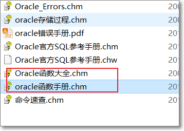

 

### 1.1.5.  数字函数

​	常用数字函数:

​	**round**(12.35,1)  四舍五入

​	**trunc**(12.35,1)  截断

​	

【示例】

需求：钱数：*1385.56**，*分别根据不同场景进行处理显示不同结果：买东西（抹零头：1385，1380）、发工资（发钱了：1386）

 ```sql
--需求：钱数：1385.56，分别根据不同场景进行处理显示不同结果：买东西（抹零头：1385，1380）、发工资（发钱了：1386）
SELECT TRUNC(1385.56) 买东西抹零头,TRUNC(1385.56,-1) 抹零头,
ROUND(1385.56) 发钱,ROUND(1385.56,1) 发钱
 FROM dual;

 ```


【提示】：

Round和trunc函数，除了对数字起作用外，对于日期也是起作用的。（后面会提到）

 

### 1.1.6.  日期函数

【示例】

问题：日期可以相减么？日期可以相加么？

 ```sql
SELECT SYSDATE-SYSDATE FROM dual;--日期相减一般是为了计算两个日期之间间隔
SELECT SYSDATE+SYSDATE FROM dual;--日期相加没意义
 ```


常用函数（了解，用时查询）

 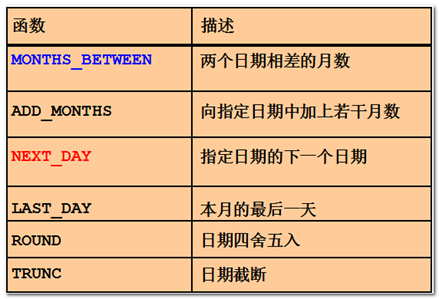    

next_day(基础日期,星期几)

星期几,是从周日开始，分别数字为1，2，3。。。。

 

【示例】

需求1：计算员工的工龄（工龄：当前的日期和入职的日期的差），要求分别显示员工入职的天数、多少月、多少年。

需求2：查看当月最后一天的日期。

需求3：查看指定日期的下一个星期天或星期一的日期。（next_day(基础日期,星期几)）

 ```sql
--需求1：计算员工的工龄（工龄：当前的日期和入职的日期的差），要求分别显示员工入职的天数、多少月、多少年。
SELECT ename, SYSDATE-hiredate 工龄天,
(SYSDATE-hiredate)/30 工龄月不精确,months_between(SYSDATE,hiredate) 工龄月精确,
TRUNC (months_between(SYSDATE,hiredate)/12) 工龄年精确
FROM emp;
--需求2：查看当月最后一天的日期。
SELECT last_day(SYSDATE) FROM dual;
--需求3：查看指定日期的下一个星期天或星期一的日期。（next_day(基础日期,星期几)）--星期日是1，星期一2
SELECT next_day(SYSDATE,1) FROM dual;
SELECT next_day(SYSDATE,2) FROM dual;

 ```


【扩展知识】

扩展：时间戳systimestamp关键字。

【示例】

查看当前系统默认精度的日期时间和更高精度的时间戳，要求显示结果如下：

 ```sql
SELECT SYSDATE,Systimestamp FROM dual;
 ```

 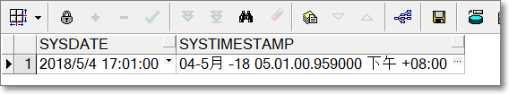

 

### 1.1.7.   转换函数

数据类型转换分类：显示转换, 隐式转换

 

l **隐式转换**

【示例】

需求：查询10号部门的信息，分别使用数字和字符串作为条件的值。

 ```sql
--需求：查询10号部门的信息，分别使用数字和字符串作为条件的值。
SELECT * FROM emp WHERE deptno=10;
SELECT * FROM emp WHERE deptno='10';--字符串隐式转换为数字了
SELECT * FROM emp WHERE deptno='10q';--隐式转换的前提，是能转换才可以。

 ```


【工具的使用补充】在查询数据的时候，通过工具来快捷查看字段的数据类型：

  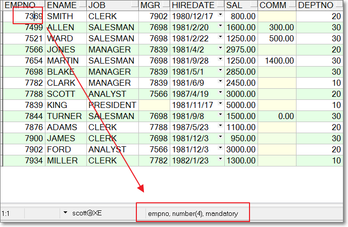

 

**隐式转换的条件：**

Oracle可以自动的完成下列类型（三种）的转换：

  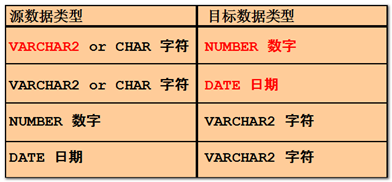

 

**非法转换：**

隐式转换的前提是：被转换的对象是可以转换的。下面的语句会报错：

 ```sql
SELECT * FROM emp WHERE deptno='10q';
 ```


运行会抛一个异常：

 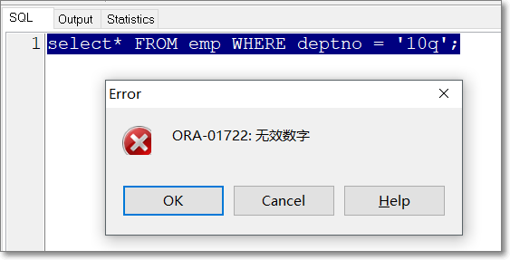 

 

l **显示转换（三个函数）**

  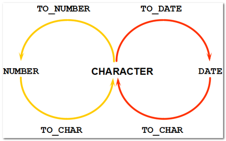

三个转换函数的语法：

将日期或数字转换成字符

 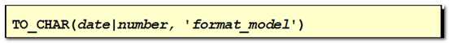

将字符转换成日期

 

将字符转换成数字

 

 

**【提示：记忆方式】：第一个参数都是要转换的目标（到底用哪个函数，跟目标有关系），第二个都是转换的格式。**

 

【示例】

需求1：显示今天的完整日期，结果参考：“2015-07-06 11:07:25”。

需求2：显示今天是几号，不包含年月和时间，结果参考：“8日”。

需求3：显示当月最后一天是几号，结果参考：”30“。

需求4：xiaoming的入职日期是2015-03-15，由于其入职日期当时忘记录入，现在请将其插入到emp表中。

需求5：查看2015年2月份最后一天是几号，结果参考“28“

 ```sql
--需求1：显示今天的完整日期，结果参考：“2015-07-06 11:07:25”。

SELECT to_char(SYSDATE,'yyYy-mm-dD HH24:mi:ss') FROM dual;
--oracle的日期格式和java不一样

--需求2：显示今天是几号，不包含年月和时间，结果参考：“8日”。
SELECT to_char(SYSDATE,'dd')||'日' FROM dual;

--需求3：显示当月最后一天是几号，结果参考：”30“。
 SELECT to_char(last_day(SYSDATE),'dd') FROM dual;      


--需求4：xiaoming的入职日期是2015-03-15，由于其入职日期当时忘记录入，现在请将其插入到emp表中。
UPDATE emp SET  hiredate = to_date('2015-03-15','yyyy-mm-dd') WHERE ename = 'xiao_ming';
SELECT  * FROM emp;
COMMIT;
--需求5：查看2015年2月份最后一天是几号，结果参考“28“
SELECT to_char(last_day(to_date('2015-02','yyyy-mm')),'dd') FROM dual;
-- 不指定具体日期的话, 默认从1开始
 
 ```

【注意】和java不同，Oracle的日期格式对大小写不敏感。

 

【使用上的选择】:到底要用哪个函数，关键是传进来的目标的类型和最终需要的结果类型。

 

**日期格式的常见元素：**

  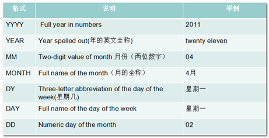


 

**数字格式的常见元素：**

  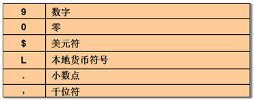

提示：9代表任意数字，可以不存在。0代表数字，如果该位置不存在，则用0占位。

 

【示例】

需求：查询员工的薪水，格式要求：两位小数，千位数分割，本地货币代码。

 ```sql
--需求：查询员工的薪水，格式要求：两位小数，千位数分割，本地货币代码。
SELECT ename,sal,to_char(sal,'L99,999.00') FROM emp;
SELECT ename,sal,to_char(sal,'L00,000.00') FROM emp;
 ```


### 1.1.8.  滤空函数（通用函数）

滤空函数也称为通用函数，其特点是：适用于任何数据类型，同时也适用于空值。

常见的滤空函数：

  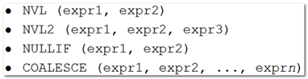

使用方法：

l nvl(a,c)，当a为null的时候，返回c，否则，返回a本身。

l nvl2(a,b,c),当a为null的时候，返回c，否则返回b—三元运算

其中，nvl2中的2是增强的意思，类似于varchar2。

l nullif(a,b),当a=b的时候，返回null，否则返回a

l coalesce(a,b,c,d)，从左往右查找，当找到第一个不为null的值的时候，就显示这第一个有值的值。

 

【示例】

需求：查询员工的月收入（基本薪资+奖金）

 ```sql
--需求：查询员工的月收入（基本薪资+奖金）
SELECT ename,sal+nvl(comm,0) 月收入 FROM emp;
SELECT coalesce(NULL,NULL,1,2) FROM dual;--返回第一个不为空的值
 ```


### 1.1.9.   条件表达式

条件表达式的作用是：在SQL语句中使用判断的逻辑（类似于IF-THEN-ELSE）来呈现个性化的数据。

条件判断语句有两种：

l  CASE 表达式：SQL99的语法，类似Basic，比较繁琐

 

 

l  DECODE 函数：Oracle自己的语法，类似Java，比较简单

 

1.       Decode函数

也可以理解为解码翻译函数。

语法：

decode (字段名,要翻译的原始值1，翻译后的值1，......，其他不满足翻译条件的默认值)

 

【示例】

需求:要将工种job的英文转换为中文

 ```sql
--需求:要将工种job的英文转换为中文
SELECT ename,job,
DECODE(job,'CLERK','职员','SALESMAN','销售人员','MANAGER','经理','其他工种')
 FROM emp;

 ```


业务场景补充：

比如人的性别：一般数据库存放的是：0和1，2，在直接出报表的时候，就需要转换显示。

 ```sql
SELECT NAME 姓名,DECODE(sex,1,'男',0,'女','保密') 性别 FROM TABLE;
 ```


2.       Case子句

语法：

 ```plsql
case 字段 when 要翻译的值 then 翻译的结果
when 要翻译的值 then 翻译的结果
		......
		else 默认的结果值
end
 ```

 

【示例】要将工种job的英文转换为中文

 ```sql
 SELECT ename,job,
 
 CASE job WHEN 'CLERK' THEN '职员'
    WHEN 'SALESMAN' THEN '卖男'
   ELSE '其他工种'
 end

 FROM emp;

 ```


3.       case子句增强

需求：查看公司员工的工资情况，要求显示员工的姓名、职位、工资、以及工资情况。如果是工资小于1000，则显示“工资过低”，工资大于1000小于5000为“工资适中”，工资大于5000的，则显示“工资过高”：

 ```plsql
SELECT ename,job,sal,
  CASE WHEN sal<1000 THEN '工资过低' 
       WHEN sal BETWEEN 1000 AND 5000 THEN '工资适中'
         when sal IS NULL THEN '没工资酱油瓶'
         ELSE '工资太高'
  END
FROM emp;

 ```

Decode和Case的使用选择：

在Oracle中，翻译值的这种条件判断，优先使用decode，因为简单明了，且Oracle有一定的优化；更复杂的条件判断或者其他的关系型数据库，只能使用Case子句。

 

 

## 1.2. 多行函数

### 1.2.1.  多行函数的概念

多行函数也称之为分组函数、组函数、聚集函数。

简答的说就是把多行的值汇聚计算成一个值。

 

常见的分组函数：

 count(), max(), min(), sum(), avg()

多行函数会自动滤空。

 

【示例】

需求：统计计算员工的平均奖金。

 ```sql
--需求：统计计算员工的平均奖金。（不同需求不同结果）
SELECT AVG(comm) FROM emp;--统计的是有奖金的人的平均奖金
--相当于
SELECT SUM(comm)/COUNT(comm) FROM emp;--多行函数会自动滤空
--统计所有人的平均奖金
SELECT AVG(nvl(comm,0)) FROM emp;
 ```


### 1.2.3.  嵌套函数

distinct可用来过滤掉多余的重复记录只保留一条，但往往只用 它来返回不重复记录的条数，而不是用它来返回显示不重记录的所有值。因此，一般和count配合使用，作为统计非空且不重复的记录数。

需求：查看有几个部门，通过**emp**表 

```sql
SELECT COUNT(DISTINCT(DEPTNO)) FROM EMP;
```

【注意】：DISTINCT关键字效率会比较低，如果仅仅是为了显示不重复的记录，建议使用group by；

 慢的原因是：

distinct只有用二重循环查询来解决，而这样对于一个数据量非常大的表来说，无疑是会直接影响到效率的。

[了解]：MAX()和MIN()函数不仅可以作用于数值型数据，也可以作用于字符串或是日期时间数据类型的数据。

