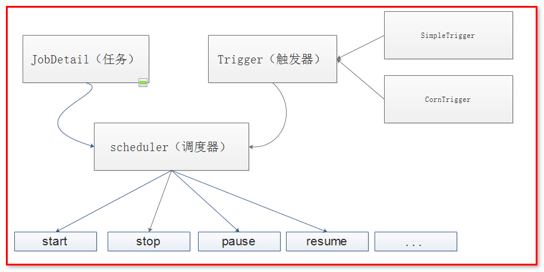
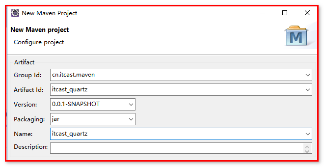
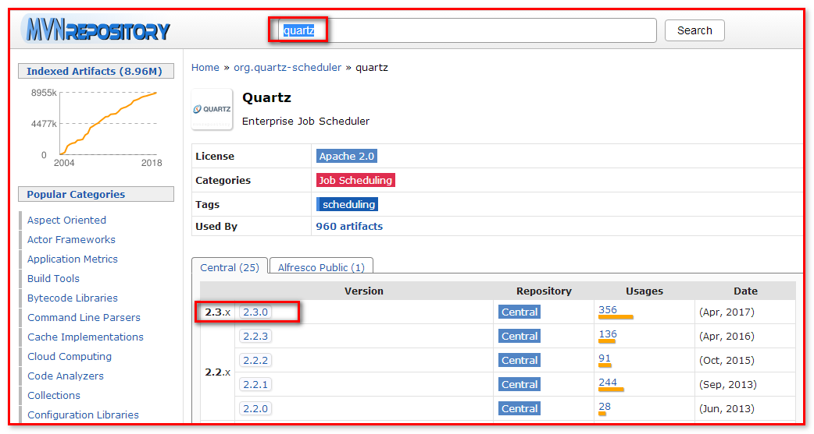
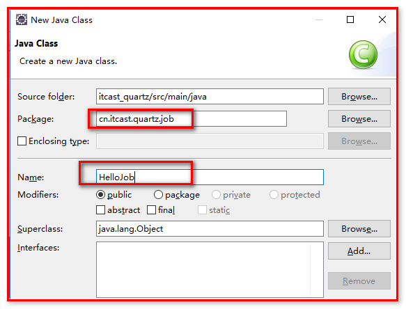
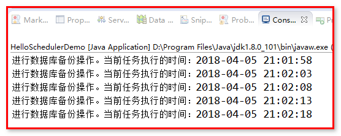
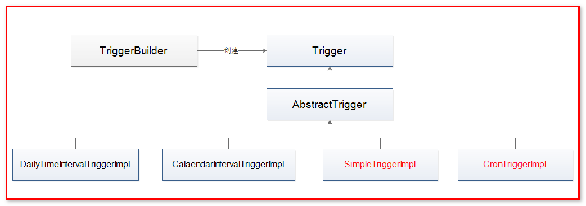
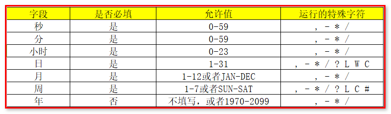
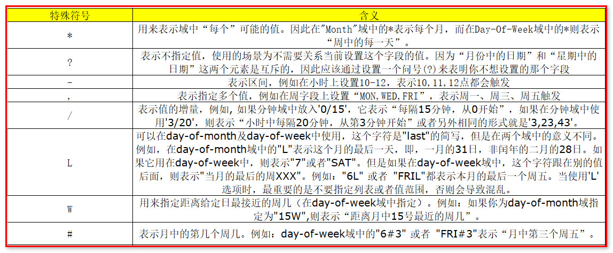

#Quartz任务调度

##一.Quartz概念
Quartz是OpenSymphony开源组织在Job scheduling领域又一个开源项目，它可以与J2EE与J2SE应用程序相结合也可以单独使用。

quartz是开源且具有丰富特性的"任务调度库"，能够集成于任何的java应用，小到独立的应用，大至电子商业系统。quartz能够创建亦简单亦复杂的调度，以执行上十、上百，甚至上万的任务。任务job被定义为标准的java组件，能够执行任何你想要实现的功能。quartz调度框架包含许多企业级的特性，如JTA事务、集群的支持。

简而言之，quartz就是基于java实现的任务调度框架，用于执行你想要执行的任何任务。


官网：
http://www.quartz-scheduler.org/ 
##二.Quartz运行环境
- Quartz 可以运行嵌入在另一个独立式应用程序
- Quartz 可以在应用程序服务器(或servlet容器)内被实例化，并且参与事务
- Quartz 可以作为一个独立的程序运行(其自己的Java虚拟机内)，可以通过RMI使用
- Quartz 可以被实例化，作为独立的项目集群(负载平衡和故障转移功能)，用于作业的执行

## 三.Quartz设计模式
- Builder模式
- Factory模式
- 组件模式
- 链式编程

## 四.Quartz学习的核心概念

 - 任务Job

Job就是你想要实现的任务类，每一个Job必须实现org.quartz.job接口，且只需实现接口定义的execute()方法。

 - 触发器Trigger

Trigger为你执行任务的触发器，比如你想每天定时3点发送一份统计邮件，Trigger将会设置3点进行执行该任务。Trigger主要包含两种SimpleTrigger和CronTrigger两种。关于二者的区别的使用场景，后续的课程会进行讨论。

 - 调度器Scheduler

Scheduler为任务的调度器，它会将任务job及触发器Trigger整合起来，负责基于Trigger设定的时间来执行Job。


## 五.Quartz的体系结构




## 六.Quartz的几个常用API
以下是Quartz编程API几个重要接口，也是Quartz的重要组件

- Scheduler 用于与调度程序交互的主程序接口。
  Scheduler 调度程序-任务执行计划表，只有安排进执行计划的任务Job（通过scheduler.scheduleJob方法安排进执行计划），当它预先定义的执行时间到了的时候（任务触发trigger），该任务才会执行。
- Job 我们预先定义的希望在未来时间能被调度程序执行的任务类，我们可以自定义。
- JobDetail 使用JobDetail来定义定时任务的实例，JobDetail实例是通过JobBuilder类创建的。
- JobDataMap 可以包含不限量的（序列化的）数据对象，在job实例执行的时候，可以使用
  其中的数据；JobDataMap是Java Map接口的一个实现，额外增加了一些便于存取基本类型的数
  据的方法。
- Trigger 触发器，Trigger对象是用来触发执行Job的。当调度一个job时，我们实例一个触发器然后调整它的属性来满足job执行的条件。表明任务在什么时候会执行。定义了一个已经被安排的任务将会在什么时候执行的时间条件，比如每2秒就执行一次。
- JobBuilder -用于声明一个任务实例，也可以定义关于该任务的详情比如任务名、组名等，这个声明的实例将会作为一个实际执行的任务。
- TriggerBuilder 触发器创建器，用于创建触发器trigger实例。
- JobListener、TriggerListener、SchedulerListener监听器，用于对组件的监听。


## 七.Quartz的使用
### 1.准备工作

建立Maven工程


查找：www.mvnrepository.com



### 2.引入Quartz的jar包

    	<dependencies>
    		<dependency>
    			<groupId>org.quartz-scheduler</groupId>
    			<artifactId>quartz</artifactId>
    			<version>2.3.0</version>
    		</dependency>
            <dependency>
    			<groupId>junit</groupId>
    			<artifactId>junit</artifactId>
    			<version>4.12</version>
    		</dependency>
    		<dependency>
    			<groupId>org.slf4j</groupId>
    			<artifactId>slf4j-log4j12</artifactId>
    			<version>1.7.5</version>
    		</dependency>
    		<dependency>
    			<groupId>log4j</groupId>
    			<artifactId>log4j</artifactId>
    			<version>1.2.15</version>
    		</dependency>
    	</dependencies>
    
    	<build>
    		<plugins>
    			<plugin>
    				<groupId>org.apache.maven.plugins</groupId>
    				<artifactId>maven-compiler-plugin</artifactId>
    				<version>3.5.1</version>
    				<configuration>
    					<target>1.8</target>
    					<source>1.8</source>
    				</configuration>
    			</plugin>
    		</plugins>
    	</build>

导入log4j.properties日志文件

    ### direct log messages to stdout ###
    log4j.appender.stdout=org.apache.log4j.ConsoleAppender
    log4j.appender.stdout.Target=System.out
    log4j.appender.stdout.layout=org.apache.log4j.PatternLayout
    log4j.appender.stdout.layout.ConversionPattern=%d{ABSOLUTE} %5p %c{1}:%L - %m%n
    
    ### direct messages to file mylog.log ###
    log4j.appender.file=org.apache.log4j.FileAppender
    log4j.appender.file.File=c:/mylog.log
    log4j.appender.file.layout=org.apache.log4j.PatternLayout
    log4j.appender.file.layout.ConversionPattern=%d{ABSOLUTE} %5p %c{1}:%L - %m%n
    
    ### set log levels - for more verbose logging change 'info' to 'debug' ###
    
    log4j.rootLogger=info, stdout

###3.入门案例

（1）创建HelloJob任务类



HelloJob.java

    // 定义任务类
    public class HelloJob implements Job {
    
    	@Override
    	public void execute(JobExecutionContext arg0) throws JobExecutionException {
    		// 定义时间
    		Date date = new Date();
    		SimpleDateFormat dateFormat = new SimpleDateFormat("yyyy-MM-dd HH:mm:ss");
    		String dateString = dateFormat.format(date);
    		// 定义工作任务内容
    		System.out.println("进行数据库备份操作。当前任务执行的时间："+dateString);
    	}
    }

（2）创建任务调度类HelloSchedulerDemo

HelloSchedulerDemo.java

    public class HelloSchedulerDemo {

    	public static void main(String[] args) throws Exception {
    		// 1：从工厂中获取任务调度的实例
            Scheduler scheduler = StdSchedulerFactory.getDefaultScheduler();
    
            // 2：定义一个任务调度实例，将该实例与HelloJob绑定，任务类需要实现Job接口
            JobDetail job = JobBuilder.newJob(HelloJob.class)
                    .withIdentity("job1", "group1") // 定义该实例唯一标识
                    .build();
    
            // 3：定义触发器 ，马上执行, 然后每5秒重复执行一次
            Trigger trigger = TriggerBuilder.newTrigger()
                    .withIdentity("trigger1", "group1") // 定义该实例唯一标识
                    .startNow()  // 马上执行
                    .withSchedule(SimpleScheduleBuilder.simpleSchedule()
            .repeatSecondlyForever(5)) // 每5秒执行一次   
                    .build();
    
            // 4：使用触发器调度任务的执行
            scheduler.scheduleJob(job, trigger);
    
            // 5：开启
            scheduler.start();
            // 关闭
            // scheduler.shutdown();
    	}
    }

（3）实现效果



###4.Job和JobDetail介绍

- Job：工作任务调度的接口，任务类需要实现该接口。该接口中定义execute方法，类似JDK提供的TimeTask类的run方法。在里面编写任务执行的业务逻辑。
- Job实例在Quartz中的生命周期：每次调度器执行Job时，它在调用execute方法前会创建一个新的Job实例，当调用完成后，关联的Job对象实例会被释放，释放的实例会被垃圾回收机制回收。
- JobDetail：JobDetail为Job实例提供了许多设置属性，以及JobDetaMap成员变量属性，它用来存储特定Job实例的状态信息，调度器需要借助JobDetail对象来添加Job实例。
- JobDetail重要属性：name、group、jobClass、jobDataMap

        JobDetail job = JobBuilder.newJob(HelloJob.class)
                .withIdentity("job1", "group1") // 定义该实例唯一标识，并指定一个组。
                .build();
          
        System.out.println("name:"+job.getKey().getName());
        System.out.println("group:"+job.getKey().getGroup());
        System.out.println("jobClass:"+job.getJobClass().getName());

###5.JobExecutionContext介绍

- 当Scheduler调用一个Job，就会将JobExecutionContext传递给Job的execute()方法；
- Job能通过JobExecutionContext对象访问到Quartz运行时候的环境以及Job本身的明细数据。

###6.JobDataMap介绍

（1）使用Map获取。
- 在进行任务调度时，JobDataMap存储在JobExecutionContext中 ，非常方便获取。
- JobDataMap可以用来装载任何可序列化的数据对象，当job实例对象被执行时这些参数对象会传递给它。
- JobDataMap实现了JDK的Map接口，并且添加了非常方便的方法用来存取基本数据类型。

HelloSchedulerDemo.java

		// 2：定义一个任务调度实例，将该实例与HelloJob绑定，任务类需要实现Job接口
	    JobDetail job = JobBuilder.newJob(HelloJob.class)
	    		.withIdentity("job1", "group1") // 定义该实例唯一标识
	    		.usingJobData("message", "打印日志")
	    		.build();
		
	    // 3：定义触发器 ，马上执行, 然后每5秒重复执行一次
	    Trigger trigger = TriggerBuilder.newTrigger()
	    		.withIdentity("trigger1", "group1") // 定义该实例唯一标识
	    		.startNow()  // 马上执行
	    		//.startAt(triggerStartTime) // 针对某个时刻执行
	    		.withSchedule(SimpleScheduleBuilder.simpleSchedule()
	                .repeatSecondlyForever(5)) // 每5秒执行一次   
	    		.usingJobData("message", "simple触发器")
	    		.build();

HelloJob.java

	JobKey jobKey = context.getJobDetail().getKey();
	System.out.println("工作任务名称："+jobKey.getName()+";工作任务组："+jobKey.getGroup());
	System.out.println("任务类名称（带包名）："+context.getJobDetail().getJobClass().getName());
	System.out.println("任务类名称："+context.getJobDetail().getJobClass().getSimpleName());
	System.out.println("当前任务执行时间："+context.getFireTime());
	System.out.println("下一任务执行时间："+context.getNextFireTime());
	
	TriggerKey triggerKey = context.getTrigger().getKey();
	System.out.println("触发器名称："+triggerKey.getName()+";触发器组："+triggerKey.getGroup());
	
	JobDataMap jobDataMap = context.getJobDetail().getJobDataMap();
	String jobMessage = jobDataMap.getString("message");
	System.out.println("任务参数消息值："+jobMessage);
	
	JobDataMap triggerDataMap = context.getTrigger().getJobDataMap();
	String triggerMessage = triggerDataMap.getString("message");
	System.out.println("触发器参数消息值："+triggerMessage);

（2）Job实现类中添加setter方法对应JobDataMap的键值，Quartz框架默认的JobFactory实现类在初始化job实例对象时会自动地调用这些setter方法。

HelloJob.java
​	
	private String message;

	public void setMessage(String message) {
		this.message = message;
	}

这里注意：如果遇到同名的key，Trigger中的.usingJobData("message", "simple触发器")会覆盖JobDetail中的.usingJobData("message", "打印日志")。

###7.有状态的Job和无状态的Job

@PersistJobDataAfterExecution注解的使用

有状态的Job可以理解为多次Job调用期间可以持有一些状态信息，这些状态信息存储在JobDataMap中，而默认的无状态job每次调用时都会创建一个新的JobDataMap。

（1）修改HelloSchedulerDemo.java。添加.usingJobData("count", 0)，表示计数器。

```
JobDetail job = JobBuilder.newJob(HelloJob.class)
    		.withIdentity("job1", "group1") // 定义该实例唯一标识
    		.usingJobData("message", "打印日志")
    		.usingJobData("count", 0)
    		.build();
```
（2）修改HelloJob.java

添加count的setting和getting方法。

	private Integer count;
	public void setCount(Integer count) {
		this.count = count;
	}
在public void execute(JobExecutionContext context) throws JobExecutionException的方法中添加。

		++count;
		System.out.println("count数量："+count);
		context.getJobDetail().getJobDataMap().put("count", count);
HelloJob类没有添加@PersistJobDataAfterExecution注解，每次调用时都会创建一个新的JobDataMap。不会累加；

HelloJob类添加@PersistJobDataAfterExecution注解，多次Job调用期间可以持有一些状态信息，即可以实现count的累加。


###8.Trigger介绍




Quartz有一些不同的触发器类型，不过，用得最多的是SimpleTrigger和CronTrigger。

（1）jobKey

表示job实例的标识，触发器被触发时，该指定的job实例会被执行。

（2）startTime

表示触发器的时间表，第一次开始被触发的时间，它的数据类型是java.util.Date。

（3）endTime

指定触发器终止被触发的时间，它的数据类型是java.util.Date。

案例：

HelloJobTrigger.java

	// 定义任务类
	public class HelloJobTrigger implements Job {
	
		@Override
		public void execute(JobExecutionContext context) throws JobExecutionException {
			// 定义时间
			Date date = new Date();
			SimpleDateFormat dateFormat = new SimpleDateFormat("yyyy-MM-dd HH:mm:ss");
			String dateString = dateFormat.format(date);
			
			// 定义工作任务内容
			System.out.println("进行数据库备份操作。当前任务执行的时间："+dateString);
			
			// 获取jobKey、startTime、endTime
			Trigger trigger = context.getTrigger();
			System.out.println("jobKey的标识:"+trigger.getJobKey().getName()+";jobKey的组名称："+trigger.getJobKey().getGroup());
			System.out.println("任务开始时间:"+dateFormat.format(trigger.getStartTime())+";任务结束时间："+dateFormat.format(trigger.getEndTime()));
		}
	}

HelloSchedulerDemoTrigger.java

	public class HelloSchedulerDemoTrigger {

		public static void main(String[] args) throws Exception {
			// 1：从工厂中获取任务调度的实例
	        Scheduler scheduler = StdSchedulerFactory.getDefaultScheduler();
	        
	        // 定义日期
	        Date startDate = new Date();
	        // 启动任务，任务在当前时间3秒后执行
	        startDate.setTime(startDate.getTime()+3000);
	        // 定义日期
	        Date endDate = new Date();
	        // 结束任务，任务在当前时间10秒后停止
	        endDate.setTime(endDate.getTime()+10000);
	
	        // 2：定义一个任务调度实例，将该实例与HelloJob绑定，任务类需要实现Job接口
	        JobDetail job = JobBuilder.newJob(HelloJobTrigger.class)
	        		.withIdentity("job1", "group1") // 定义该实例唯一标识
	        		.usingJobData("message", "打印日志")
	        		.build();
	
	        // 3：定义触发器 ，马上执行, 然后每5秒重复执行一次
	        Trigger trigger = TriggerBuilder.newTrigger()
	        		.withIdentity("trigger1", "group1") // 定义该实例唯一标识
	        		.startAt(startDate)
	        		.endAt(endDate)
	        		.withSchedule(SimpleScheduleBuilder.simpleSchedule()
	                    .repeatSecondlyForever(5)) // 每5秒执行一次   
	        		.usingJobData("message", "simple触发器")
	        		.build();
	
	        // 4：使用触发器调度任务的执行
	        scheduler.scheduleJob(job, trigger);
	        
	        // 5：开启
	        scheduler.start();
	        // 关闭
	        // scheduler.shutdown();
		}
	}

###9.SimpleTrigger触发器

SimpleTrigger对于设置和使用是最为简单的一种 QuartzTrigger。

它是为那种需要在特定的日期/时间启动，且以一个可能的间隔时间重复执行 n 次的 Job 所设计的。

案例一：表示在一个指定的时间段内，执行一次作业任务；

HelloJobSimpleTrigger.java

	// 定义任务类
	public class HelloJobSimpleTrigger implements Job {


		@Override
		public void execute(JobExecutionContext context) throws JobExecutionException {
			// 定义时间
			Date date = new Date();
			SimpleDateFormat dateFormat = new SimpleDateFormat("yyyy-MM-dd HH:mm:ss");
			String dateString = dateFormat.format(date);
			
			// 定义工作任务内容
			System.out.println("进行数据库备份操作。当前任务执行的时间："+dateString);
		}
	}

HelloSchedulerDemoSimpleTrigger.java

	public class HelloSchedulerDemoSimpleTrigger {

		public static void main(String[] args) throws Exception {
			// 1：从工厂中获取任务调度的实例
	        Scheduler scheduler = StdSchedulerFactory.getDefaultScheduler();
	        
	        // 定义日期
	        Date startDate = new Date();
	        // 启动任务，任务在当前时间3秒后执行
	        startDate.setTime(startDate.getTime()+3000);
	
	        // 2：定义一个任务调度实例，将该实例与HelloJob绑定，任务类需要实现Job接口
	        JobDetail job = JobBuilder.newJob(HelloJobSimpleTrigger.class)
	        		.withIdentity("job1", "group1") // 定义该实例唯一标识
	        		.build();
	
	        // 3：定义触发器 ，马上执行, 然后每5秒重复执行一次
	        Trigger trigger = TriggerBuilder.newTrigger()
	        		.withIdentity("trigger1", "group1") // 定义该实例唯一标识
	        		.startAt(startDate)
	        		.build();
	
	        // 4：使用触发器调度任务的执行
	        scheduler.scheduleJob(job, trigger);
	        
	        // 5：开启
	        scheduler.start();
	        // 关闭
	        // scheduler.shutdown();
		}
	}


案例二：或在指定的时间间隔内多次执行作业任务。

修改HelloSchedulerDemoSimpleTrigger.java

		// 3：定义触发器 ，马上执行, 然后每5秒重复执行一次
	    Trigger trigger = TriggerBuilder.newTrigger()
	            .withIdentity("trigger1", "group1") // 定义该实例唯一标识
	            .startAt(startDate)
	            .withSchedule(SimpleScheduleBuilder.simpleSchedule().repeatSecondlyForever(5)
	    				.withRepeatCount(2)) // 每5秒执行一次，连续执行3次后停止，默认值是0
	            .build();

案例三：指定任务的结束时间。

修改HelloSchedulerDemoSimpleTrigger.java

	// 定义日期
	Date endDate = new Date();
	// 启动结束，任务在当前时间10秒后停止
	endDate.setTime(endDate.getTime()+10000);
	
	// 2：定义一个任务调度实例，将该实例与HelloJob绑定，任务类需要实现Job接口
	JobDetail job = JobBuilder.newJob(HelloJobSimpleTrigger.class)
			.withIdentity("job1", "group1") // 定义该实例唯一标识
			.build();
	
	// 3：定义触发器 ，马上执行, 然后每5秒重复执行一次
	Trigger trigger = TriggerBuilder.newTrigger()
			.withIdentity("trigger1", "group1") // 定义该实例唯一标识
			.startAt(startDate)
			.endAt(endDate)
			.withSchedule(SimpleScheduleBuilder.simpleSchedule().repeatSecondlyForever(5)
					.withRepeatCount(3)) // 每5秒执行一次，连续执行3次后停止
			.build();	

需要注意的点

- SimpleTrigger的属性有：开始时间、结束时间、重复次数和重复的时间间隔。
- 重复次数属性的值可以为0、正整数、或常量 SimpleTrigger.REPEAT_INDEFINITELY。
- 重复的时间间隔属性值必须为大于0或长整型的正整数，以毫秒作为时间单位，当重复的时间间隔为0时，意味着与Trigger同时触发执行。
- 如果有指定结束时间属性值，则结束时间属性优先于重复次数属性，这样的好处在于：当我们需要创建一个每间隔10秒钟触发一次直到指定的结束时间的 Trigger，而无需去计算从开始到结束的所重复的次数，我们只需简单的指定结束时间和使用REPEAT_INDEFINITELY作为重复次数的属性 值即可。

###10.CronTrigger触发器

如果你需要像日历那样按日程来触发任务，而不是像SimpleTrigger 那样每隔特定的间隔时间触发，CronTriggers通常比SimpleTrigger更有用,因为它是基于日历的作业调度器。

使用CronTrigger，你可以指定诸如“每个周五中午”，或者“每个工作日的9:30”或者“从每个周一、周三、周五的上午9：00到上午10：00之间每隔五分钟”这样日程安排来触发。甚至，象SimpleTrigger一样，CronTrigger也有一个startTime以指定日程从什么时候开始，也有一个（可选的）endTime以指定何时日程不再继续。

（1）Cron Expressions——Cron 表达式

Cron表达式被用来配置CronTrigger实例。Cron表达式是一个由7个子表达式组成的字符串。每个子表达式都描述了一个单独的日程细节。这些子表达式用空格分隔，分别表示：
1. Seconds 秒
2. Minutes 分钟
3. Hours 小时
4. Day-of-Month 月中的天
5. Month 月
6. Day-of-Week 周中的天
7. Year (optional field) 年（可选的域）

取值：


单个子表达式可以包含范围或者列表。例如：前面例子中的周中的天这个域（这里是"WED"）可以被替换为"MON-FRI", "MON, WED, FRI"或者甚至"MON-WED,SAT"。

所有的域中的值都有特定的合法范围，这些值的合法范围相当明显，例如：秒和分域的合法值为0到59，小时的合法范围是0到23，Day-of-Month中值得合法凡范围是1到31，但是需要注意不同的月份中的天数不同。月份的合法值是1到12。或者用字符串JAN,FEB MAR, APR, MAY, JUN, JUL, AUG, SEP, OCT, NOV 及DEC来表示。Days-of-Week可以用1到7来表示（1=星期日）或者用字符串SUN, MON, TUE, WED, THU, FRI 和SAT来表示.




练习一下：

	"0 0 10,14,16 * * ?" 每天上午10点，下午2点，4点
	"0 0/30 9-17 * * ?"   朝九晚五工作时间内每半小时，从0分开始每隔30分钟发送一次
	"0 0 12 ? * WED" 表示每个星期三中午12点 
	"0 0 12 * * ?" 每天中午12点触发 
	"0 15 10 ? * *" 每天上午10:15触发 
	"0 15 10 * * ?" 每天上午10:15触发 
	"0 15 10 * * ? *" 每天上午10:15触发 
	"0 15 10 * * ? 2005" 2005年的每天上午10:15触发 
	"0 * 14 * * ?" 在每天下午2点到下午2:59期间的每1分钟触发 
	"0 0/55 14 * * ?" 在每天下午2点到下午2:55期间，从0开始到55分钟触发 
	"0 0/55 14,18 * * ?" 在每天下午2点到2:55期间和下午6点到6:55期间的，从0开始到55分钟触发 
	"0 0-5 14 * * ?" 在每天下午2点到下午2:05期间的每1分钟触发 
	"0 10,44 14 ? 3 WED" 每年三月的星期三的下午2:10和2:44触发 
	"0 15 10 ? * MON-FRI" 周一至周五的上午10:15触发 
	"0 15 10 15 * ?" 每月15日上午10:15触发 
	"0 15 10 L * ?" 每月最后一日的上午10:15触发 
	"0 15 10 ? * 6L" 每月的最后一个星期五上午10:15触发 
	"0 15 10 ? * 6L 2002-2005" 2002年至2005年的每月的最后一个星期五上午10:15触发 
	"0 15 10 ? * 6#3" 每月的第三个星期五上午10:15触发 
案例：

HelloJobCronTrigger.java

	// 定义任务类
	public class HelloJobCronTrigger implements Job {


		@Override
		public void execute(JobExecutionContext context) throws JobExecutionException {
			// 定义时间
			Date date = new Date();
			SimpleDateFormat dateFormat = new SimpleDateFormat("yyyy-MM-dd HH:mm:ss");
			String dateString = dateFormat.format(date);
			
			// 定义工作任务内容
			System.out.println("进行数据库备份操作。当前任务执行的时间："+dateString);
		}
	}


HelloSchedulerDemoCronTrigger.java

	public class HelloSchedulerDemoCronTrigger {

		public static void main(String[] args) throws Exception {
			// 1：从工厂中获取任务调度的实例
	        Scheduler scheduler = StdSchedulerFactory.getDefaultScheduler();
	
	        // 2：定义一个任务调度实例，将该实例与HelloJob绑定，任务类需要实现Job接口
	        JobDetail job = JobBuilder.newJob(HelloJobCronTrigger.class)
	        		.withIdentity("job1", "group1") // 定义该实例唯一标识
	        		.build();
	
	        // 3：定义触发器 ，马上执行, 然后每5秒重复执行一次
	        Trigger trigger = TriggerBuilder.newTrigger()
	        		.withIdentity("trigger1", "group1") // 定义该实例唯一标识
	        		.withSchedule(CronScheduleBuilder.cronSchedule("0/5 * * 6 4 ?"))// 定义表达式
	        		.build();
	
	        // 4：使用触发器调度任务的执行
	        scheduler.scheduleJob(job, trigger);
	        
	        // 5：开启
	        scheduler.start();
	        // 关闭
	        // scheduler.shutdown();
		}
	}


小提示：

- ‘L’和‘W’可以一起使用。（企业可用在工资计算）
- ‘#’可表示月中第几个周几。（企业可用在计算母亲节和父亲节）
- 周字段英文字母不区分大小写，例如MON==mon。
- 利用工具，在线生成。

