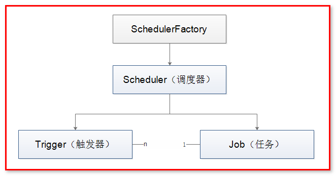
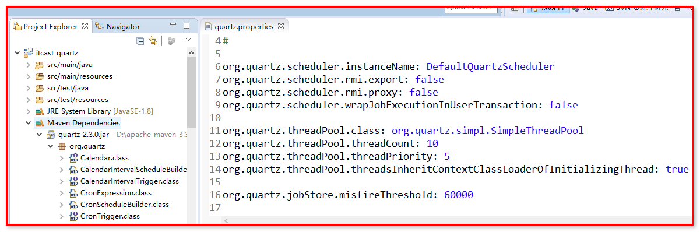

#Quartz任务调度2

##一.配置、资源SchedulerFactory

Quartz以模块方式构架，因此，要使它运行，几个组件必须很好的咬合在一起。幸运的是，已经有了一些现存的助手可以完成这些工作。

所有的Scheduler实例由SchedulerFactory创建

Quartz的三个核心概念：调度器、任务、触发器，三者之间的关系是：



大家都知道，一个作业，比较重要的三个要素就是Schduler，jobDetail，Trigger；而Trigger
对于job而言就好比一个驱动器；没有触发器来定时驱动作业，作业就无法运行；对于Job而言，
一个job可以对应多个Trigger，但对于Trigger而言，一个Trigger只能对应一个job；所以一
个Trigger 只能被指派给一个 Job；如果你需要一个更复杂的触发计划，你可以创建多个 Trigger并指派它们给同一个 Job。

Scheduler的创建方式：

（1）StdSchedulerFactory:

Quartz默认的SchedulerFactory

- 使用一组参数（java.util.Properties）来创建和初始化Quartz调度器
- 配置参数一般存储在quartz.properties文件中
- 调用getScheduler方法就能创建和初始化调度器对象


		SchedulerFactory schedulerFactory = new StdSchedulerFactory();
		Scheduler scheduler = schedulerFactory.getScheduler();

用法一：输出调度器开始的时间（重要：使得任务和触发器进行关联）：

Date scheduleJob(JobDetail jobDetail, Trigger trigger)

	SimpleDateFormat dateFormat = new SimpleDateFormat("yyyy-MM-dd HH:mm:ss");
	System.out.println("调度器开始的时间是："+dateFormat.format(scheduler.scheduleJob(job, trigger)));

用法二：启动任务调度：

void start();

	scheduler.start();	

用法三：任务调度挂起，即暂停操作

void standby()

    // Scheduler执行2秒后自动挂起
    Thread.sleep(2000L);
    scheduler.standby();	
    // Scheduler执行5秒后自动开启
    Thread.sleep(5000L);
    scheduler.start();	

用法四：关闭任务调度

void shutdown()

shutdown(true)：表示等待所有正在执行的job执行完毕之后，再关闭Scheduler；
shutdown(false)：表示直接关闭Scheduler

测试一：

	// Scheduler执行2秒后自动挂起
	Thread.sleep(2000L);
	scheduler.shutdown();
	// Scheduler执行5秒后自动开启
	Thread.sleep(5000L);
	scheduler.start();

测试二：

	// Scheduler执行2秒后自动挂起
	Thread.sleep(2000L);
	/**
	 * shutdown(true)：表示等待所有正在执行的job执行完毕之后，再关闭Scheduler；
	 * shutdown(false)：表示直接关闭Scheduler
	 */
	scheduler.shutdown(false);
	System.out.println("scheduler是否被关闭："+scheduler.isShutdown());

同时修改：HelloJobScheduler.java

任务调度延迟5秒执行

	// 延迟任务执行的时间，推迟5秒向后执行
	try {
		Thread.sleep(5000L);
	} catch (InterruptedException e) {
		e.printStackTrace();
	}


（2）DirectSchedulerFactory（了解）：

DirectSchedulerFactory是对SchedulerFactory的直接实现,通过它可以直接构建Scheduler、threadpool 等

		DirectSchedulerFactory directSchedulerFactory = DirectSchedulerFactory.getInstance();
		Scheduler scheduler = directSchedulerFactory.getScheduler();

##二.Quartz.properties

默认路径：quartz-2.3.0中的org.quartz中的quartz.properties


我们也可以在项目的资源下添加quartz.properties文件，去覆盖底层的配置文件。

组成部分

- 调度器属性

org.quartz.scheduler.instanceName属性用来区分特定的调度器实例，可以按照功能用途来给调度器起名。

org.quartz.scheduler.instanceId属性和前者一样，也允许任何字符串，但这个值必须在所有调度器实例中是唯一的，尤其是在一个集群环境中，作为集群的唯一key。假如你想Quartz帮你生成这个值的话，可以设置为AUTO。

- 线程池属性

threadCount

处理Job的线程个数，至少为1，但最多的话最好不要超过100，在多数机器上设置该值超过100的话就会显得相当不实用了，特别是在你的 Job 执行时间较长的情况下

threadPriority

线程的优先级，优先级别高的线程比级别低的线程优先得到执行。最小为1，最大为10，默认为5

org.quartz.threadPool.class

一个实现了 org.quartz.spi.ThreadPool 接口的类，Quartz 自带的线程池实现类是 org.quartz.smpl.SimpleThreadPool 

- 作业存储设置

描述了再调度器实例的生命周期中，Job和Trigger信息是如何被存储的。

- 插件配置

满足特定需求用到的Quartz插件的配置。

例子：

	#===============================================================     
	#Configure Main Scheduler Properties     调度器属性
	#===============================================================  
	#调度器的实例名     
	org.quartz.scheduler.instanceName = QuartzScheduler     
	#调度器的实例ID，大多数情况设置为auto即可  
	org.quartz.scheduler.instanceId = AUTO     
	 
	#===============================================================     
	#Configure ThreadPool     线程池属性
	#===============================================================   
	#处理Job的线程个数，至少为1，但最多的话最好不要超过100，在多数机器上设置该值超过100的话就会显得相当不实用了，特别是在你的 Job 执行时间较长的情况下
	org.quartz.threadPool.threadCount =  5     
	#线程的优先级，优先级别高的线程比级别低的线程优先得到执行。最小为1，最大为10，默认为5
	org.quartz.threadPool.threadPriority = 5 
	#一个实现了 org.quartz.spi.ThreadPool 接口的类，Quartz 自带的线程池实现类是 org.quartz.smpl.SimpleThreadPool      
	org.quartz.threadPool.class = org.quartz.simpl.SimpleThreadPool     
	 
	#===============================================================     
	#Configure JobStore 作业存储设置
	#===============================================================      
	#要使 Job 存储在内存中需通过设置  org.quartz.jobStrore.class 属性为 org.quartz.simpl.RAMJobStore 
	org.quartz.jobStore.class = org.quartz.simpl.RAMJobStore     
	 
	#===============================================================     
	#Configure Plugins    插件配置 
	#===============================================================       
	org.quartz.plugin.jobInitializer.class =       
	org.quartz.plugins.xml.JobInitializationPlugin       
	      
	org.quartz.plugin.jobInitializer.overWriteExistingJobs = true      
	org.quartz.plugin.jobInitializer.failOnFileNotFound = true      
	org.quartz.plugin.jobInitializer.validating=false  


也可以编写程序代码操作quartz.properties文件的内容：

	public class QuartzProperties {

		public static void main(String[] args) {
	        // 创建工厂实例
	        StdSchedulerFactory factory = new StdSchedulerFactory();
	        
	        // 创建配置工厂的属性对象
	        Properties props = new Properties();
	        props.put(StdSchedulerFactory.PROP_THREAD_POOL_CLASS, "org.quartz.simpl.SimpleThreadPool"); // 线程池定义
	        props.put("org.quartz.threadPool.threadCount", "5"); // 默认Scheduler的线程数
	        
	        try {
	            // 使用定义的属性初始化工厂
	            factory.initialize(props);
	            
	            Scheduler scheduler = factory.getScheduler();
	            
	            scheduler.start();
	        } catch (SchedulerException e) {
	            e.printStackTrace();
	        }
	    }
	}

通过Properties设置工厂属性的缺点在用硬编码，假如需要修改例子中线程数量，将不得不修改代码，然后重新编译。我们这里不推荐使用。


## 三.Quartz监听器

### 1.概念

Quartz的监听器用于当任务调度中你所关注事件发生时，能够及时获取这一事件的通知。类似于任务执行过程中的邮件、短信类的提醒。Quartz监听器主要有JobListener、TriggerListener、SchedulerListener三种，顾名思义，分别表示任务、触发器、调度器对应的监听器。三者的使用方法类似，在开始介绍三种监听器之前，需要明确两个概念：全局监听器与非全局监听器，二者的区别在于：

全局监听器能够接收到所有的Job/Trigger的事件通知，

而非全局监听器只能接收到在其上注册的Job或Trigger的事件，不在其上注册的Job或Trigger则不会进行监听。

本课程关于全局与非全局的监听器的使用，将一一介绍。

###2.JobListener

任务调度过程中，与任务Job相关的事件包括：job开始要执行的提示; job执行完成的提示。


    public interface JobListener {

      	String getName();
      	void jobToBeExecuted(JobExecutionContext context);
      	void jobExecutionVetoed(JobExecutionContext context);


        void jobWasExecuted(JobExecutionContext context,
                JobExecutionException jobException);
    }

 其中：

1) getName方法：用于获取该JobListener的名称。

2) jobToBeExecuted方法：Scheduler在JobDetail将要被执行时调用这个方法。

3) jobExecutionVetoed方法：Scheduler在JobDetail即将被执行，但又被TriggerListerner否决时会调用该方法

4) jobWasExecuted方法：Scheduler在JobDetail被执行之后调用这个方法

示例：

HelloJobListener.java

	// 定义任务类
	public class HelloJobListener implements Job {
	    @Override
	    public void execute(JobExecutionContext context) throws JobExecutionException {
	        // 定义时间
	        Date date = new Date();
	        SimpleDateFormat dateFormat = new SimpleDateFormat("yyyy-MM-dd HH:mm:ss");
	        String dateString = dateFormat.format(date);
	
	        // 定义工作任务内容
	        System.out.println("进行数据库备份操作。当前任务执行的时间："+dateString);
	    }
	}
创建自定义的JobListener

MyJobListener.java

    public class MyJobListener implements JobListener{
        @Override
        public String getName() {
            String name = getClass().getSimpleName();
            System.out.println("监听器的名称是："+name);
            return name;
        }
    
        @Override
        public void jobToBeExecuted(JobExecutionContext context) {
            String jobName = context.getJobDetail().getKey().getName();
            System.out.println("Job的名称是："+jobName+"     Scheduler在JobDetail将要被执行时调用这个方法");
        }
    
        @Override
        public void jobExecutionVetoed(JobExecutionContext context) {
            String jobName = context.getJobDetail().getKey().getName();
            System.out.println("Job的名称是："+jobName+"     Scheduler在JobDetail即将被执行，但又被TriggerListerner否决时会调用该方法");
        }
    
        @Override
        public void jobWasExecuted(JobExecutionContext context, JobExecutionException jobException) {
            String jobName = context.getJobDetail().getKey().getName();
            System.out.println("Job的名称是："+jobName+"     Scheduler在JobDetail被执行之后调用这个方法");
        }
    }
执行调度器

HelloSchedulerDemoJobListener.java


	public class HelloSchedulerDemoJobListener {
		public static void main(String[] args) throws Exception {
		// 1：从工厂中获取任务调度的实例
	    Scheduler scheduler = StdSchedulerFactory.getDefaultScheduler();
	
	    // 2：定义一个任务调度实例，将该实例与HelloJob绑定，任务类需要实现Job接口
	    JobDetail job = JobBuilder.newJob(HelloJobListener.class)
	    		.withIdentity("job1", "group1") // 定义该实例唯一标识
	    		.build();


          // 3：定义触发器 ，马上执行, 然后每5秒重复执行一次
          Trigger trigger = TriggerBuilder.newTrigger()
                  .withIdentity("trigger1", "group1") // 定义该实例唯一标识
                  .startNow()  // 马上执行
                  //.startAt(triggerStartTime) // 针对某个时刻执行
                  .withSchedule(SimpleScheduleBuilder.simpleSchedule()
                      .repeatSecondlyForever(5)) // 每5秒执行一次 
                  .build();
    
          // 4：使用触发器调度任务的执行
          scheduler.scheduleJob(job, trigger);
    
          // 创建并注册一个全局的Job Listener
          scheduler.getListenerManager().addJobListener(new MyJobListener(), EverythingMatcher.allJobs());
    
          // 创建并注册一个指定任务的Job Listener
          // scheduler.getListenerManager().addJobListener(new MyJobListener(), 			  KeyMatcher.keyEquals(JobKey.jobKey("job1", "group1")))；
          // 5：开启
          scheduler.start();
          // 关闭
          // scheduler.shutdown();
      }
    }
###3.TriggerListener

任务调度过程中，与触发器Trigger相关的事件包括：触发器触发、触发器未正常触发、触发器完成等。

```
public interface TriggerListener {

    public String getName();

    public void triggerFired(Trigger trigger, JobExecutionContext context);

    public boolean vetoJobExecution(Trigger trigger, JobExecutionContext context);

    public void triggerMisfired(Trigger trigger);

    public void triggerComplete(Trigger trigger, JobExecutionContext context,
            int triggerInstructionCode);
}
```

其中：

1) getName方法：用于获取触发器的名称

2) triggerFired方法：当与监听器相关联的Trigger被触发，Job上的execute()方法将被执行时，Scheduler就调用该方法。

3) vetoJobExecution方法：在 Trigger 触发后，Job 将要被执行时由 Scheduler 调用这个方法。TriggerListener 给了一个选择去否决 Job 的执行。假如这个方法返回 true，这个 Job 将不会为此次 Trigger 触发而得到执行。

4) triggerMisfired方法：Scheduler 调用这个方法是在 Trigger 错过触发时。你应该关注此方法中持续时间长的逻辑：在出现许多错过触发的 Trigger 时，长逻辑会导致骨牌效应。你应当保持这上方法尽量的小。

5) triggerComplete方法：Trigger 被触发并且完成了 Job 的执行时，Scheduler 调用这个方法。


 示例：

下面的例子简单展示了TriggerListener的使用，其中创建并注册TriggerListener与JobListener几乎类似。

HelloJobListener.java	

	// 定义任务类
	public class HelloJobListener implements Job {
	    @Override
	    public void execute(JobExecutionContext context) throws JobExecutionException {
	        // 定义时间
	        Date date = new Date();
	        SimpleDateFormat dateFormat = new SimpleDateFormat("yyyy-MM-dd HH:mm:ss");
	        String dateString = dateFormat.format(date);
	
	        // 定义工作任务内容
	        System.out.println("进行数据库备份操作。当前任务执行的时间："+dateString);
	    }
	}
MyTriggerListener.java

	public class MyTriggerListener implements TriggerListener{
		private String name;
	
		public MyTriggerListener(String name) {
	   		 this.name = name;
		}
	
	    @Override
	    public String getName() {
	        return name;
	    }
	
	    @Override
	    public void triggerFired(Trigger trigger, JobExecutionContext context) {
	        String triggerName = trigger.getKey().getName();
	        System.out.println(triggerName + " 被触发");
	    }
	
	    @Override
	    public boolean vetoJobExecution(Trigger trigger, JobExecutionContext context) {
	        String triggerName = trigger.getKey().getName();
	        System.out.println(triggerName + " 没有被触发");
	        return true; // true：表示不会执行Job的方法
	    }
	
	    @Override
	    public void triggerMisfired(Trigger trigger) {
	        String triggerName = trigger.getKey().getName();
	        System.out.println(triggerName + " 错过触发");
	    }
	
	    @Override
	    public void triggerComplete(Trigger trigger, JobExecutionContext context,
	            CompletedExecutionInstruction triggerInstructionCode) {
	        String triggerName = trigger.getKey().getName();
	        System.out.println(triggerName + " 完成之后触发");
	    }
	}
任务调度类HelloSchedulerDemoTriggerListener.java

	public class HelloSchedulerDemoTriggerListener {
	    public static void main(String[] args) throws Exception {
	        // 1：从工厂中获取任务调度的实例
	        Scheduler scheduler = StdSchedulerFactory.getDefaultScheduler();
	
	        // 2：定义一个任务调度实例，将该实例与HelloJob绑定，任务类需要实现Job接口
	        JobDetail job = JobBuilder.newJob(HelloJobListener.class)
	                .withIdentity("job1", "group1") // 定义该实例唯一标识
	                .build();


            // 3：定义触发器 ，马上执行, 然后每5秒重复执行一次
            Trigger trigger = TriggerBuilder.newTrigger()
                    .withIdentity("trigger1", "group1") // 定义该实例唯一标识
                    .startNow()  // 马上执行
                    .withSchedule(SimpleScheduleBuilder.simpleSchedule()
                        .repeatSecondlyForever(5)) // 每5秒执行一次 
                    .build();
    
            // 4：使用触发器调度任务的执行
            scheduler.scheduleJob(job, trigger);
    
            // 创建并注册一个全局的Trigger Listener
            scheduler.getListenerManager().addTriggerListener(new MyTriggerListener("simpleTrigger"), EverythingMatcher.allTriggers());
    
            // 创建并注册一个局部的Trigger Listener
            // scheduler.getListenerManager().addTriggerListener(new MyTriggerListener("simpleTrigger"), KeyMatcher.keyEquals(TriggerKey.triggerKey("trigger1", "group1")));
    
            // 5：开启
            scheduler.start();
            // 关闭
            // scheduler.shutdown();
        }
     }


###4.SchedulerListener

SchedulerListener会在Scheduler的生命周期中关键事件发生时被调用。与Scheduler有关的事件包括：增加一个job/trigger，删除一个job/trigger，scheduler发生严重错误，关闭scheduler等。

```
public interface SchedulerListener {

    public void jobScheduled(Trigger trigger);

    public void jobUnscheduled(String triggerName, String triggerGroup);

    public void triggerFinalized(Trigger trigger);

    public void triggersPaused(String triggerName, String triggerGroup);

    public void triggersResumed(String triggerName, String triggerGroup);

    public void jobsPaused(String jobName, String jobGroup);

    public void jobsResumed(String jobName, String jobGroup);

    public void schedulerError(String msg, SchedulerException cause);

    public void schedulerStarted();

    public void schedulerInStandbyMode();

    public void schedulerShutdown();

    public void schedulingDataCleared();
}
```

其中：

1) jobScheduled方法：用于部署JobDetail时调用

2) jobUnscheduled方法：用于卸载JobDetail时调用

3) triggerFinalized方法：当一个 Trigger 来到了再也不会触发的状态时调用这个方法。除非这个 Job 已设置成了持久性，否则它就会从 Scheduler 中移除。

4) triggersPaused方法：Scheduler 调用这个方法是发生在一个 Trigger 或 Trigger 组被暂停时。假如是 Trigger 组的话，triggerName 参数将为 null。

5) triggersResumed方法：Scheduler 调用这个方法是发生成一个 Trigger 或 Trigger 组从暂停中恢复时。假如是 Trigger 组的话，假如是 Trigger 组的话，triggerName 参数将为 null。参数将为 null。
6) jobsPaused方法：当一个或一组 JobDetail 暂停时调用这个方法。
7) jobsResumed方法：当一个或一组 Job 从暂停上恢复时调用这个方法。假如是一个 Job 组，jobName 参数将为 null。
8) schedulerError方法：在 Scheduler 的正常运行期间产生一个严重错误时调用这个方法。
9) schedulerStarted方法：当Scheduler 开启时，调用该方法
10) schedulerInStandbyMode方法： 当Scheduler处于StandBy模式时，调用该方法
11) schedulerShutdown方法：当Scheduler停止时，调用该方法
12) schedulingDataCleared方法：当Scheduler中的数据被清除时，调用该方法。

 示例：

下面的代码简单描述了如何使用SchedulerListener方法：


HelloJobListener.java

    public class HelloJobListener implements Job {
        @Override
        public void execute(JobExecutionContext context) throws JobExecutionException {
            // 定义时间
            Date date = new Date();
            SimpleDateFormat dateFormat = new SimpleDateFormat("yyyy-MM-dd HH:mm:ss");
            String dateString = dateFormat.format(date);
    
            // 定义工作任务内容
            System.out.println("进行数据库备份操作。当前任务执行的时间："+dateString);
        }
    }
MySchedulerListener.java


    public class MySchedulerListener implements SchedulerListener{
        @Override
        public void jobScheduled(Trigger trigger) {
            String jobName = trigger.getJobKey().getName();
            System.out.println(jobName + " 完成部署");
        }
    
        @Override
        public void jobUnscheduled(TriggerKey triggerKey) {
            System.out.println(triggerKey + " 完成卸载");
        }
    
        @Override
        public void triggerFinalized(Trigger trigger) {
            System.out.println("触发器被移除 " + trigger.getJobKey().getName());
        }
    
        @Override
        public void triggerPaused(TriggerKey triggerKey) {
            System.out.println(triggerKey + " 正在被暂停");
        }
    
        @Override
        public void triggersPaused(String triggerGroup) {
            System.out.println("触发器组 "+triggerGroup + " 正在被暂停");
        }
    
        @Override
        public void triggerResumed(TriggerKey triggerKey) {
            System.out.println(triggerKey + " 正在从暂停中恢复");
        }
    
        @Override
        public void triggersResumed(String triggerGroup) {
            System.out.println("触发器组 "+triggerGroup + " 正在从暂停中恢复");
        }
    
        @Override
        public void jobAdded(JobDetail jobDetail) {
            System.out.println(jobDetail.getKey()+" 添加工作任务");
        }
    
        @Override
        public void jobDeleted(JobKey jobKey) {
            System.out.println(jobKey+" 删除工作任务");
        }
    
        @Override
        public void jobPaused(JobKey jobKey) {
            System.out.println(jobKey+" 工作任务正在被暂停");
        }
    
        @Override
        public void jobsPaused(String jobGroup) {
            System.out.println("工作任务组 "+jobGroup+" 正在被暂停");
        }
    
        @Override
        public void jobResumed(JobKey jobKey) {
            System.out.println(jobKey+" 正在从暂停中恢复");
        }
    
        @Override
        public void jobsResumed(String jobGroup) {
            System.out.println("工作任务组 "+jobGroup+" 正在从暂停中恢复");
        }
    
        @Override
        public void schedulerError(String msg, SchedulerException cause) {
            System.out.println("产生严重错误时调用：   "+msg+"  "+cause.getUnderlyingException());
        }
    
        @Override
        public void schedulerInStandbyMode() {
            System.out.println("调度器在挂起模式下调用");
        }
    
        @Override
        public void schedulerStarted() {
            System.out.println("调度器 开启时调用");
        }
    
        @Override
        public void schedulerStarting() {
            System.out.println("调度器 正在开启时调用");
        }
    
        @Override
        public void schedulerShutdown() {
            System.out.println("调度器 已经被关闭 时调用");
        }
    
        @Override
        public void schedulerShuttingdown() {
            System.out.println("调度器 正在被关闭 时调用");
        }
    
        @Override
        public void schedulingDataCleared() {
            System.out.println("调度器的数据被清除时调用");
        }
    }
HelloSchedulerDemoSchedulerListener.java

	public class HelloSchedulerDemoSchedulerListener {
	    public static void main(String[] args) throws Exception {
	        // 1：从工厂中获取任务调度的实例
	        Scheduler scheduler = StdSchedulerFactory.getDefaultScheduler();
	
	        // 2：定义一个任务调度实例，将该实例与HelloJob绑定，任务类需要实现Job接口
	        JobDetail job = JobBuilder.newJob(HelloJobListener.class)
	                .withIdentity("job1", "group1") // 定义该实例唯一标识
	                .build();


            // 3：定义触发器 ，马上执行, 然后每5秒重复执行一次
            Trigger trigger = TriggerBuilder.newTrigger()
                    .withIdentity("trigger1", "group1") // 定义该实例唯一标识
                    .startNow()  // 马上执行
                    .withSchedule(SimpleScheduleBuilder.simpleSchedule()
                        .repeatSecondlyForever(5)) // 每5秒执行一次 
                    .build();
    
            // 4：使用触发器调度任务的执行
            scheduler.scheduleJob(job, trigger);
    
            // 创建SchedulerListener
            scheduler.getListenerManager().addSchedulerListener(new MySchedulerListener());
    
            // 移除对应的SchedulerListener
            // scheduler.getListenerManager().removeSchedulerListener(new MySchedulerListener());
    
            // 5：开启
            scheduler.start();
            // 延迟7秒后关闭
            Thread.sleep(7000);
            // 关闭
            scheduler.shutdown();
        }
     }


