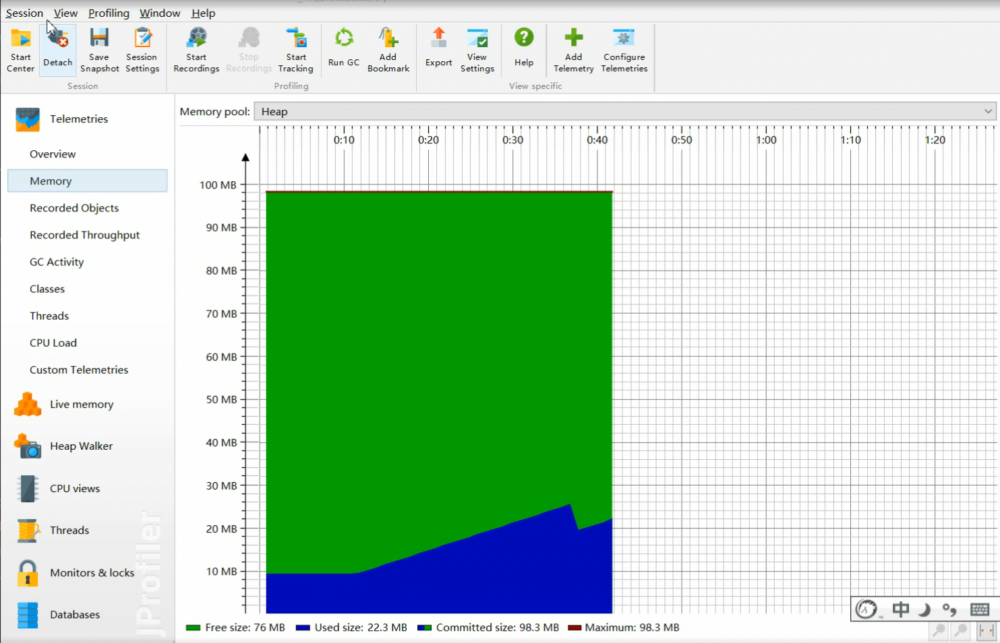
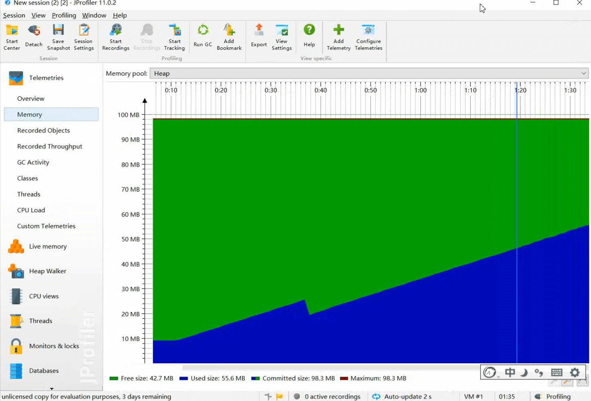

# JVM垃圾回收机制

## jvm的基本组成

### 虚拟机的组成

所谓java能实现跨平台，是因为在不同平台上运行不同的虚拟机决定的，因此java文件的执行不直接在操作系统上执行，

而是通过jvm虚拟机执行，我们可以从这张图看到，JVM并没有直接与硬件打交道，而是与操作系统交互用以执行java程序。

### 运行流程

这张图是jvm的组成图，分为四部分：

 - 类加载器

   ​	类加载器的作用是加载类文件到内存。比如我们写一个HelloWorld.java的程序，首先使用javac命令进行编译，生成HelloWorld.java的字节码文件，

   怎样才能执行.class文件呢。就需要用药类加载器将字节码文件加载到内存中，然后通过jvm后续的模块进行加载执行程序。ClassLoader只管加载，

   至于是否能够执行，则不属于它的负责范围，由执行引擎负责。

 - 执行引擎

   ​	执行引擎也叫解释器，负责解释命令，提交操作系统执行

 - 本地接口

   ​	本地接口的作用是融合不同的编程语言为Java所用，它的初衷是融合C/C++程序，Java诞生的时候是C/C++横

   行的时候，要想立足，必须有一个聪明的、睿智的调用C/C++程序，于是就在内存中专门开辟了一块区域处理

   标记为native的代码，它的具体做法是Native Method Stack中登记native方法，在Execution Engine执行时

   加载native libraies。目前该方法使用的是越来越少了，除非是与硬件有关的应用，比如通过Java程序驱动打印

   机，或者Java系统管理生产设备，在企业级应用中已经比较少见，因为现在的异构领域间的通信很发达，比如

   可以使用Socket通信，也可以使用Web Service等等，不多做介绍。

 - 运行时数据区

   ​	运行数据区是整个JVM的重点。我们所有写的程序都被加载到这里，之后才开始运行，Java生态系统如此的繁

   荣，得益于该区域的优良自治。整个JVM框架由加载器加载文件，然后执行器在内存中处理数据，需要与异构系统交互是可以通过本地接口进行！

## jvm的内存区域

### 内存区域概述：

​	对于从事C或者C++的程序员来说，必须对每个对象的整个生命周期负责。但是对java程序员来说，在jvm的自动内存管理机制下，不需要为每一个对象去

写delete或者free代码，不容易出现内存泄漏或内存溢出的问题。但正因为java程序员将内存管理权力交给了内存管理机制，所以一旦出现内存泄漏或者内存溢出

的问题，在对jvm内存结构不清楚的情况下，排查错误将会成为一项非常复杂且困难的工作。

### 运行时数据区：

运行时数据区是程序员最应该关注的一片区域，下面我们就了解一下运行时数据区的构成。

**程序计数器：**

​       程序计数器是一小块的内存区域，可以看做当前线程执行字节码的行号指示器，在虚拟机的概念模型里，字节码解释工作就是通过改变这个计数器的值来选取下一个要

​      执行的字节码指令。比如分支控制，循环控制，跳转，异常等操作，线程恢复等功能都是通过这个计数器来完成。由于jvm的多线程是通过线程的轮流切换并分配处理器

​      执行时间来实现的。因此，在任何一个确定的时刻，一个处理器（对于多核处理器来说是一个内核）都只会执行一条线程中的指令。因此，为了线程切换后能回到正确的

​      执行位置，每条线程都需要自己独有的程序计数器，多条线程计数器之间互不影响，独立存储。我们称这类内存区域为线程私有的内存区域。

​      如果线程正在执行一个Java方法，这个计数器记录的是正在执行的虚拟机字节码指令的地址；如果正在执行native方法，则这个计数器则为空(undefined)

​      此内存区域是Java中虚拟机中唯一一个没有规定任何OutOfMemoryError的内存区域。

**Java虚拟机栈：**

​	与程序计数器一致，Java虚拟机栈也是线程私有的，生命周期与线程相同。虚拟机栈描述的是方法的执行内存模型，每个方法在执行的时候都会创建一个栈帧，用于存储局部

​	变量表，操作数栈，方法出口等信息。每一个方法从执行到结束的过程，就对应一个栈帧从入栈到出栈的过程。

​	局部变量表存放了编译器可知的四类八种基本数据类型，对象引用(refrence)，它不等同于对象本身，可能是指向对象起始地址的引用指针。

​	局部变量表的内存分配在编译期已经完成分配了，其中64位长度的long和double会占用两个局部变量空间，其余的数据类型只占一个。当进入一个方法时，这个方法需要在栈中分配

​	多大的内存空间是完全能够确定的，方法运行期间不改变局部变量表的大小。

​	如果线程在栈中申请的深度大于虚拟机所允许的深度，将出现StackOverFlowError异常; 如果虚拟机栈可以动态扩展(当前大部分虚拟机支持动态扩展，当然也允许固定长度的虚拟机栈)，如果

​	扩展无法申请到足够的内存，

​	就会抛出OutOfMemoryError异常。

**本地方法栈：**

​	本地方法栈与虚拟机栈的作用非常类似，只不过虚拟机栈执行的是Java方法，而本地方法栈执行的是本地native方法，在虚拟机规范中并没有对本地方法栈中方法使用的语言，使用方式与数

​	据结构并没有强行规定，因此具体的虚拟机可以自由实现它。甚至有的虚拟机，如Sun的Hotspot虚拟机直接将虚拟机栈和本地方法栈合二为一。当然与虚拟机栈一样，本地方法栈也会抛出

​	StackOverFlowError异常和OutOfMemoryError异常。

**Java堆**

​	对于大多数应用来说，Java堆(Java Heap)是JVM所管理的内存中最大的一块区域，且Java堆是被所有线程所共享的一片区域，在虚拟机启动时创建。该区域的唯一目的就是存放实例对象，

几乎所有的对象实例都在这里分配空间。这一点在JVM规范上描述的是：所有的对象实例以及数组都要在堆上分配空间。

​	Java堆是垃圾收集器管理的管理的主要区域，因此很多时候被称为GC堆。从内存分配的角度讲，由于现在的垃圾回收机制都是分代垃圾回收，所以堆中可以再划分为老年代和新生代，

再细的划分为Eden区，Survivor区，其中Survivor区又可细分为From Survivor区和To Survivor区。根据JVM的规范规定，Java堆可以处于物理上不连续的内存空间，只要逻辑上是连续的即可。

就像我们的磁盘一样，既可以是固定大小的，也可以是可扩展的。不过当前主流的都采用可扩展的策略(采用-Xmx 和 -Xms控制)。如果在堆中没有完成内存分配，且堆也没有可扩展的内存空间，

则会抛出OutOfMemoryError异常。

**方法区：**

​	方法区与java堆一样，有各个线程共享的内存区域，它用于存储已被虚拟机加载的类信息，常量，静态变量，及时编译器编译后的代码等数据。Java虚拟机相对而言对方法区的限制非常宽

松，除了和堆一样不需要连续的空间和可以选择固定大小或者可扩展之外，还可以选择不实现垃圾回收。相对而言，垃圾回收在这个区域算比较少见了，但并非数据进入方法区以后就可以实现永

久存活了，这个区域的回收目标主要是常量池的回收和对类型的卸载，一般来说，这个区域的回收成绩是比较难以让人满意的。尤其是类型的卸载，条件相当苛刻。根据Java虚拟机规范规定，当

方法区无法满足内存分配时，将抛出OutOfMemoryError异常。

**运行时常量池：**

​	运行时常量池是方法区的一部分，Class文件中除了有类的版本，字段，方法和接口的信息外，还有一项信息是常量池。用于存放编译器各种字面量和符号的引用，这部分内容将在类加载后

进入到常量池中存储。一般来说，除了保存Class文件中描述的符号引用外，还会把翻译出来的直接引用也存储在运行时常量池中。运行时常量池相对于Class文件的常量池一个最大的特性就是

动态性，Java语言并不要求常量一定在编译期间产生，也就是说并非预置入Class文件中常量池的内容才能进入常量池，在运行期间也可能将新产生的常量放进常量池，这种特性被利用最多的就

是String的intern()方法。既然运行时常量池属于方法区的一部分，自然具备方法区的约束，所以当内存申请不到的时候也会抛出OutOfMemoryError异常。

直接内存：

​	直接内存并不属于Jvm运行时数据区的一部分，但是这部分内存区域被频繁的调用，也可能发生OutOfMemoryError异常，所以一起讨论。显然本机的直接内存不会受到Java堆分配内存的影

响，但是既然是内存，肯定要受到本机总内存的限制。服务器管理员在配置虚拟机参数时，会根据实际内存设置-Xmx等参数信息，但经常忽略直接内存。使得各个区域的内存总和大于物理内存

限制，从而导致动态扩展时出现OutOfMemoryError异常。

### 内存溢出异常

- Java堆溢出

- -Xms20m
  -Xmx20m
  -XX:+HeapDumpOnOutOfMemoryError

- 虚拟机栈和本地方法栈溢出

- 直接内存溢出

## 内存分配与回收策略

### 判断对象已死的算法

在堆里面存放着各种各类的Java对象，垃圾收集器在对堆进行垃圾回收时，首要就是判断哪些对象还活着，哪些对象已经死去(即不被任何途径引用的对象)。

#### 引用计数器算法：

- 引用计数器算法简单概括为：给对象添加一个引用计数器，每当有一个地方引用该对象时，计数器+1，当引用失效时，计数器-1，任何时刻，当计数器为0

  的时候，该对象不再被引用。客观的说，引用计数器的实现简单，判定效率也高，大部分场景下是一个不错的选择。但是，当前主流的Jvm均没有采用标记

  清除算法，原因在于，它很难解决对象之间互相循环调用的情况。

#### 可达性分析算法：

​	在主流的商用程序语言(如C#， Java)的主流实现中，都是通过可达性分析来判断对象是否存活，这个算法的思想就是通过一系列的成为"GC Roots"的对象作为起始点，

​	从这些节点开始向下搜索，搜索所走过的路径成为引用链，当一个对象到"GC Roots"没有任何引用链相连，则证明此对象是不可用的。

​	

​	如图所示，虽然Obj5, Obj6, Obj7互有关联，但是他们到GC root没有任何引用链，所以判定为需要被回收的对象。

常说的GC(Garbage Collector) roots，特指的是垃圾收集器（Garbage Collector）的对象，GC会收集那些不是GC roots且没有被GC roots引用的对象。

- 在Java中，可以作为GC Roots的对象包括下面几种： 

  - 虚拟机栈中引用的对象； 
  - 方法区中类静态属性引用的对象； 
  - 方法区中的常量引用的对象； 
  - 本地方法栈中JNI（即一般说的Native方法）的引用的对象；

  

#### 再谈引用：

​	无论是通过引用计数器判断的引用数量，还是通过可达性分析判断出的引用链是否可达，判定对象是否存活都跟引用有关。在JDK1.2以前，引用被定义为当一个reference类型的数据

代表的是另外一块内存的起始地址，该类型的数据被称之为引用，这种定义很纯粹，但是也很狭隘，一个对象在这种定义下只有被引用和没有被引用两种状态。对于描述一些“食之无味，弃之可

惜”的对象就显得无能为力。我们希望能描述这类对象，当内存足够的时候，将它存放在内存中，当内存空间进行垃圾回收后显得还是内存紧张时，可以回收这部分对象，很多系统的缓存功能

都符合这样的应用场景。因此在JDK1.2以后对引用进行重新的扩充，分为强引用，软引用，弱引用，虚引用4中，这四种引用的强度依次递减。

​	**强引用：**

​	强引用是在代码中普遍存在的，类似于Object obj = new Object()，只要强引用一直存在，垃圾收集器就永远不会回收被引用的对象。

​	**软引用：**

​	软引用用来描述一些还有用但并非必须的对象，对于软引用关联着的对象，当内存溢出异常发生之前，通过垃圾回收进行二次回收。如果二次回收完成之后，系统内存依然不够，才会抛出

​	内存溢出异常，在jdk1,2以后用SoftReference类来实现软引用。

​	**弱引用：**

​	弱引用也是用来描述非必须对象的，但是它的强度相比于软引用来说更弱一些，它仅仅能生存到下一次垃圾回收之前。当垃圾收集时，无论内存是否足够，弱引用的对象都要被回收，

​	在jdk1.2以后用WeakReference类来实现弱引用

​	**虚引用：**

​	虚引用是最弱的一种引用关系，一个对象是否有虚引用的存在，完全不会对其生存时间构成影响，也无法通过一个虚引用来获取一个实例对象。为一个对象设置弱引用的唯一目的就是

​	该对象在垃圾回收时受到一个系统通知，Jdk1,2以后用PhantomReference实现虚引用。

​	

​	**生存还是死亡？**

​	即使在可达性分析中，没有引用链到达GC Roots，也并非是“非死不可”的。这个时候对象处于缓刑阶段，要正式宣告死亡，至少要经历两次标记的过程。如果对象在进行可达性分析后

​	发现没有与GC Roots相连接的引用链，那它将会被第一次标记并进行一次筛选，筛选的条件是此对象是否要执行finalize()方法，当对象么有覆盖finalize()方法，或者finalize()方法已经被

​	虚拟机调用过，虚拟机将这两种情况都视为不必要执行finalize()方法。

​	如果该对象被判定要执行finalize()方法，那么这个对象会被放在一个叫F-Queue的队列中，并在稍后有一个虚拟机自行创建的，优先级较低的线程去执行它，这里的执行是指会触发finalize()

​	方法，但并不会等待它执行结束。这样做的原因是如果一个对象在执行finalize()时非常缓慢，或者执行了死循环，这样就会导致F-Queue中的其他对象处于等待中，严重的会导致整个垃圾回

​	收系统崩溃。finalize()是对象逃脱死亡的最后一次机会，稍后GC将对F-Queue中的对象进行二次标记，如果对象要在finalize()中拯救自己的话，只能重新与引用链上的任意一个对象建立关联

​	即可，比如把对象自己(this关键字)赋值给其他成员变量或者对象，那在第二次标记时就被移出即将回收的集合，如果没有关联上，基本可以确定要被回收了。

### 垃圾收集算法：

#### 	**标记-清除算法：**

​		最基础的收集算法是标记-清除算法，如同它的名字一样，分为标记和清除两个阶段。第一步标记出所要回收的对象，在标记完成后统一回收所有被标记的对象。如何标记已经在上面说

​		过了，之所以说它是最基本的垃圾收集算法，原因在于其他的算法也是基于这种思路并对其不足做以改进得到的。主要问题有两个，第一个是效率问题，标记和清除的效率都不高。

​		第二个是空间分配问题，标记清除后会产生大量的不连续的内存空间，空间碎片太多可能会导致以后程序在运行过程中需要给较大对象分配空间时，无法找到足够的内存空间，而不得不

​		提前进行一次垃圾收集动作。如图所示，会产生大量的垃圾碎片，导致空间的利用率不高。

​		

#### 	**复制算法：**

​		为了解决效率问题，一种称为复制的收集算法出现了，它将可用内存分为大小相等的两块，每次只使用其中的一块，当这一块内存区域用完了，就将还存活的对象复制到另一块内存中，

​		然后再把已使用的空间一次性清理掉，这样每次都是对半个区域进行回收，内存分配时也就不用考虑碎片等问题了，只要移动堆顶指针，按顺序分配内存即可，实现简单，运行高效。

​		只是这种做法将原来的内存缩小为一半，代价太高了。

​		现在的商用虚拟机都采用这种方法来回收新生代，IBM专门研究表明，新生代中的对象98%都是"朝生夕死"的，所以并不需要按照1:1划分内存区域，而是将内存分为一块较大的区域给

​		Eden和两块较小的区域给Survivor, 当回收时，将Eden和Survivor区中还存活的对象一次性复制到另一块Survivor区，然后将Eden和Survivor区进行一次性清理。Hotspot区默认的Eden

​		和Survivor的比例为8:1，也就是说新生代的可用内存为90%，只有10%的内存会被划分为保留内存。当然，大多数情况下是98%，但我们不能保证每次回收的存活对象都小于10%，

​		当Survivor区不够用时，需要依赖其他区域进行分配担保。如果另外一块Survivor区已经不够用了，对象可通过内存担保机制直接进入到老年代。

​		

​	

#### 	**标记整理算法：**

​		复制算法在存活对象比例比较高的情况下要进行较多的复制操作，效率将会变低，更关键的是，如果不想浪费50%的区域，则需要额外的空间进行分配担保，以应对内存中100%

​		对象都存活的极端情况，所以老年代一般不选用这种算法。

​		根据老年代的特点，有人提出了另一种标记-整理算法，标记过程与标记-清除算法一致，但后续步骤不是对可回收对象直接进行清理，而是让所有存活对象都向一端移动，然后直接清

​		理掉边界外的对象。示意图如下：

​		

​	**分代收集算法：**

​		当前商用的垃圾收集器都采用的是分代垃圾回收，这种算法没有什么新的思想，只是根据对象的存活周期将内存分为几块，一般是将java堆分为新生代和老年代，这样就可以根据各个代

​		的对象特点选用最适当的回收算法。在新生代，每次垃圾回收都有大量的对象死去，只有少量存活，这样就适合采用复制算法。只需要付出少量的对象复制成本就可以完成垃圾回收，

​		而老年代因为存活率高，没有其他内存进行分配担保，就必须使用标记-清理或者标记-整理进行回收。

1. 分代分为年轻代和老年代，年轻代里头又分为 Eden区和Survivor区，通常默认的比例为8:1:1, 每次只保留10%的空间用作预留区域，然后将90%的空间可以用作新生对象。
2. 每一次垃圾回收之后，存活的对象年龄对应+1，当经历15次还依然存活的对象，我们让它直接进入到老年代
3. 另外一种进入到老年代的方式是内存担保机制，也就是当新生代的空间不够的时候，对象直接进入到老年代
4. 新生代的垃圾回收叫Minor GC， 老年代的叫Full GC

### 垃圾收集器：

#### **Serial收集器**

Serial收集器是最基本，发展最悠久的收集器，在JDK1.3.1之前是虚拟机新生代垃圾回收的唯一选择。这个收集器是一个单线程的。它的单线程的意义并不仅仅说明它只会使用一个CPU

或者一条收集线程去完成收集工作，最重要的是，它进行垃圾收集时，其他工作线程会暂停，直到收集结束。这项工作由虚拟机在后台自动发起和执行的，在用户不可见的情况下将所有

工作线程全部停掉，这对于很多应用程序来说是不可容忍的。我们可以设想一下，我们的计算机在运行1个小时就要停止5分钟的时候，这是什么情况？对于这种设计，虚拟机设计人员表示

的也是非常委屈，因为不可能边收集，这边还要不断的产生垃圾对象，这样是清理不完的。

所以从1.3一直到现在，虚拟机的开发团队一直为减少因垃圾回收而产生的线程停顿所努力着，所出现的虚拟机越来越优秀，但直到现在，依然没有完全消除。

讲到这里，貌似Serial收集器已经是"食之无味弃之可惜"了，但实际上，它依然是虚拟机在Client模式下，新生代默认的垃圾收集器。它有相对于其他垃圾收集器的优势，比如由于没有线程

之间切换的开销，专心做垃圾收集自然能够收获最高的线程利用效率。在用户桌面应用背景下，一般分配给虚拟机的内存不会太大，收集几十兆或者一两百兆的新生代对象，停顿时间完全

可以控制在几十毫秒到一百毫秒之间，这个是可以接受的，只要不是频繁发生。因此，Serial收集器在Client模式下，对于新生代来说依然是一个很好的选择。

#### ParNew收集器

ParNew收集器其实就是Serial收集器的多线程版本，除了使用多线程进行垃圾回收之外，其余可控参数，收集算法，停止工作线程，对象分配原则，回收策略等与Serial收集器完全一致。

除了多线程实现垃圾收集之外，其他没有什么太多创新之处，但是它确实Server模式下的新生代的首选的虚拟机收集器。其中一个重要的原因就是除了Serial收集器外，只有它能与CMS

配合使用。在JDK1.5时期，HotSpot推出了一款在强交互应用划时代的收集器CMS，这款收集器是HotSpot第一款真正意义上的并发收集器，第一次实现了垃圾回收与工作线程同时工作

的可能性，换而言之，你可以边污染，边收集。

不过CMS作为老年代的收集器，却无法与1.4中发布的最新的新生代垃圾收集器配合使用，反之只能使用Serial或者Parnew中的一个。ParNew收集器可以使用-XX:+UseParNewGC强行

指定它，或者使用-XX:+UseConcMarkSweepGC选项后的默认新生代收集器。

ParNew收集器在单CPU环境下绝对不会有比Serial收集器更好的效果，甚至优于存在线程交互开销，该收集器在通过超线程技术实现的两个CPU的环境下都不能保证百分之百超越Serial

收集器。当然，随着CPU数量的增加，对于GC时系统的有效资源利用还是很有好处的。在CPU非常多的情况下，可以使用-XX:ParallelGCThreads来限制垃圾回收线程的数量。

#### Parallel Scavenge收集器

Parallel Scavenge收集器是一个新生代收集器，采用复制算法，又是并行的多线程垃圾收集器。它的关注点与其它收集器的关注点不一样，CMS等收集器的关注点在于缩短垃圾回收时

用户线程停止的时间，而Parallel Scavenge收集器则是达到一个可控制的吞吐量，所谓吞吐量就是CPU运行用户线程的时间与CPU运行总时间的比值，

即 吞吐量 = （用户线程工作时间）/（用户线程工作时间 + 垃圾回收时间），比如虚拟机总共运行100分钟，垃圾收集消耗1分钟，则吞吐量为99%。停顿时间越短越适合与用户交互的

程序，良好的响应速度能提高用户体验，但是高吞吐量则可以高效率的利用CPU的时间，尽快完成程序的运算任务，主要适合在后台运算而不需要太多交互的程序。

有两个参数控制吞吐量，分别为最大垃圾收集时间： -XX:MaxGCPauseMills， 直接设置吞吐量的大小: -XX:GCTimeRatio

-XX:+UseAdaptiveSizePolicy

自适应策略也是Parallel Scavenge收集器区别去Parnew收集器的重要一点

#### Serial Old收集器

Serial Old收集器是Serial收集器的老年代版本，它同样是一个单线程收集器，使用标记-整理算法，这个收集器的主要目的也是在与给Client模式下使用。如果在Server模式下，还有两种用途，一

种是在jdk5以前的版本中配合Parallel Scavenge收集器使用，另一种用途作为CMS的备用方案，在并发收集发生Concurrent Mode Failure时使用。

#### Parallel Old收集器

Parallel Old收集器是Parallel Scavenge收集器的老年代版本，使用多线程和标记-整理算法，这个收集器在jdk6中才开始使用的，在此之前Parallel Scavenge收集器一直处于比较尴尬的阶段，

原因是，如果新生代采用了Parallel Scavenge收集器，那么老年代除了Serial Old之外，别无选择，由于老年代Serial在服务端的拖累，使得使用了Parallel Scavenge收集器也未必能达到吞吐

量最大化的效果，由于单线程的老年代无法充分利用服务器多CPU的处理能力，在老年代很大而且硬件比较高级的环境中，这种组合的吞吐量甚至不如Parallel Scavenge收集器 + CMS。

直到Parallel Old收集器出现后，"吞吐量优先收集器"终于有了名副其实的组合，在注重吞吐量优先和CPU资源敏感的场合，可以采用Parallel Scavenge收集器 + Parallel Old收集器

#### CMS收集器

CMS收集器是一种以获取最短停顿时间为目标的收集器。从名字(Concurrent Mark Sweep)上就可以看出，采用的标记-清除算法，它的过程分为4个步骤：

只有初始标记和重新标记需要暂停用户线程。

1. 初始标记 --- 仅仅关联GC Roots能直接关联到的对象，速度很快

2. 并发标记 --- 进行GC Roots Tracing的过程，

3. 重新标记 --- 为了修正并发标记期间，因用户程序运作而导致标记产生变动的那一部分对象的标记记录

4. 并发清除

   

   

   

   由于整个过程中耗时最长的并发标记和并发清除过程收集器都能与用户线程一起工作，所以总的来说，CMS的内存回收过程与用户线程一起并发执行的

   CMS收集器的三大缺点：

   1. CMS收集器对CPU资源非常敏感
   2. 无法处理浮动垃圾
   3. 因为基于标记清除算法，所以会有大量的垃圾碎片产生 -XX:+UseCMSCompactAtFullCollection

#### G1收集器

**首先，G1的设计原则就是简单可行的性能调优**

-XX:+UseG1GC -Xmx32g -XX:MaxGCPauseMillis=200

其中-XX:+UseG1GC为开启G1垃圾收集器，-Xmx32g 设计堆内存的最大内存为32G，-XX:MaxGCPauseMillis=200设置GC的最大暂停时间为200ms。如果我们需要调优，在内存大小一定的情况下，我们只需要修改最大暂停时间即可。

​      1.内存分配

   2. Young垃圾回收

 	3. Mix垃圾回收

常见设置参数:

## 虚拟机性能监控与故障处理工具

#### Jconsole工具

jmap工具命令： jmap -dump:live,format=b,file=heap.bin 4308

Jconsole是一种基于JMX的可视化监视，管理工具。

1. Jsonsole所在的目录

   

## 

在jdk的bin目录下可以看到，然后双击它打开监控界面，因为我本地运行的是idea，所以选择这个进行监控，点击连接

进来以后我们可以看到这个界面，概述页签主要是虚拟机主要运行数据的概览。有四个图，分别为堆，线程，类和CPU占有率

内存页签用于监视受收集器管理的虚拟机内存(java堆和永久代的)变化趋势，

线程页签，当线程等待时可以用来监控分析

#### Jprofiler工具

