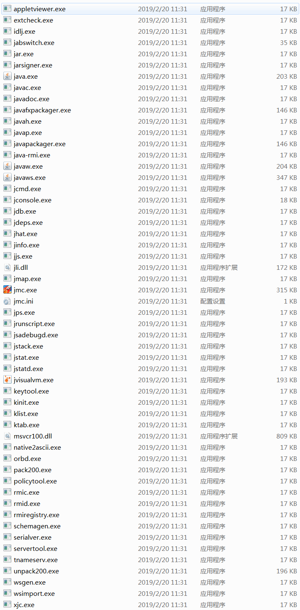
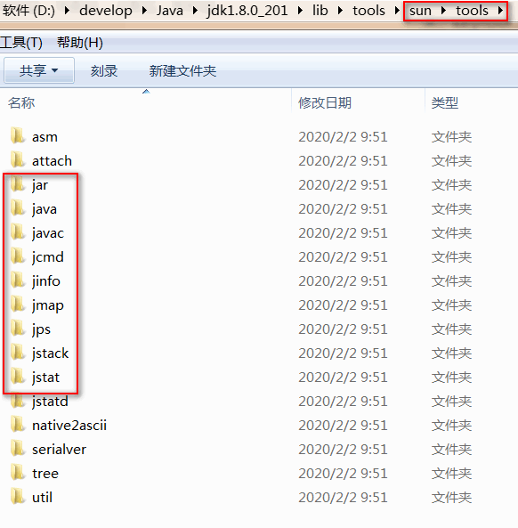

# 课程介绍

1.工具概述：

2.命令行工具：

​	jps;

​	jstat;

​	jinfo;

​	jmap;

​	jhat;

​	jstack;

3.可视化工具：

​	jconsole;

​	VisualVM;

4.内存分析和线程分析：

# 1.工具概述

作为一个java程序员，最基本的要求就是用java语言编写程序，并能够在jvm虚拟机上正常运行，但是在实际开发过程中，我们所有的程序由于各种各样的原因，并不是总能够正常运行，经常会发生故障或者程序的性能低下等问题，此时我们就需要借助于一些jdk提供的工具来定位问题、分析问题并给出合适的解决方案。

jdk给程序员提供的辅助工具都存放在bin目录下，见下图：

jdk提供的这些工具都是使用java语言编写的，他们都来自于lib/tools.jar,解压tools.jar，然后找到它下面sun/tools,截图如下，我们很清楚的能够看到这些目录的名称和前面看到的工具的名称一致。

需要特别注意说明的是：接下来我们讲解的工具全部基于windows平台下的JDK8版本，如果JDK版本，操心系统不同，工具所支持的功能可能会有较大差别，大部分工具在JDK5中就已经提供了，但是为了避免运行环境带来的差异和兼容性问题，建议使用JDK8来验证我们讲解的内容。 

这个模块主要学习虚拟机性能监控与故障处理工具的基本使用与实战，要学习这个模块，需要大家首先有一定的java编程经验，并且对jvm内存结构以及jvm垃圾回收机制有一定的了解。

# 2.常用jdk工具（命令行）

这里不会讲解所有的jdk工具，没有必要，我们挑选一些常用的jdk工具给大家讲解，先简单了解一下常用的jdk工具及它们各自的作用：

jps(JVM Process Status Tool)：显示指定系统内所有的虚拟机进程

jstat(JVM Statistics Monitoring Tool)：用于收集虚拟机各方面的运行数据

jinfo(Configuration Info forJava)：显示虚拟机配置信息

jmap(Memory Map for Java)：生成虚拟机的内存转储快照（heapdump文件）

jhat(JVM Heap Dump Browser)：用于分析heapdump文件，它会建立一个HTTP/HTML服务器，让用户可以在浏览器上查看分析结果

jstack(Stack Trace forJava)：显示虚拟机的线程快照

## 2.1 jps(JVM Process Status Tool)

**作用：**列出正在运行的虚拟机进程。并显示虚拟机执行主类(Main Class,main()函数所在的类)名称以及这些进程的本地虚拟机唯一ID(Local Virtual Machine Identifier,LVMID)

虽然功能比较单一，但它是使用频率最高的JDK命令行工具，因为其他的JDK工具大多需要输入它查询到的唯一ID来确定要监控的是哪一个虚拟机进程。对于本地虚拟机进程来说，唯一ID与操作系统的进程ID是一致的。使用Windows的任务管理器或者UNIX的ps命令也可以查询到虚拟机进程的唯一ID，但如果同时启动多个虚拟机进程，无法根据进程名称定位时，那只有依赖jps命令 显示主类的功能 才能区分了。 

**命令格式：**

jps\[options\]\[hostid\]

**参数解释：**

第一个参数：options

-q：显示进程ID

-m：显示进程ID，主类名称，以及传入main方法的参数

-l：显示进程ID，主类全名

-v：显示进程ID，主类名称，以及传入JVM的参数

-V：显示进程ID，主类名称

[-mlvV]可以任意组合使用

第二个参数：hostid

​	主机或者是服务器的ip，如果不指定，就默认为当前的主机或者是服务器。

​	注意：如果需要查看其他机器上的jvm进程，需要在待查看机器上启动jstatd。 

## 2.2 jstat(JVM Statistics Monitoring Tool)

**作用：**监视虚拟机各种运行状态信息，可以显示本地或者是远程虚拟机进程中的类装载、内存、垃圾收集、JIT编译等运行数据

**命令格式：**

jstat \[ options vmid \[ interval \[count\] \] \] <pid>

**参数解释：**

第一个参数：options

代表用户希望查询的虚拟机信息，主要分为3类：类装载、垃圾收集和运行期编译状况，具体选项及作用如下： 

-class：显示有关类加载器行为的统计信息

-compiler：显示有关Java HotSpot VM即时编译器行为的统计信息

-gc：显示有关垃圾收集堆行为的统计信息

-gccapacity：显示有关各个垃圾回收代容量及其相应空间的统计信息

-gccause：显示有关垃圾收集统计信息(同-gcutil），以及上一次和当前(如果适用)垃圾收集事件的原因

-gcnew：显示新生代行为的统计信息

-gcnewcapacity：显示有关新生代大小及其相应空间的统计信息

-gcold：显示有关老年代行为的统计信息和元空间统计信息

-gcoldcapacity：显示有关老年代大小的统计信息

-gcmetacapacity：显示有关元空间大小的统计信息

-gcutil：显示有关垃圾收集统计信息

-printcompilation：显示Java HotSpot VM编译方法统计信息

 

第二个参数：vmid

如果是本地虚拟机进程，vmid和本地虚拟机唯一ID是一致的

如果是远程虚拟机进程，那vmid的格式应当是：

[protocol:][//]lvmid[@hostname[:port]/servername]

 

第三个参数：interval

采样间隔，单位为秒(s)或毫秒(ms)

默认单位是毫秒。必须为正整数。

指定后，该jstat命令将在每个间隔产生其输出

 

第四个参数：count

要显示的样本数

 

**注意点：**

参数interval和count代表查询间隔和次数，如果省略这两个参数，说明只查询一次：

查询一次进程8888垃圾收集情况：

jstat –gc 8888

 

假设需要每250毫秒查询一次进程8888垃圾收集情况，一共查询10次，那命令应当是： 

jstat –gc 8888 250 10

**常见统计选项演示：**

-class选项：

类加载器统计信息：

Loaded：已加载的类数

Bytes：加载的kB数

Unloaded：卸载的类数

Bytes：卸载的KB数

Time：执行类加载和卸载操作所花费的时间

 

-compiler选项：

Java HotSpot VM即时编译器统计信息：

Compiled：执行的编译任务数

Failed：编译任务数失败

Invalid：无效的编译任务数

Time：执行编译任务所花费的时间

FailedType：上次失败的编译的编译类型

FailedMethod：上次失败的编译的类名和方法

-gc 选项：

垃圾收集的堆统计信息

S0C：当前幸存者空间0容量（kB）

S1C：当前生存空间1的容量（kB）

S0U：幸存者空间0使用大小（kB）

S1U：幸存者空间1使用大小（kB）

EC：当前伊甸园空间容量（kB）

EU：伊甸园空间使用大小（kB）

OC：当前的老年代容量（kB）

OU：老年代使用大小（kB）

MC：元空间容量（kB）

MU：元空间使用大小（kB）

CCSC：压缩的类空间容量（kB）

CCSU：使用的压缩类空间（kB）

YGC：新生代垃圾收集事件的数量

YGCT：新生代垃圾回收时间

FGC：完整GC事件的数量

FGCT：完整的垃圾收集时间

GCT：总垃圾收集时间

-gcutil 选项：

垃圾收集统计信息

S0：幸存者空间0利用率占该空间当前容量的百分比

S1：幸存者空间1利用率占空间当前容量的百分比

E：Eden空间利用率占空间当前容量的百分比

O：老年代利用率占空间当前容量的百分比

M：元空间利用率占空间当前容量的百分比

CCS：压缩的类空间利用率，以百分比表示

YGC：新生代GC事件的数量

YGCT：新生代垃圾回收时间

FGC：完整GC事件的数量

FGCT：完整的垃圾收集时间

GCT：总垃圾收集时间

## 2.3 jinfo(Configuration Info forJava)

**作用：**实时地查看和调整虚拟机各项参数

**命令格式：**

jinfo \[options\] <pid>

**参数解释：**

第一个参数：options

no option：输出全部的参数和系统属性

-flag name：输出对应名称的参数

-flag [+|-]name：开启或者关闭对应名称的参数

-flag name=value：设定对应名称的参数

-flags：输出全部的参数

-sysprops：输出系统属性

 

**命令演示：**

命令：jinfo pid

描述：输出当前 jvm 进程的全部参数和系统属性

 

命令：jinfo -flag name pid

描述：使用该命令，可以查看指定的 jvm 参数的值

如：查看当前 jvm 进程是否开启打印 GC 日志

jinfo -flag PrintGC pid

 

命令：jinfo -flag [+|-]name pid

描述：开启或者关闭对应名称的参数

使用 jinfo 可以在不重启虚拟机的情况下，可以动态的修改 jvm 的参数。尤其在线上的环境特别有用。

jinfo -flag +PrintGC pid

jinfo -flag PrintGC pid

jinfo -flag +PrintGC pid

jinfo -flag PrintGC pid

 

命令：jinfo -flag name=value pid

描述：修改指定参数的值。

和上面的例子相似，但是上面的主要是针对 boolean 值的参数设置的。

如果是设置 value值，则需要使用 name=value 的形式

jinfo -flag HeapDumpPath pid

jinfo -flag HeapDumpPath=d:\\dump pid

jinfo -flag HeapDumpPath pid

jinfo -flag HeapDumpPath= pid

jinfo -flag HeapDumpPath pid

**注意：**jinfo虽然可以在java程序运行时动态地修改虚拟机参数，但并不是所有的参数都支持动态修改

命令：jinfo -flags pid

描述：输出全部的虚拟机参数

 

命令：jinfo -sysprops pid

描述：输出当前虚拟机进程的全部的系统属性

 

## 2.4 jmap(Memory Map for Java)

**作用：**是一个多功能的命令，它可以生成 java 程序的 dump 文件， 也可以查看堆内对象信息、查看 ClassLoader 的信息以及 finalizer 队列

**命令格式：**

jmap [options] <pid>

 

**参数解释：**

第一个参数：options

no option： 查看进程的内存映像信息,类似 Solaris pmap 命令。

heap： 显示Java堆详细信息

histo[:live]： 显示堆中对象的统计信息

clstats：打印类加载器信息

finalizerinfo： 显示在F-Queue队列等待Finalizer线程执行finalizer方法的对象

dump:<dump-options>：生成堆转储快照

**命令演示：**

命令：jmap pid

描述：查看进程的内存映像信息

使用不带选项参数的jmap打印共享对象映射，将会打印目标虚拟机中加载的每个共享对象的起始地址、映射大小以及共享对象文件的路径全称

 

命令：jmap -heap pid

描述：显示Java堆详细信息

打印一个堆的摘要信息，包括使用的GC算法、堆配置信息和各内存区域内存使用信息

 

命令：jmap -histo:live pid

命令：jmap -histo pid

描述：显示堆中对象的统计信息

其中包括每个Java类、对象数量、内存大小(单位：字节)、完全限定的类名。打印的虚拟机内部的类名称将会带有一个’*’前缀。如果指定了live子选项，则只计算活动的对象

 

命令：jmap -clstats pid

描述：打印类加载器信息

-clstats是-permstat的替代方案，在JDK8之前，-permstat用来打印类加载器的数据

打印Java堆内存的永久保存区域的类加载器的智能统计信息。对于每个类加载器而言，它的名称、活跃度、地址、父类加载器、它所加载的类的数量和大小都会被打印。此外，包含的字符串数量和大小也会被打印。

 

命令：jmap -finalizerinfo pid

描述：打印等待终结的对象信息

Number of objects pending for finalization:0 说明当前F-Queue队列中并没有等待Finalizer线程执行finalizer方法的对象。

 

命令：jmap -dump:live,format=b,file=d:\\jmap.bin pid

描述：生成堆转储快照dump文件

以hprof二进制格式转储Java堆到指定filename的文件中。live子选项是可选的。如果指定了live子选项，堆中只有活动的对象会被转储。想要浏览heap dump，你可以使用jhat(Java堆分析工具)读取生成的文件。这个命令执行，JVM会将整个heap的信息dump写入到一个文件，heap如果比较大的话，就会导致这个过程比较耗时，并且执行的过程中为了保证dump的信息是可靠的，所以会暂停应用， 线上系统慎用

## 2.5 jhat(JVM Heap Dump Browser)

**作用：**与jmap搭配使用来分析jmap生成的堆转储快照。jhat内置了一个微型的HTTP/HTML服务器，生成dump文件的分析结果后，可以在浏览器中查看。

不过，这个工具一般除非实在没有其他工具，否则不会使用。主要原因有二：一是一般不会在部署应用程序的服务器上直接分析dump文件，即使可以这样做，也会尽量将dump文件拷贝到其他机器上进行分析，因为分析工作是一个耗时且消耗硬件资源的过程，既然都要在其他机器上进行，就没必要受到命令行工具的限制了； 二是jhat的分析功能相对来说比较简陋，其他有较好的替代工具，比如VisualVM,以及专业用于分析dump文件的Eclipse Memory Analyzer、 IBM HeapAnalyzer等工具都能实现比jhat更强大更专业的分析功能。

 

**命令格式：**

jhat [options] 堆转储文件

**参数解释：**

第一个参数：options

[-stack <bool>]：开关对象分配调用栈跟踪（tracking object allocation call stack）。 如果分配位置信息在堆转储中不可用，则必须将此标志设置为 false，默认值为 true。

[-refs <bool>]：开关对象引用跟踪（tracking of references to objects）。 默认值为 true。默认情况下，返回的指针是指向其他特定对象的对象，如反向链接或输入引用（referrers or incoming references），会统计/计算堆中的所有对象。

[-port <port>]：设置 jhat HTTP server 的端口号。默认值 7000。

[-exclude <file>]：指定对象查询时需要排除的数据成员列表文件（列出应从可访问对象查询中排除的数据成员的文件)。例如，如果文件列列出了 java.lang.String.value，那么当从某个特定对象 Object o 计算可达的对象列表时，引用路径涉及 java.lang.String.value 的都会被排除

[-baseline <file>]：指定一个基准堆转储（baseline heap dump）。在两个 heap dumps 中有相同 object ID 的对象会被标记为不是新的（marked as not being new）。其他对象被标记为新的（new）。在比较两个不同的堆转储时很有用。

[-debug <int>]：设置 debug 级别。0 表示不输出调试信息。值越大则表示输出更详细的 debug 信息。

[-version]：启动后只显示版本信息就退出

 

第二个参数：堆转储文件

要浏览的Java二进制堆转储文件

 **命令演示：**

命令：jhat D:\\jmap.bin

 

执行命令后，我们看到系统开始读取这段dump信息，当系统提示Server is ready的时候，用户可以通过在浏览器键入http://ip:7000进行查询。有时 dump 文件很大，在启动时会报堆空间不足的错误，可加参数 jhat -J-Xmx512m <heap dump file>，这个内存大小可自行设置。

 看文件中的内容，重点看下面的七个：

jhat 启动后显示的 html 页面中包含有：

A:显示出堆中所包含的所有的类（All Classes（including platform））。

B:从根集能引用到的对象（All Members of the Rootset）。

C:显示平台包括的所有类的实例数量（Instance Counts for All Classes（including platform/excluding platform））。

D:一般查看堆异常情况主要看 Instance Counts for All Classes（excluding platform）平台外的所有对象信息和 Heap Histogram 以树状图形式展示堆情况。

E:堆实例的分布表（Heap Histogram）。

F:Finalizer 摘要（Finalizer Summary）。

G:执行对象查询语句（OQL）。

\#查询字符串

select s from java.lang.String s 

## 2.6 jstack(Stack Trace forJava)

**作用：**查看或导出 Java 应用程序中线程堆栈信息 .

线程快照是当前java虚拟机内每一条线程正在执行的方法堆栈的集合，生成线程快照的主要目的是定位线程出现长时间停顿的原因，如线程间死锁、死循环、长时间等待外部资源等。 线程出现停顿的时候通过jstack来查看各个线程的调用堆栈，就可以知道没有响应的线程到底在后台做什么事情，或者等待什么资源。 如果java程序崩溃生成core文件，jstack工具可以用来获得core文件的java stack和native stack的信息，从而可以轻松地知道java程序是如何崩溃和在程序何处发生问题。另外，jstack工具还可以附属到正在运行的java程序中，看到当时运行的java程序的java stack和native stack的信息.

**命令格式：**

jstack [ options ] <pid>

**参数解释：**

第一个参数：options

-F : 当线程挂起时，使用jstack -l pid 请求不被响应时，强制输出线程堆栈

-l : 除堆栈外，显示关于锁的附加信息,例如 ownable synchronizers

-m : 可以同时输出java以及C/C++的堆栈信息

 

演示：

​	CPU占用过高：

​		1.使用Process Explorer工具，找到CPU占用率高的进程的id；

​		2.右击该进程，查看属性，在thread选项卡中，找到cpu占用率高的线程id

​		3.把线程id转换成16进制

​		4.使用jstack -l <pid> 查看进程的线程快照

​		5.在线程快照中找到指定的线程，并分析代码

​	

# 3.常用jdk工具(可视化)

## 3.1 JConsole 

**作用：**查看Java应用程序的运行概况，监视垃圾收集器管理的虚拟机内存(堆和元空间)的变化趋势，以及监控程序内的线程。

启动JConsole，在控制台输入：jconsole即可,在弹出的界面中，选择本地进程，然后进去看界面页签信息。显示的是整个虚拟机主要运行数据的概览，其中包括堆内存使用情况，线程，类，CPU使用情况四项信息的曲线图。

内存：

相当于命令行的jstat命令，用于监视受垃圾收集器管理的虚拟机内存(堆和元空间)的变化趋势，这不仅是包括堆内存的整体信息，更细化到伊甸区、幸存区、老年代的使用情况。同时，也包括非堆区，即元空间的使用情况，单机界面右上角的“执行GC”按钮，可以强制应用程序进行一次Full GC。

线程：

相当于命令行的jstack命令，遇到线程停顿的时候可以使用它来进行监控分析。JConsole 显示了系统内的线程数量，并在屏幕下方，显示了程序中所有的线程。单击线程名称，便可以查看线程的栈信息。

类：

如图所示，显示了系统以及装载的类数量。在详细信息栏中，还显示了已卸载的类数量。

VM摘要：

在VM摘要页面，JConsole 显示了当前应用程序的运行环境。包括虚拟机类型、版本、堆信息以及虚拟机参数等。相当于jinfo命令

MBean：

MBean页面允许通过JConsole访问已经在MBean服务器注册的MBean对象。

## 3.2 Visual VM 

**作用：**是到目前为止随JDK发布的功能最强大的运行监视和故障处理程序，并且可以遇见在未来一段时间内都是官方主力发展的虚拟机故障处理工具。官方在VisualVM的软件说明中写上了“All-in-One”的描述字样，预示着他除了运行监视、故障处理外，还提供了很多其他方面的功能。如性能分析，VisualVM的性能分析功能甚至比起很多专业的收费的工具都不会逊色多少，而且VisualVM还有一个很大的优点：不需要被监视的程序基于特殊的运行，因此他对应用程序的实际性能的影响很小，使得他可以直接应用在生产环境中。

VisualVM基于NetBeans平台开发，因此他一开始就具备了插件扩展功能的特性，通过插件扩展支持，VisualVM可以做到：

- 显示虚拟机进程以及进程的配置、环境信息（jps、jinfo）。
- 监视应用程序的CPU、GC、堆、方法区以及线程的信息（jstat、jstack）。
- dump以及分析堆转储快照（jmap、jhat）。
- 方法级的程序运行性能分析，找到被调用最多、运行时间最长的方法。
- 离线程序快照：收集程序的运行时配置、线程dump、内存dump等信息建立一个快照，可以将快照发送开发者处进行Bug反馈。
- 其他plugins的无限的可能性......

**使用：**

1.在控制台输入：jvisualvm执行即可；

2.安装插件：

​	2.1 从主菜单中选择“工具”>“插件” ；

​	2.2 在“可用插件”标签中，选中该插件的“安装”复选框。单击“安装” ；

​	2.3 逐步完成插件安装程序。 

**默认插件：**

概述（Overview）：

​	程序的基本信息和启动参数、环境变量等等；

监视（Monitor）：

​	用于显示CPU、内存（分为Heap和Metaspace）、类和线程的使用情况或者数量，另外还包括执行垃圾回收和对堆 Dump的快捷功能 ；

线程（Threads）：

​	详细查看每个线程的运行时间及状态等；

抽样器（Sampler）：

​	对CPU和内存进行一段时长的取样，从而对应用程序进行分析 ；

# 4.内存分析和线程分析

**监视：**

​	监视是一种用来查看应用程序运行时行为的一般方法。通常会有多个视图（View）分别实时地显示 CPU 使用情况、内存使用情况、线程状态以及其他一些有用的信息，以便用户能很快地发现问题的关键所在。

**转储：**

​	性能分析工具从内存中获得当前状态数据并存储到文件用于静态的性能分析。Java 程序是通过在启动 Java 程序时添加适当的条件参数来触发转储操作的。它包括以下三种：

- ​	系统转储：JVM 生成的本地系统的转储，又称作核心转储。一般的，系统转储数据量大，需要平台相关的工具去分析，如 Windows 上的 windbg 和 Linux 上的 gdb。

- ​	Java 转储：JVM 内部生成的格式化后的数据，包括线程信息，类的加载信息以及堆的统计数据。通常也用于检测死锁。

- ​	堆转储：JVM 将所有对象的堆内容存储到文件。

**快照：**

​	应用程序启动后，性能分析工具开始收集各种运行时数据，其中一些数据直接显示在监视视图中，而另外大部分数据被保存在内部，直到用户要求获取快照，基于这些保存的数据的统计信息才被显示出来。快照包含了应用程序在一段时间内的执行信息，通常有 CPU 快照和内存快照两种类型。

- ​	CPU 快照：主要包含了应用程序中函数的调用关系及运行时间，这些信息通常可以在 CPU 快照视图中进行查看。

- ​	内存快照：主要包含了内存的分配和使用情况、载入的所有类、存在的对象信息及对象间的引用关系等。这些信息通常可以在内存快照视图中进行查看。

**性能分析：**

​	性能分析是通过收集程序运行时的执行数据来帮助开发人员定位程序需要被优化的部分，从而提高程序的运行速度或是内存使用效率，主要有以下三个方面：

- ​	CPU 性能分析：CPU 性能分析的主要目的是统计函数的调用情况及执行时间，或者更简单的情况就是统计应用程序的 CPU 使用情况。通常有 CPU 监视和 CPU 快照两种方式来显示 CPU 性能分析结果。

- ​	内存性能分析：内存性能分析的主要目的是通过统计内存使用情况检测可能存在的内存泄露问题及确定优化内存使用的方向。通常有内存监视和内存快照两种方式来显示内存性能分析结果。

- ​	线程性能分析：线程性能分析主要用于在多线程应用程序中确定内存的问题所在。一般包括线程的状态变化情况，死锁情况和某个线程在线程生命期内状态的分布情况等